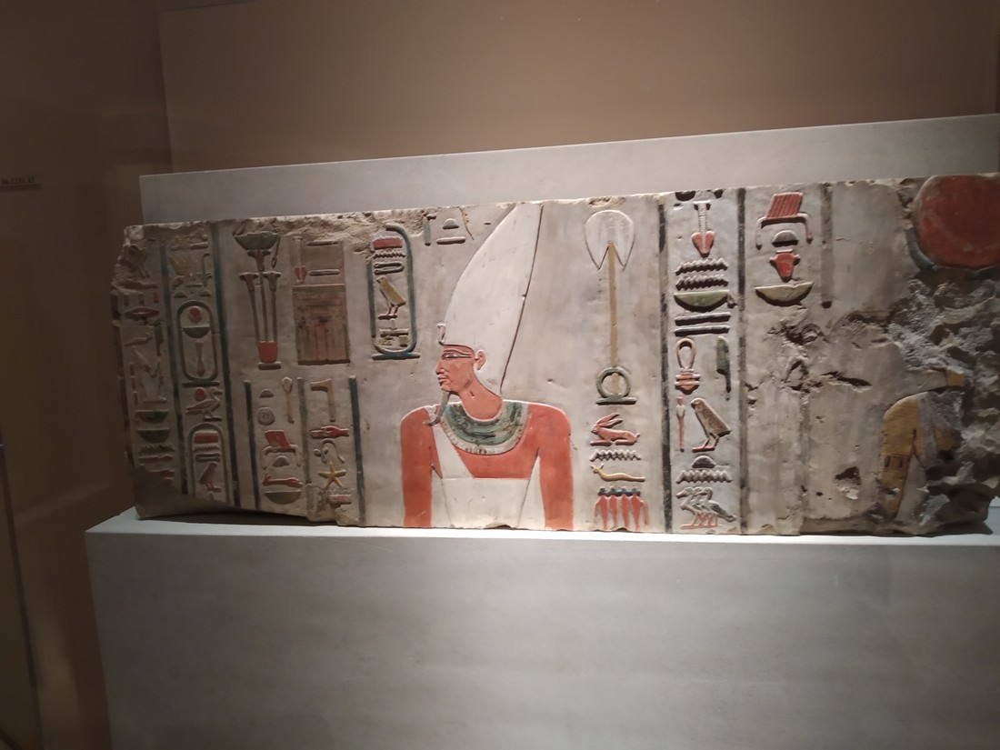
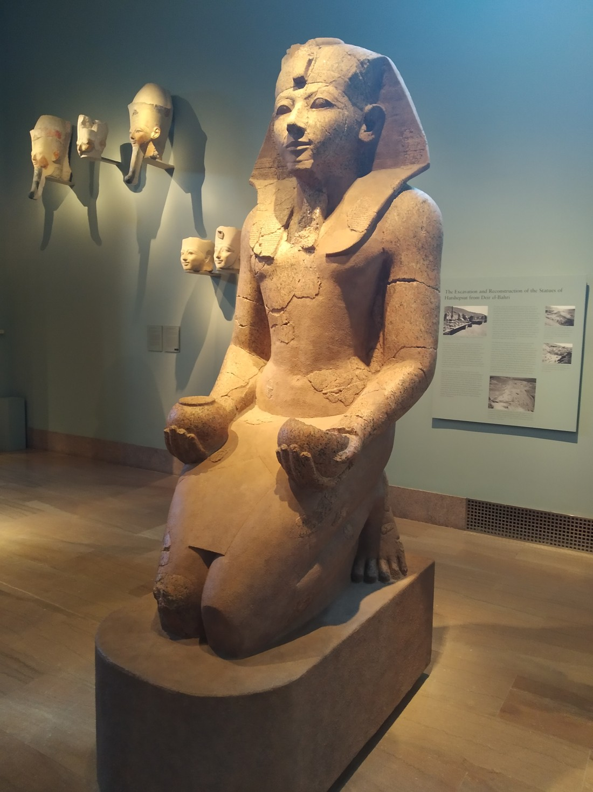
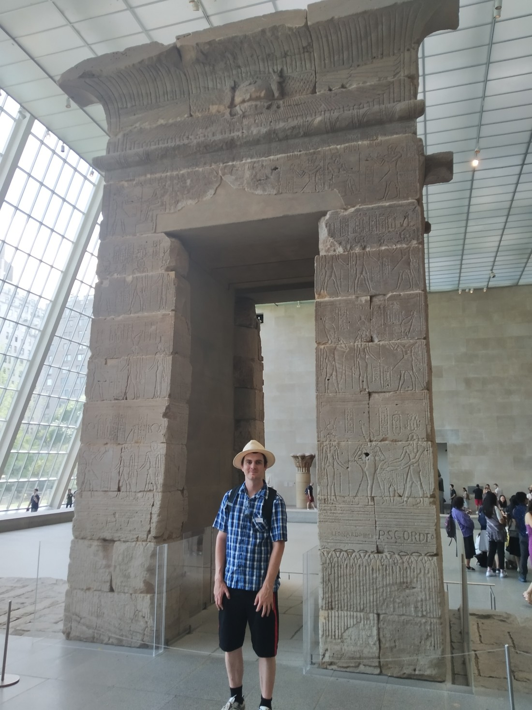
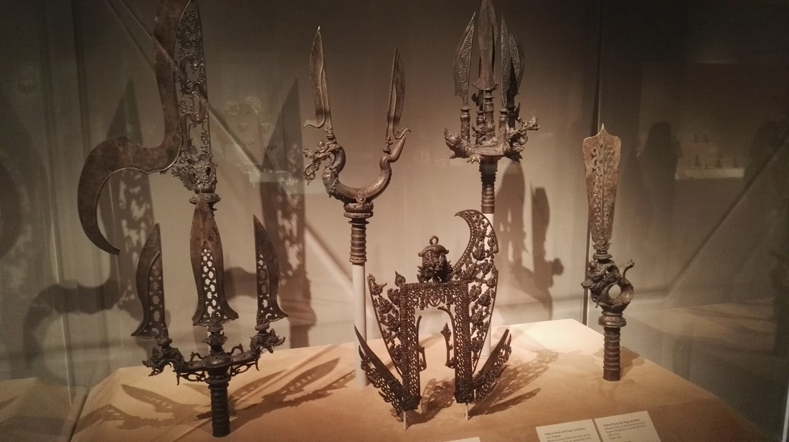
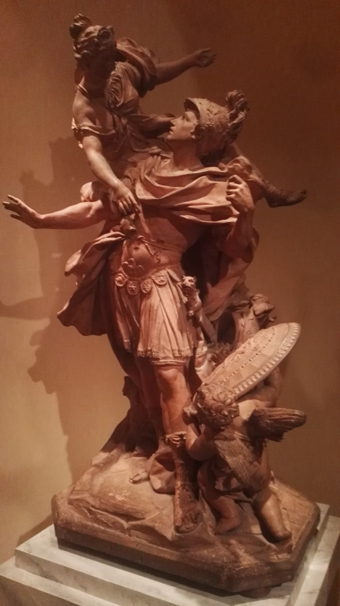
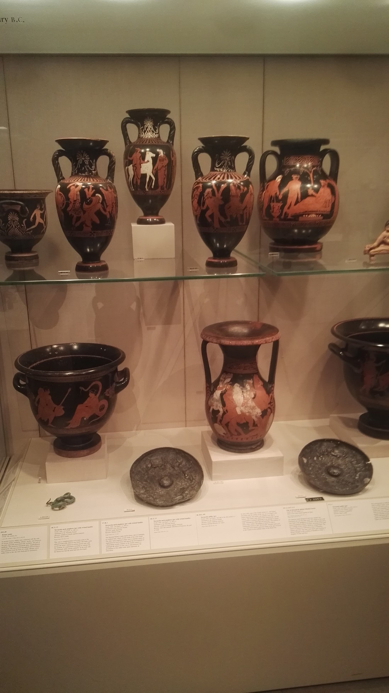
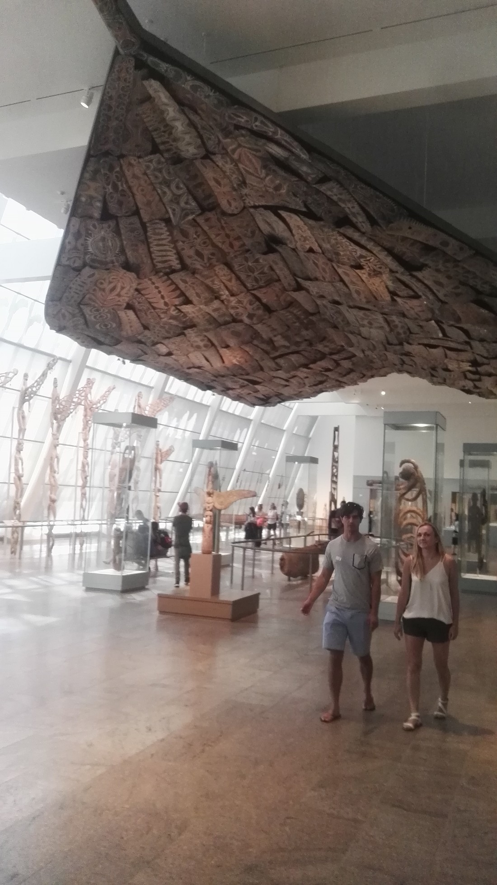
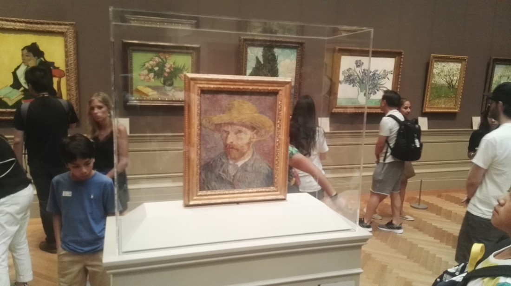
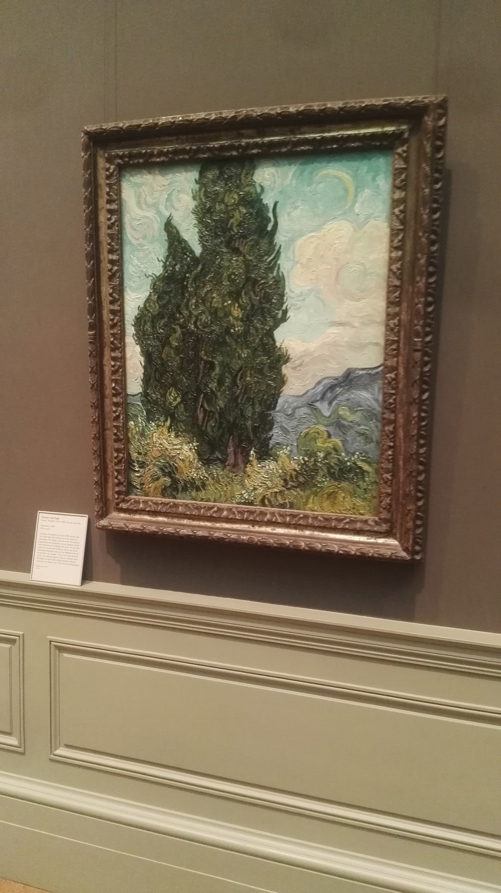

New York is known for its museums and the one museum that Betty and I both wanted to check out was the Museum of Modern Art (or “MoMA”). This museum housed some of the most recognisable and famous works of art.

…It was closed until October.

Still, New York has dozens of Museums. We found out that the Metropolitan Museum of Art (or “The Met”) was the second most visited museum in the world. We’re not usually the type to visit art galleries but we figured we may as well check it out. It was also very populated (should have foreseen that) but it was air conditioned so it was a nice break from walking around Central Park.

I was actually stunned when we walked into the first exhibit. It was a collection of Egyptian artefacts, sculptures, scrolls, wall hangings, vases etc. I had seen stuff like this in fictional movies and TV shows but seeing it in person was quite different.

I regret not photographing some of the wall art but at that point I wasn’t expecting to want to photograph anything. It wasn’t until we entered a room with sculptures of people on boats that I truly realised that these exhibits might be something I wanted to look over again at a later date.

> It really begs the question, “Who built this, any why?”

Each room had panels with various information about the pieces. 26 boat sculptures were discovered in a previously unknown room in an Egyptian tomb in the 1920s. To be honest, that’s one of the few panels I ended up reading because the exhibits were so large that stopping to read everything would have taken up more time than we had.

The Met also nicely acknowledged the fact that viewing everything may take a long time. There are no single day tickets. Each ticket is valid for three days and they were reasonably priced too ($25 USD). That was nice because it meant that we didn’t need to feel rushed as we could return the next day to continue our exploration of the museum.

Very soon into our visit we realised that the museum is laid out like a labyrinth. It is very hard to simply walk into an exhibit and just follow the rooms in a sequential order to see everything. Some of the exhibits were split over multiple floors. Some exhibits were inside another exhibit. We tried to see everything in the exhibits we were most interested in but I do not doubt that there might have been rooms or nooks we might have missed.

> Some exhibits are harder to miss than others

Eventually we navigated our way through most of the Egyptian section and entered the American section. My initial reaction to seeing it on the floor plan was, “American art – So what?” But this turned out to be just as fascinating as the Egyptian section.

The American art section was basically just European style art, but done or collected by people in the United States from when settlers arrived. Unlike the other countries’ art exhibits, nothing in the American Art had been imported.

They had whole rooms from mansions in different periods – many of which were in New York and had been donated (wall panels and everything) before the building was torn down to build apartments.

There was a lot of furniture, paintings and sculptures – so much so that one section of the exhibit was basically just a fancy storehouse containing excess items in library-like rows.

We then moved on into the Weapons and Armour section. This contained exactly what you would expect it to contain – weapons and armour. It contained swords of all types, guns of all type, and even sword-guns.

It contained full suits of armour of various types, and also from various cultures.

At this point I wanted to run off to catch a cruise so we left the museum (well, not straight away – we had to find the exit first). Looking at the map we realised that we’d been there almost two hours and we hadn’t even seen half of the first floor yet. It’s that big.

We returned the next day (albeit with out my regular camera phone so excuse me if these next few images aren’t as detailed). We’d already spent a lot of the day doing other stuff but we were determined to get through the rest of the museum.

We started in the Asian art section, which appeared to be primarily Chinese but also had subsections for Korean, Indian, and Southeast Asian art. Naturally, this took a while to get through.

Then we on to European art.

And then onto the Greek art section.

We kind of skipped the Oceania art section.

At this point we had definitely had our fair share of art. Too much art in fact. Also, far too much walking. It sounds nice on paper – we spent the day walking around New York and Central Park before heading to a museum for a break. Well, this museum is definitely not a break.

The last exhibit we visited was of paintings from famous artists. We recognised some of the Van Gogh art but nothing else.

> Doctor Who reference\!

> We didn’t get to see “A Starry Night” – that is a MoMA. But we did get to see his less popular “A Moony Day” (That’s not true, don’t cite this on Wikipedia)

And with that we left the museum, having consumed too much art. We’d barely read any of the accompanying panels. We’d rushed through many of the sections. We were tired of walking. As a result, we truly did not appreciate many of the works as much as we otherwise might have. There simply was too much.

And of course, this was only one of the dozens of museums in New York. I can’t fathom how long it would take to get round them all.