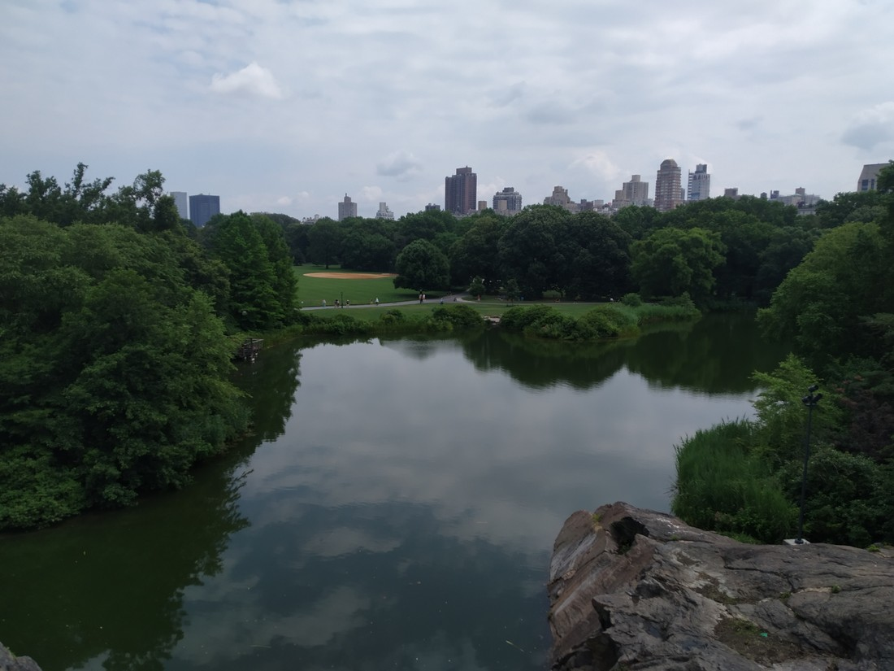
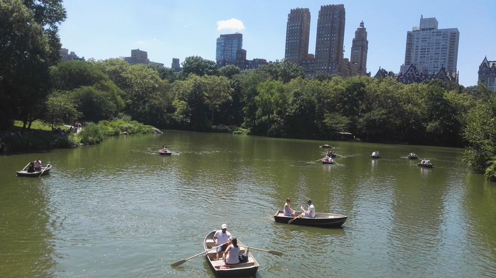
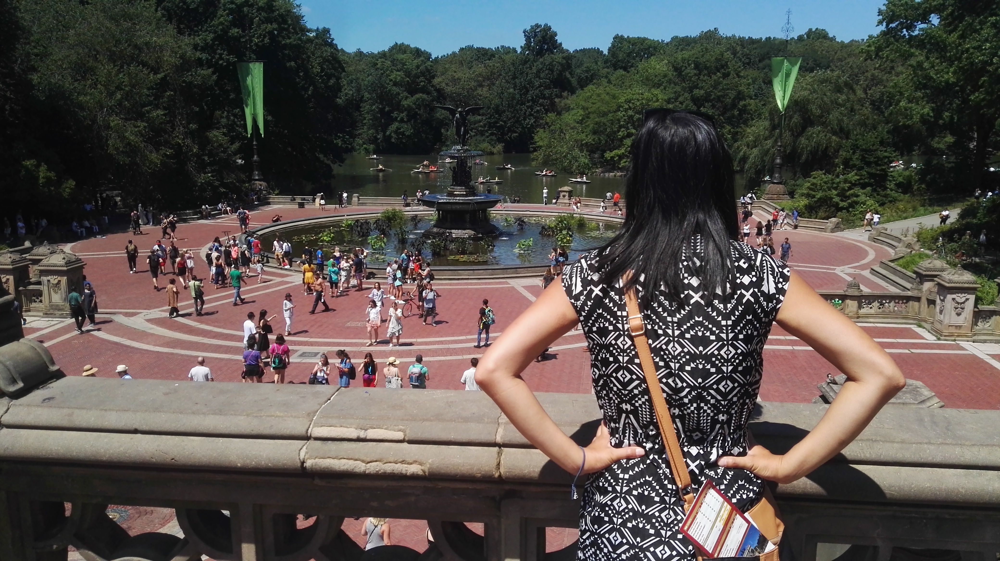
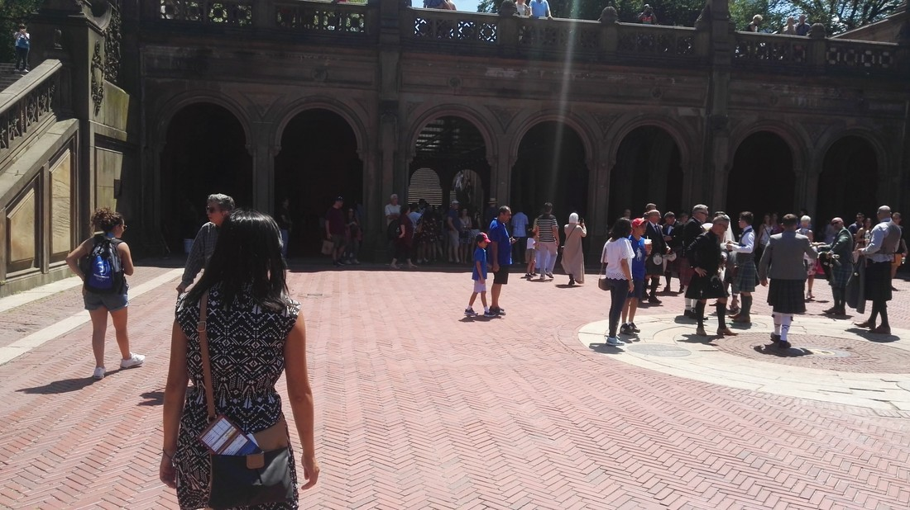

If there was ever going to be a “must do” while in New York, Central Park would have to be it. The park itself takes up the space of 150 city blocks. Originally I thought to myself, “wouldn’t it be fun to walk from one end to the other.” I quickly answered my own question, “No. No it would not.”

> I’m not even sure that this lake would be in the top three biggest in the park

The park is extremely varied and is kinda broken up into sections. It has what you’d expect for a park – paths and trees. But it also has more unusual features, like a rather underwhelming castle and a arena for Shakespeare in the Park. It’s definitely no botanical gardens but it is still nice to walk through.

> Me: “Oh look, an angle with no people. Better photograph it quickly”

The park is also filled with touristy things. Rickshaw-like cyclists guard a lot of the entrances offering rides for between $3 and $7 a minute (who would pay $7 honestly?). Horse-drawn carriages roam around the park. There’s the occasional gift shop. Also, you can rent a row boat if you want to serenade your significant other (until you realise that you don’t know how to row).

> Cue song from The Little Mermaid

But while there are touristy things everywhere in Central Park, it also feels very much like a park for locals. There are huge lawns and fields all over the place for picnicking, sunbathing, and frisbeeing. General traffic isn’t allowed anywhere in the park so instead they are filled with joggers and cyclists. We saw groups gathered for workouts, teams playing baseball, even a group gathered to paint their pets. This park certainly is a great resource for people lucky enough to live in New York.

> Yep, this is one lucky squirrel

There are also a few attractions located inside Central Park. The Central Park Zoo (whose lax security was detailed in the 2005 film Madagascar) is located in the south east corner while the Metropolitan Museum of Art is located on the eastern edge, conveniently located many blocks away from any subway stations.

> You can tell it was hot because this is the pose of someone trying to air out their armpits. I’m glad there were no photos of me here because I would have definitely been glistening all over from sweat.

We visited Central Park on two different days and saw two different parts of the park. Doctor Who filmed an episode in New York so we scouted on the filming locations – which turned out to be some of the most popular parts of the park. Is everyone a Doctor Who fan?

> This was a lot less crowded in the Doctor Who episode.

However while it might have been shady, Central Park was perhaps the most humid part of New York. It was nice to visit but both times, after a while we felt like we had to seek out an air conditioned building.

*Subtle segue into blog post about the Met*