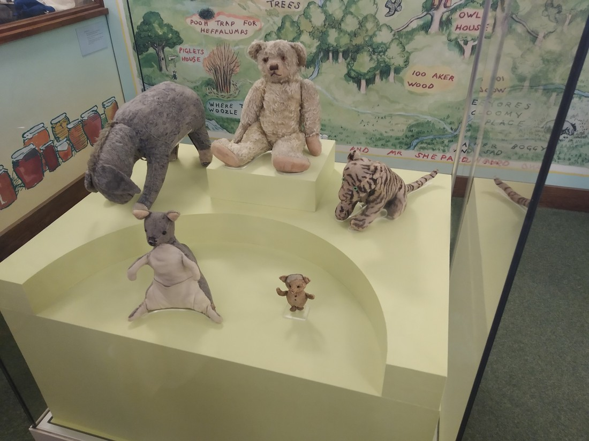

When we were on the tour bus on the day we arrived, our tour guide pointed out the New York Public Library. It was a huge building built in the 1890s. Our guide also mentioned that they had tours at 11am each day.

So the next day we turned up at the library at 10:45, ready for a tour.

It seems unfair to even call it a library. It more closely resembles a museum. The entrance area is absolutely huge.

> Not a book in sight.

Even the corridors are just as grand.

> The marble was imported from Greece.

With all the tourists walking around, it truly felt more like a tourist attraction than a library.

But our tour guide insisted that it was a working library. However unlike most libraries, this was a “research” library. The library held various collections on different topics such as Jewish history, Asian history, maps, tobacco, genealogy on top of a general catalogue.

The tour guide made it seem like these collections were encapsulated anything and everything about the topics they are collecting. For instance, the tobacco collection contains plays where a cigar case is used as a prop in one scene.

> Old fashioned lamps with outlets for charging laptops. Very cool.

The library also held some famous documents such as some speech done by some president and some first edition by some playwright in England in the 1600s. I can’t remember exactly what they were. But I do remember that the library held the original stuffed animals that inspired Winnie the Pooh!

> They don’t look a day over 95

We didn’t actually see many books because the majority of the library’s collection was stored under the nearby park. These books can be requested and it takes about 30 minutes for the librarians to get it for you.

> These weren’t books, they were atlases. Completely different. They may as well be picture books.

Overall this was definitely a sight worth seeing. Not a bad stop for our first morning in New York.

> Seriously, people come here to read?