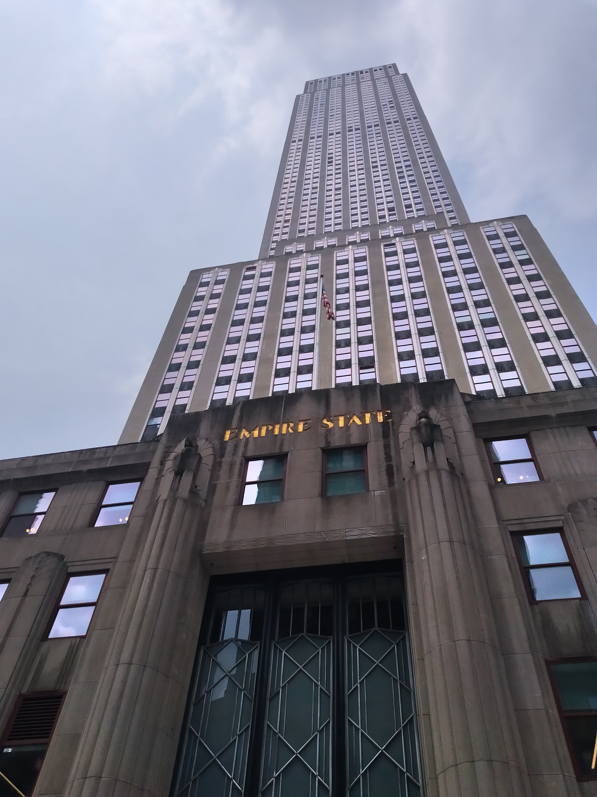

I mentioned previously that we met a retired lady on the train to New York who had previously lived there. We asked her whether she had an recommendations of things to do while we were in New York. She said that she always recommends people who are only staying in New York for a couple of days take a bus tour around the city.

We had done one of these tours in San Francisco so we were in agreement that this was an good idea. Plus, she knew enough to warn us about the heat so she must know what she was talking about.

Upon arrival in New York (or to be more specific, Manhattan) we were able to use the internet again and we found that there were three tour bus companies operating a hop-on hop-off service. One company had very cheap tickets but many online reviews were quite negative (suspiciously negative in fact, looking at you other bus companies). Of the remaining two, one was the same company that we had used in San Francisco so we picked that one.

Unlike in San Francisco there was no head office we could visit to buy tickets. Instead we had to deal with one of the many salesmen that hung about near the bus stops. The man who sold us our tickets spoke with a heavy (non American) accent and inexplicably insisted that we buy a three day pass after we told him we’d be in New York for four days. Trusting that he knew what he was talking about, we bought the recommended ticket only to find that it came with a extra free bonus day – which was nice. The tickets allowed us to jump on any of the four bus routes as well us the night bus route and as another bonus, came with a free cruise around the harbour. So overall it was quite good value, considering we payed a similar amount for a one day ticket in San Francisco.

> Bryant Park (I actually remembered what this one was called, unlike a lot of the other uncaptioned photos)

So we hopped on a bus straight away for a tour around downtown Manhattan. Initially we had concerns about our tour guide. He was greying and spoke with a heavy Spanish accent. Our guides in San Francisco had been much younger people and they seemed to have a better understanding about what makes an interesting commentary for tourists. But by the end of the tour our concerns were gone. What this man might have lacked in interestingness, he made up for in sincerity. For instance, he advised against going to the 9 / 11 museum if you’re bringing kids along. It’s nice to not hear recommendations that everyone do everything.

> Times Square is so famous for its billboards, the building owners can survive off the advertising alone.

Our tour on the first day took us from Times Square down Fifth Avenue. We learned that Fifth Avenue divided the city into east and west. We learned that the numbered avenues all run north / south and the numbered streets all run east west. We learned that the numbering on the streets starts at Fifth Avenue and goes outward. These facts proved quite useful when we had to find addresses on future days. Especially since the tall buildings kept messing with the GPS.

> The “Flatiron” building – where Spider-man works.

In fact, I came to love the grid system in the city. It made walking from one location to another quite easy knowing we just had to walk X blocks north and Y blocks west. We ended up doing a lot of walking because our apartment was relatively central but there wasn’t a subway station nearby. Also, congestion on New York’s roads were the stuff nightmares are made of. I didn’t envy any of the taxi drivers who had to battle with them every day.

> Spot the lanes.

Anyway, the bus took us downtown past Wall Street and back up the eastern side of the island. The guide was very good at explaining the history of various parts of the city. he seemed to have an encyclopaedic knowledge of all the years various events happened and what years each building held the record for being the tallest in the world. Overall it quite good, although at times it was quite hot sitting in an open top doubledecker bus.

We ended up hopping back on this bus a few more times in order to get from one place to another. Each time we encountered a different guide and each had very different styles. One guy’s style seemed to be just to tell us to look at things. “Look to your right at the stuffed giraffe in the store doorway,” he would say. “Look to your left and you can see into the office building.” But often he would have interesting things to say that weren’t mentioned by other guides, often about how the buildings were built.

> Apparently this building was notable for some reason.

On our second day we took the uptown bus tour which went along Park Ave toward Central Park which is where all the richest people in New York lived or have lived. This bus was quite a different experience as the guide mostly just listed famous people and where they lived or worked etc.

There were two other bus routes. One around Harlem and one into Brooklyn. The Brooklyn tour was a bit hard to get to for us and while we had intended to do the Harlem tour on our last day in New York, I managed to forget the tickets.

Lastly there was the night tour. This tour took us over the Manhattan bridge into Brooklyn which allowed us to see the skyline of Manhattan. We timed it so that we would be on the bus when the sun set, which allowed us to see some very pretty lights although my camera really isn’t the best at capturing them.

Unfortunately our tour guide for this tour was a bit creepy. He certainly knew a lot about the music scene in New York from the 70s onward, clearly because he had lived through it. Though in his defence we were travelling through a poorer district in Manhattan that had spawned a lot of different types of music.

> Times Square by night was certainly a sight to see.

Overall, the tickets were certainly worth it and were a good way to see a lot of New York. When I talked about the bus tour in San Francisco I mentioned that it went through a lot of different neighbourhoods. Well, the New York routes tended to limit themselves to one neighbourhood for two reasons: 1. New York is very big and 2. the traffic makes it very difficult to get anywhere quickly.