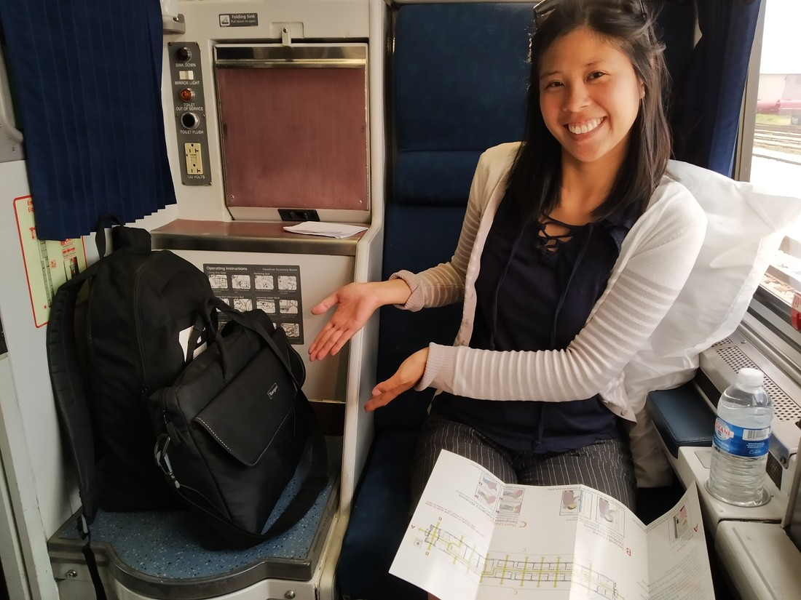
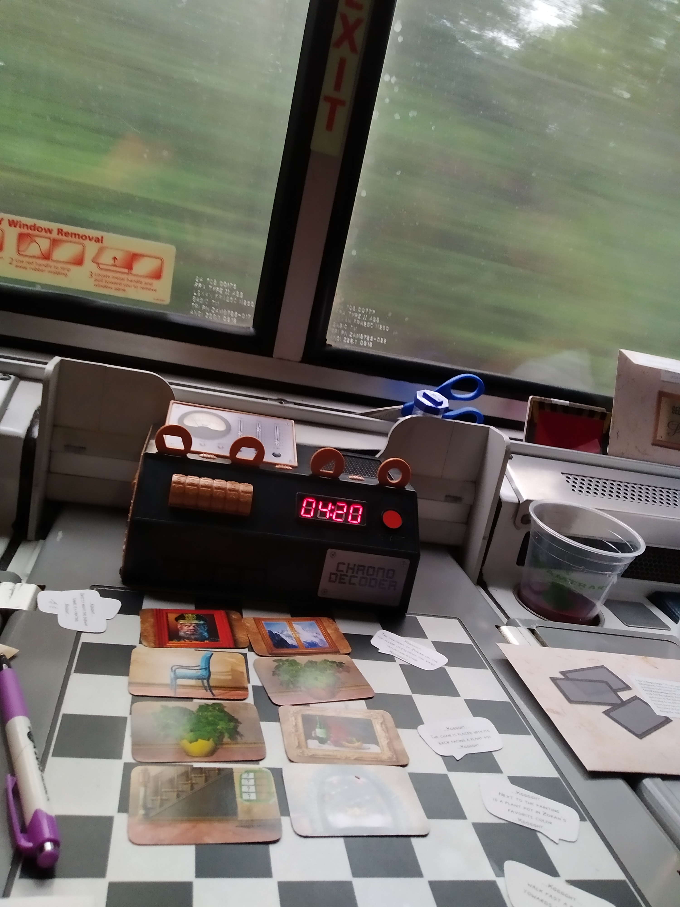
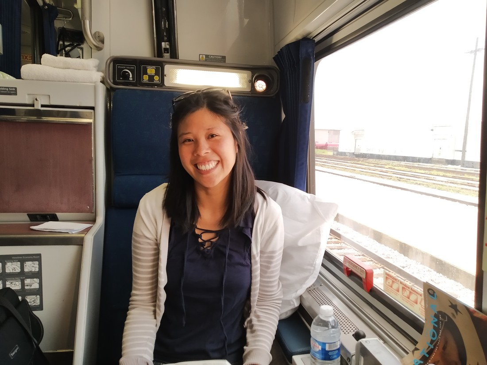

After we had sorted out our path through North America, I noticed an interesting quirk. It turns out that we never fly out of any city that we flew into. We either rent a car and drive out, or we take the train.

This was done somewhat deliberately. I quite enjoyed our three hour train ride in China. It was a good way to see the countryside. Betty also had fond memories of an overnight train in China. So rather than fly from Orlando to New York, we decided to take the train.

It mixes things up. We get to see the countryside. But how long do you think it takes a train to get from (near) the bottom of the East coast to (near) the top of the East coast? The answer: 23 hours. While we could have just booked a couple of seats on the train, we’re not poor. No point feeling like cattle in cattle class. We splashed out a bit for a “roomette” (not a room, we’re not rich either) which meant we could have a bed for the night.

We had a funny moment at the train station where we were divided between “first class” and “coach”. Betty and I weren’t sure which we were. It turned out we were actually in first class. That was pretty exciting. Some perks of first class:

+ Each carriage had their own attendant to help out, answer questions, make your bed etc.
+ Each carriage had a shower (which we didn’t use, even though I thought it might be quite exciting to shower on a train).
+ All our meals were free in the luxury dining car (rather than the standard dining car that most coach passengers used).
+ Free tea, coffee, juice and water

Our roomette was exactly what you would imagine. It was basically just two chairs facing each other with some walls and a door. When night fell, the two chairs became one bed and another came down from the ceiling (they were basically bunk beds). Each roomette also had its own toilet.

> How convenient is that?

This felt too weird to me – pooping so close to where we sat and slept. I ended up walking down the train to the coach carriages to use their bathrooms.

We had arrived at Orlando station very early (because we had to check out of the hotel at a certain time). The station was very basic – I guess people don’t take the train much nowadays. We spent a long time trying to decide whether to check our baggage in. Eventually we did, which was a good decision as there wasn’t much room in the roomette for the luggage we did have.

We also bought a number of small games in Orlando to play while we were on the train. The first (Castles of Burghundy: The Dice Game) was a Yahtzee style game which I accidentally played too much of on our last day in Florida and lost interest in. The second (Escape the Room) was a game with an electronic gadget that we purchased from Walmart. Upon opening it in our roomette we realised that it kinda looked like a bomb (complete with digital countdown timer). So we were left with one option which fortunately happened to be the one I was most excited to play.

Exit is a series of games that are basically just puzzles with a loose story to structure them together. They have frequently had puzzles with very clever solution, often using unexpected components. So we opened this game up to see what was in store only to find that one of the components was a candle.

…we can’t have an open flame on board a train.

So we were stuck with the “bomb” game. Dad will attest that this device can be quite loud sometimes so we had to muffle it whenever it was going to make a loud noise.

> Definitely not a bomb

We didn’t end up playing for the first few hours. Like I was in China, we were content to stare out the window and watch the country roll past. The rocking of the train was very relaxing. Betty fell asleep and I was very close to doing the same myself.

We boarded the train at 1pm and got to have lunch at 2pm. We walked down the carriages to the dining car and were seated with a retired lady who had boarded the same time we did. I guess this is part of the appeal of train rides – you get to meet people? This lady had lived in New York but now lived out of a hotel in Florida. She was taking the train to Seattle to do a cruise round Alaska.

For dinner we were seated with a pair of ladies. One blogged on Youtube about living with autism and they had been invited to Washington DC to be part of something there. This pair (and perhaps us) were a bit out of place among the first class passengers. Most others were retired people, including the people we sat with for breakfast. They were celebrating their 53rd wedding anniversary and were travelling back from their holiday home in Florida.

The menus had a wide variety of foods. I had a vegetarian burger for lunch and a steak for dinner (weird combination, I know). Betty had some Mexican tortilla thing for lunch and Salmon for dinner. The meals were okay, maybe slightly better. They felt a lot like (very) fancy airline food.

But the biggest oddity we found on the train was the waiter. He was just so… proper. To me he looked like he might have been a waiter all his life. I’m not sure I liked it. No point being formal for the sake of being formal. Shows how often I get to be in first class I guess.

One big problem was that the WIFI on the train rarely worked and we also didn’t have cellphone coverage often. So we basically had no internet for most of the trip. Good thing looking out the window was always an option.

When night fell, our attendant Leo came round and set up our beds for us. While the train was always making noise, we’ve had louder accommodation so far this trip. Do you think we could sleep? Well, yes… eventually. It certainly wasn’t a good night of rest. I don’t know why – we both felt very sleepy when we got on the train.

As a result, by the time the train rolled into the station in New York we were definitely ready to get off. Almost 23 hours wasn’t an intolerable time to be on a train (in first class) but it got tiring. There were interesting things to look at out the window, but they weren’t that interesting. If we need to go any considerable distance then we’ll likely be flying next time.

> Still, it was quite the novelty being in first class for once