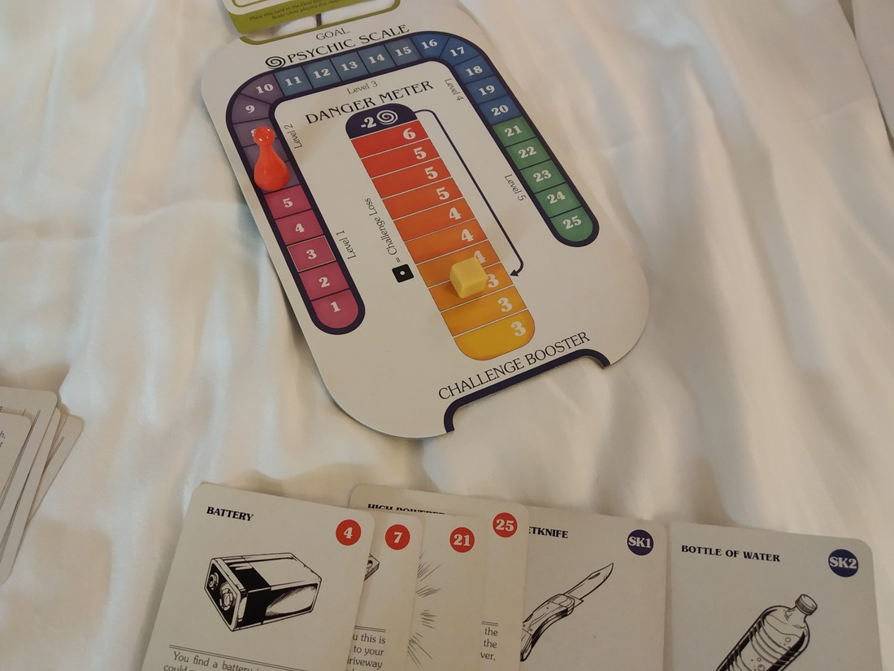

Feel free to skip this blog post. I’m just going to give some thoughts about the games we played for future reference. I expect it’ll be boring for most people – even myself if I ever read this again. I also forgot to photograph most of the games we played.

**Black Orchestra**

This is a cooperative historically themed game about killing Hitler during World War II. We play as real life people who were involved with plots on Hitler’s life and we win if we can assassinate him.

This game session was perhaps the highlight of our convention. It was an incredibly tense experience. We had to organise our plot but we were also at the whims of various events, all of which appeared true to history. Eventually we loaded Betty’s character up with a ridiculous number of guns and sent her in as a sniper.

Despite rolling lots of dice, Betty kept failing to hit Hitler. Fortunately, her attempts never aroused suspicion. We imagined that she was actually a really poor sniper and the shots were going nowhere near anyone. On the last dice on the fifth attempt, we finally won. (A sidenote: had that die displayed the wrong symbol, we might have lost the game completely).

I’d consider buying this game but Betty found it too tense and it future plays might be quite “samey”.

**Bunny Kingdom with In The Sky expansion**

Bunny Kingdom is a game about creating a bunny empire. The expansion adds the ability to spread your bunny empire into the clouds.

This expansion has only just gone on sale. We own the base game so were eager to test out the expansion to see whether it was worth buying. It looked like it might be too complicated to be worth teaching to new players.

With some patience, we eventually found an empty table with this game and a couple of extra players to try it with.

Overall, Betty and I both had a good time with this game. It helped that we both got to do the fun, new expansion stuff. It is more complicated that just the base game, but I think many new players would be able to handle it. I might pick this expansion up in the future.

**Choose Your Own Adventure: House of Danger**

For better or worse, this game is literally just a “Choose Your Own Adventure” book but as a game. It succeeds at what it is trying to do but it is very story-heavy. And these types of books never had great overall stories. The fun was always about choosing your path through the book.

We finished one fifth of the story. Overall its good value, but if I wanted this type of experience then I could have just read the books. That being said, I wouldn’t say no to playing more of it.

**Great Western Trail**

In this game we are competing to be the best person at herding cattle along the Great Western Trail.

This is a modern classic that has a lot of very hardcore fans. It was also the most complicated game we played. While the overall flow of the game wasn’t too hard, there was a lot of stuff in the game. I almost gave up while reading the rulebook. Someone walking by commented that we looked lost and offered help.

Overall the game went well. It might be interesting to play with more players but neither of us were itching to play it again during our trip.

**Heaven and Ale**

In this game we are monks competing to brew the most beer (or perhaps best beer) in our monastries.

This was the only game we just picked up because we had nothing else to play and it looked cool. It was very much a “Euro” style game, with somewhat abstract mechanics and minimal conflict.

It had some neat ideas and I’d be interested in playing it again. I don’t think its a game I need to own though.

**Mechs vs Minions**

This is a cooperative game where we play robot operators battling against constant waves of minions.

This game is quite hard and / or expensive to obtain. It contains dozens of miniatures (some of which are painted) in a giant box. I looked into buying this game at one point but it would have cost about $180 to buy and send to New Zealand. So we made it a priority to play.

We checked this game out of the library three times. It rewarded multiple plays as it contained a number of missions where new rules would be gradually introduced. Therefore we were never overloaded with rules.

We played through the tutorial and the first three missions. The third mission we lost badly, possibly due to some bad luck at the start of the game which ruined our chances.

Overall it is a very impressive game. I’m not sure about its longevity and if I did own it, I’m not sure how much it would get played. The box really is too large to take places.

**The Reckoners**

This is another overproduced, large box game that I had been interested in playing. The theme is based on a book series, where superheroes exist except they are all evil. The goal of the game is to take down the Superman-like villian, mostly by rolling dice.

This game had a feature I quite like in cooperative games – simultaneous turns. This means the game feels more like an open discussion between all players about how to win.

We lost miserably the first time. The second time, we had some good luck at the start so were able to kit our characters out with some gear and we won comfortably.

After beating this game, I don’t think I need to own it. It’s good, but a bit too pricey.

**Rising 5**

This is basically the classic game Mastermind, but as a cooperative game with a fantasy theme thrown on.

It’s an interesting game, but a really easy one. We played twice and had no trouble winning on even the highest difficulty. Worth playing, but we may never play it again.

**Smartphone Inc**

Another game that has been difficult to get. We played it only two player, but it really seems like a game that would be much better with four or five. In this game we are smartphone manufacturers and we are supposed to be fighting over markets. In our game we didn’t do any fighting for market share.

It does have a neat gimmick that involves placing tiles over each other. The tiles are double sided so it feels like a three dimensional puzzle. It was certainly unique, but it didn’t grab us as much as I thought it would.

Another game that was worth playing, but not worth further plays.