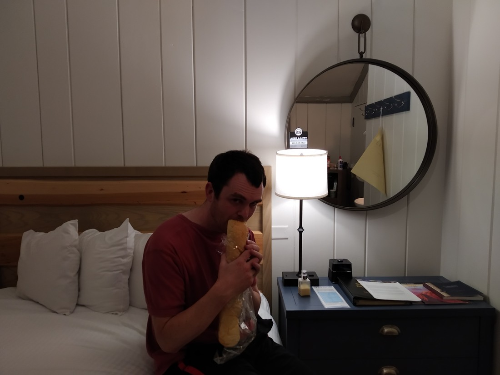

We arrived at our hotel in Orlando at around 5pm. We had a late lunch at the airport on arrival so we weren’t hungry. But eventually we did get hungry. Now we had to figure out what to eat.

There were a number of restaurants at the hotel…

Actually, I’m going to stop calling it a hotel – it was more of a resort. There were four large buildings containing hotel rooms. There was a large pool in the centre with a waterslide, waterfalls and plenty of deckchairs to tan on. There were restaurants and eateries scattered around the buildings. The convention centre sat off to the side, which was basically just a big building containing very large, school gymnasium sized rooms. It was very big.

Okay, so there were a number of restaurants at the resort. But we all know that hotel restaurants are overpriced. In our rooms there were 600ml bottles of water with $4 pricetags. But what I haven’t told you is that we decided to forgo having our linen changed (save the planet!) and instead we received a $10 credit per night. This meant we had $40 to spend on food.

So we found the 24 hour store / eatery in one of the buildings. This place did pizza. Pizza is relatively filling so we ordered one.

Like many foods, pizza in America isn’t like pizza at home. The pizza was $13 and came with no toppings. Toppings were $0.95 each and the choices weren’t that special. The toppings I can remember were:

Ham, pepperoni, sausage, onion, green/red pepper, pineapple, extra cheese. There might have been a couple of more like mushrooms and olives – but no more meats.

We ordered ourselves a ham and pineapple pizza and charged it to our room (another first for us). Came to about $16 (about $24 NZD) due to the toppings and tax but we figured, “Hey, we have to use the credit somehow.” The pizza was cooked extremely fast and probably around 10 minutes after ordering we were back in our room with the pizza.

While having to order toppings separately seems a bit mean, overall the pizza was pretty good value. There was a lot of cheese (probably too much cheese) and so it was very filling. We didn’t even finish it – we had leftovers. That’s how filling it was. I don’t often have leftovers when I have a pizza to myself.

The next day we had the same problem (needing food) so we ordered another pizza. This time we had even more leftovers. These got eaten for breakfast the next day. We still had some credit left but the thought of having pizza three dinners in a row (and once for breakfast) was too much for us.

Near Bryce Canyon we were lucky enough to stay near a grocery store and to have a microwave in our room. We found that American grocery stores have some pretty decent microwaveable dinners (as well as some pretty meh but very cheap frozen burritos). Convenience stores often have a microwave in store that you can use, which is quite neat (not that we did). When we left Yellowstone, we drove 12 miles back to town to grab some frozen dinners once we became hungry.

We’ve been packing our schedule pretty tight so far. This wasn’t planned this way but we’ve been trying to pack in as much walks and sights as we can. As a result, our meal schedule usually looks like this:

+ Hurried breakfast of cereal and bread/toast before we start our day
+ If we need to drive somewhere, we usually grab some fast food before we arrive at our destination.
+ If we are exploring somewhere, we usually grab some fast food after we are done but before we start driving
+ Then at the end of the day we’ll have something small, usually because we had a late lunch or because our options are limited. This’ll usually be stuff we’ve picked up at a grocery store, or leftovers.

I wouldn’t worry about all the fast food and sugary snacks we are eating. As we usually only have one proper meal per day and we are doing a LOT of walking, I fully expect to have lost weight by the time we return to New Zealand.

Anyway, I went off on a tangent there. My point I was trying to make is that we’re not trying to eat fancy. Our tastes are simple and for us, eating out can be both a waste of time and money. On the evening of the first day, we researched what stores are nearby. It turned out there was a CVS and a 7-eleven nearby.

Getting there was a problem. One issue is that we needed to cross a six lane highway. Sure there was a pedestrian crossing 300 metres down the road. But it’s hot. We’ve only just left the hotel and we’re already sweaty. We don’t want to spend more time in the heat than we need to.

The other issue was mentioned in my previous post – thunderstorms. On the second day we hadn’t yet been there and we became hungry right in the middle of the thundery weather. That’s why we had pizza two days straight. We couldn’t leave the resort to find other food.

While the CVS provided us with some average and overpriced cereal and frozen dinners, what we really craved was those that we had in Bryce Canyon and West Yellowstone. These would allow us to eat at our own convenience, would have a wide variety of choice, and would be easy on our wallet. So, we searched for the one store we knew we could rely on to have these frozen dinners: Walmart.

(Walmart really does have everything).

There was a Walmart 1.6 miles away from our resort.

1.6 miles is nothing to sniff at but given the distances we’ve been walking each day prior to coming to Florida, it really wasn’t that far. Only, we’d never had to walk in Florida heat before. We were also limited as to when in the day we could walk. Couldn’t go early in the morning (because we’re not awake). Couldn’t go in the afternoon (because of the thunderstorms). The walk requires us to walk along a highway with no footpath for most of the 1.6 miles. We’d rather not do that in the dark.

On the final day we had exhausted our snacks and were overdue for a big shop so after the morning events finished, we set off for Walmart. We encountered some troubles along the way. Florida is really swampy and a couple of times we had to turn back because we were blocked by watery ditches. At one point when found a huge swarm of non-biting but still very annoying bugs. It was pouring when we were in Walmart and it was threatening to rain the entire time we were walking back. It did started pouring again as we reached the 7-eleven near the resort (so at least we had some shelter we could wait in for it to lessen). We were basically forced to buy Powerade at Walmart because we were exhausting the water we had brought too quickly and our hydration was becoming questionable. On the way back we basically gave up trying to walk through the grassy verges and resorted to the less safe, walking on the shoulder.

I would never have thought our most challenging hike on this trip would have been a 30 minute (one way) walk to Walmart. All for two frozen dinners, some cookies, some crackers, and some mystery items I’ll explain later.

…So this post ended up being very different than what I had originally planned. Hope it gives you some more insight into our trip, as well us serving as a reminder to us about what went down.

Oh super long Walmart Sub, how I have missed you. (This was taken back at Grand Canyon).