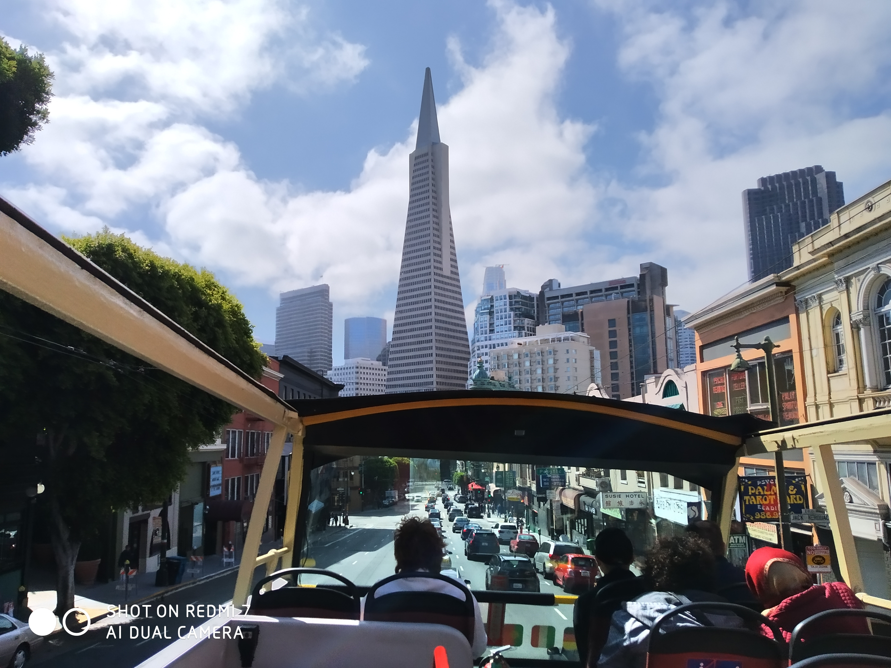

Picked up a shiny white Ford Fusion hybrid from a nice man at the Avis booth. Fun fact about him: he and I share the exact same birthday.

So driving has been an interesting experience. We were super happy to find GPS in the car (had we specifically asked about it it would have been about $10 a day ($140 for two weeks). But driving has been an interesting challenge otherwise.

Driving on the right instead of the left is generally okay. Usually you’re following other drivers or lines on the road. But turning out of one way roads can be a bit confusing. And San Francisco has a LOT of one way roads. At least the GPS means we won’t wrongly turn down them accidentally – as long as we follow the instructions exactly. I did fail to do that twice on the drive from the airport to our hotel (embarrassed face).

Another challenge is the signs. I read up on the rules of the road but I never bothered to check what the signs look like. Driving out onto the road made me question both “What is the ordinary speed limit around town” as well as “What do speed limit signs even look like”. It turns out they are the ones with the words “Speed Limit” on them.

Another challenge are the intersections. They don’t have lines to show you where to stop. At least common sense said to me “Don’t park on the pedestrian crossing”. Another challenge – stop signs. There’s no markings on the road – you have to notice the signs. And there are a lot of them. Four way stop sign intersections are really common and you need to ensure you stop and let everyone who arrived at the intersection before you go. I’m afraid I’ll forget and just roll through these.

I also found that “glancing in the rear view mirror” has been built into my muscle memory. I am still often glancing to my left even though the mirror is on my right.

I expect once we’re out of the city, we’ll have no trouble – but I was a bit nervous during our first drive. Don’t want to back into anything and risk our shiny car. We then spent the next day walking and taking the bus everywhere.

> Double decker roofless tour bus FTW