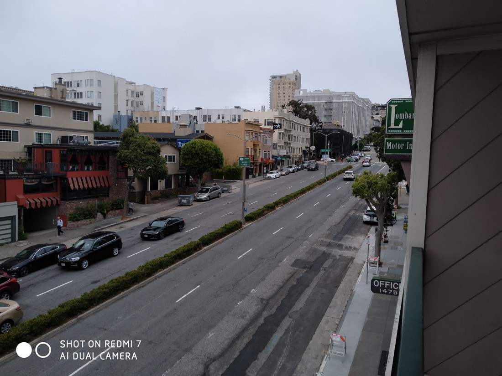

Lombard Street is proclaimed as the “Crookedest Street”. That’s a bit vague. Does it mean, “In the world”? Or, “In San Francisco?” Your slogan is unclear street.

What it actually is is a normal street that has a portion that is so steep that they added some small hairpin bends all the way down to extend the length and therefore reduce the gradient. It’s quite famous. It’s covered in lovely flowers and quite the tourist attraction. There’s a constant queue of cars waiting to drive down it. I think everyone had someone in those cars filming their descent.

Fun fact about our motel, it’s on Lombard Street and located only four blocks from the famed “crookedest” section. Weirdly, this is the view from our room\:

Yes, you are seeing it correctly. The street is relatively flat, goes in both directions and has four to six lanes. Can this really still be called Lombard Street?