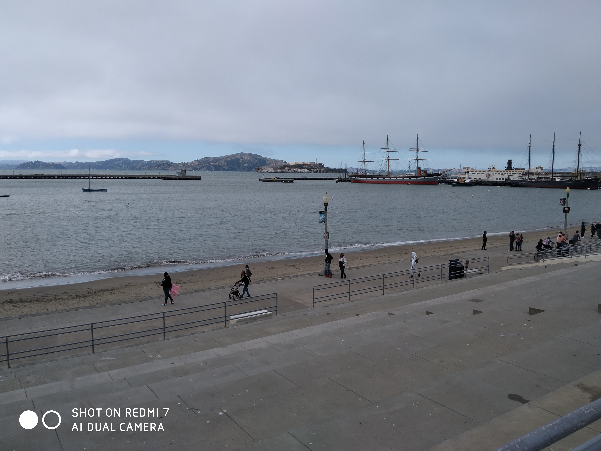

When we left the airport, we were treated to our first taste of Californian summer.

Maximum temperature on the day we arrived: 18 degrees Celsius. Worse than that, San Francisco is a very windy city (Betty accurately dubbed it “America’s Wellington”) so it feels colder than that.

> A picture towards Alkatraz – notice the gloominess

What’s going on San Francisco? I was expecting scorchingness. We packed mostly for “Mid Summer”. And you’re only giving us “Early spring”?

This is a photo of us crossing the super windy Golden Gate Bridge at 50 mph in our tour bus with no roof. Ignore the smiling faces – we’re secretly freezing.

I already googled “Las Vegas” temperature – which is our stop in two days’ time. It was 39 degrees Celsius there today.

I expect I’ll come to miss this weather very soon.