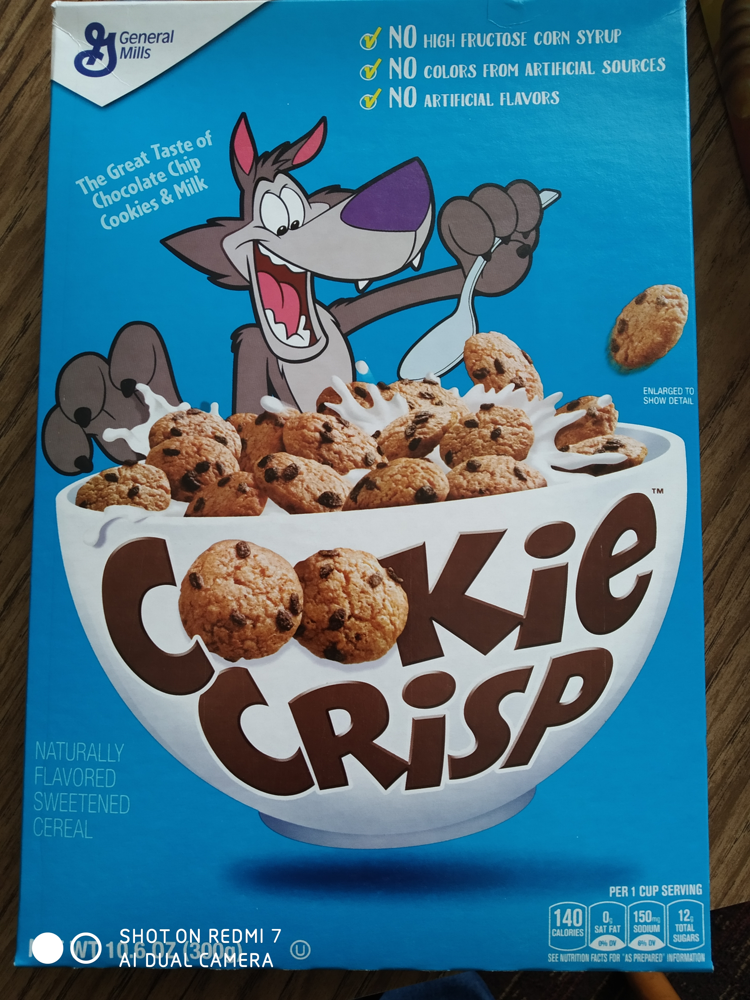

When we arrived at our hotel, we were quite hungry – having had only limited quantities of air-plane food in the last 16 hours or so. Our receptionist at the hotel recommended us a burger place across the road that was pretty good.

It was too expensive – so we went elsewhere.

The place we went to was only okay and was still very pricey. We both agreed that the pickles were perhaps the best we had ever had but the rest was nothing to write home about. By happenstance, our tour guide on the next day mentioned that this place had won some “best burger” award somewhere.

If that was the best burger you have to offer America, we’re going to be a bit disappointed. Also I hope food prices are cheaper outside of San Francisco.

> This picture is unrelated. We scoffed at all the sugary cereal the supermarket had but figured I needed to experience more American culture by eating like they do so I bought this for a laugh. I promise we’re eating healthier things than just burgers and cookie cereal.