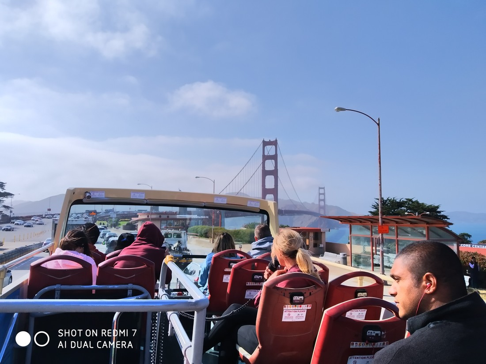
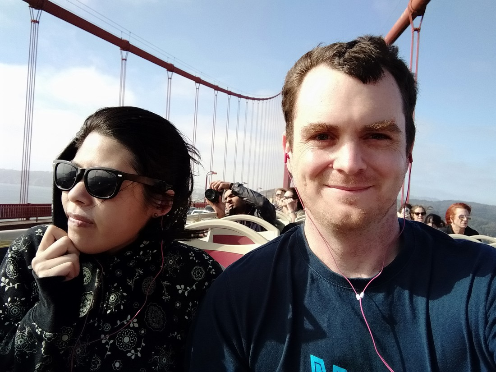
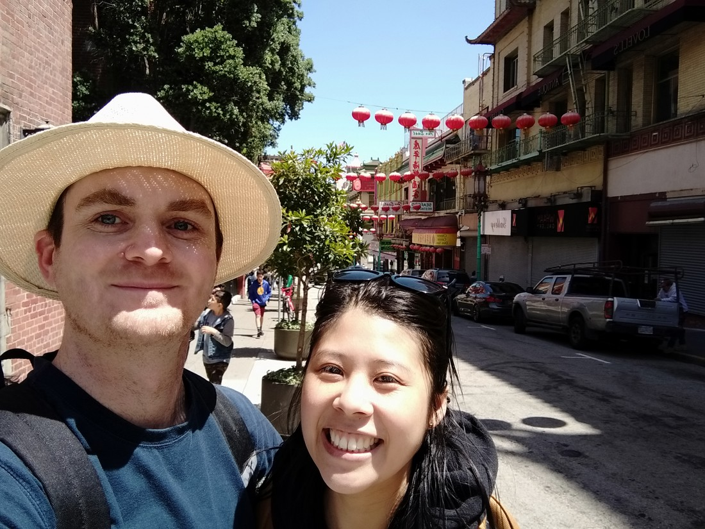

So I’ve posted about cereal and being cold but some of you are probably expecting actual photos of actual things we’ve seen. After all, we could have just stayed in New Zealand and eaten cereal and been cold.

> Near the financial district

We spent our day today riding round in a bus. It was rather pricey but was definitely worth it. We got to see lots of different parts of San Francisco along with some commentary about those parts.

> City Hall. According to our commentary, “The gold at the top of the dome is real gold. The gold on the windows is real gold spraypaint”

I was actually surprised about the route that was taken. As I said, it showed a lot of different parts of San Francisco, even the bad parts. It went straight through the “Tenderloin” district which has a large homeless population.

(I considered taking photos of this but remembered that these are still people and do deserve some dignity).

Other topics mentioned by our tour guide and tour commentary included the gay population, the Japanese population being evicted during World War II, the hippie culture, the HIV epidemic bands playing to “pharmaceutically enhanced” audiences, Acid, police taking bribes and more. I tip my hat to you San Francisco for not shying away from controversial issues in order to present an accurate history of your city – good and bad.

And what tour would be complete without a trip across the Golden Gate Bridge? (Painted “International Orange” is an often repeated fact). We crossed four times today. Once across and back. Then several hours later a second trip across and back when we realised that the quickest and cheapest way to get back to our hotel was to catch the tour bus around again.

> I already mentioned it was cold, right?

We also briefly visited San Francisco’s Chinatown (well, one of them)

Also, Golden Gate park (modelled after New York’s central park but basically built on sand).

And Alamo Square

> Despite the name “Painted Ladies”, these are actually just painted houses.

We also visited the science museum where we were asked to do a survey about vaccines and the first exhibit we saw was about human evolution. Overall I have to say, San Francisco has proved itself as a very progressive city. Sometimes hear stories about people in the USA and so far it appears those stories might be edge cases. What will going further inland bring?

