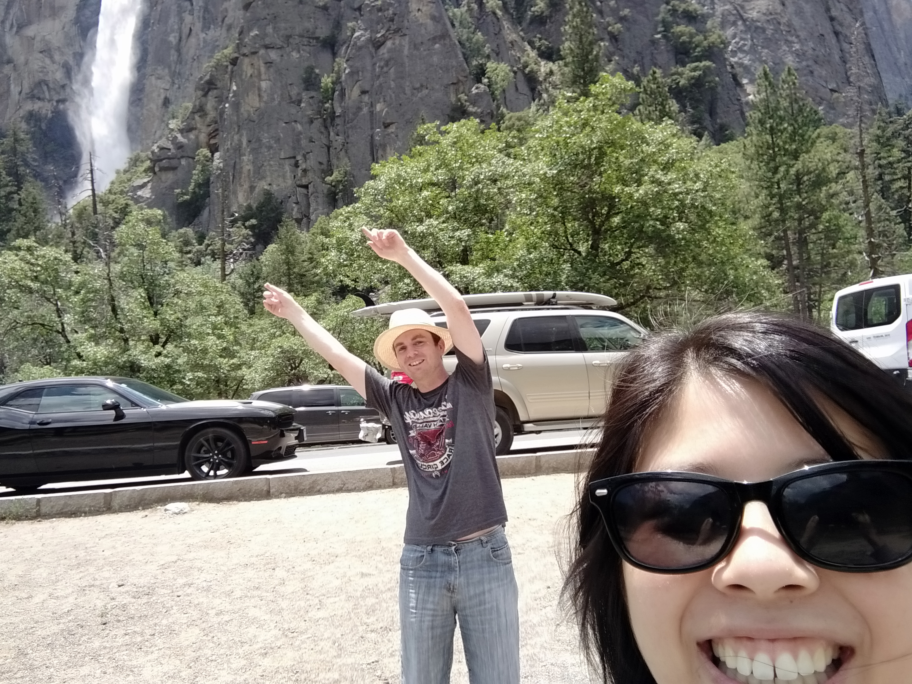

A week prior to leaving New Zealand, I noticed something odd in the route Google Maps calculated for us for one day. Instead of a 2 hour drive out of Yosemite and over the mountain range, it was scheduling an almost 5 hour drive over a different part of the mountain range. I had seen this previously when planning the route in Winter due to the roads being closed. It was now well into the first month of summer, why was the road still closed?

The answer: because of snow. According to the road’s website, the snow levels in the area were 150% of normal and so they were taking longer to clear than usual. This worried me slightly. San Francisco was much colder than expected. Will we be getting snow chilled breezes in Yosemite?

No, actually. Everything’s fine. It’s quite warm. While our travel plans may need to change for Saturday, we have received an added bonus of the extra snow in that there is a lot more water about in Yosemite for this time of year.

> Mirror Lake

There are two main waterfalls that can be seen from the road in Yosemite. Bridal Veil falls (not a very original name) and Yosemite falls (split into upper and lower). Both fall from the tops of the valley, all the way to the bottom.

> Upper Yosemite Falls

> In case you missed it, I thought I’d help by pointing out the waterfall

Well, kinda. A lot of spray is generated, which drenches the viewing points at both locations. We didn’t even make it all the way to either viewing point – we were getting too wet. You can no longer see the falls from those locations – because at those points, the falls are all around you.

> Bridal Veil Falls

I think I read that Yosemite falls doesn’t flow all year round. It looks best in Spring. Lucky us, we managed to get the Spring waterfalls in summer.

> I was being drenched while taking this picture. It’s a miracle its even usable.

And because they’re high up, they can be seen from a lot of different places in the valley.

> Upper Yosemite Falls at the top, Lower Yosemite Falls at the bottom.

And the streams look pretty healthy too. At the moment they’re pretty raging so it is forbidden to enter the streams – not even with a boat.

I wouldn’t want to anyway. I expect they are quite cold.