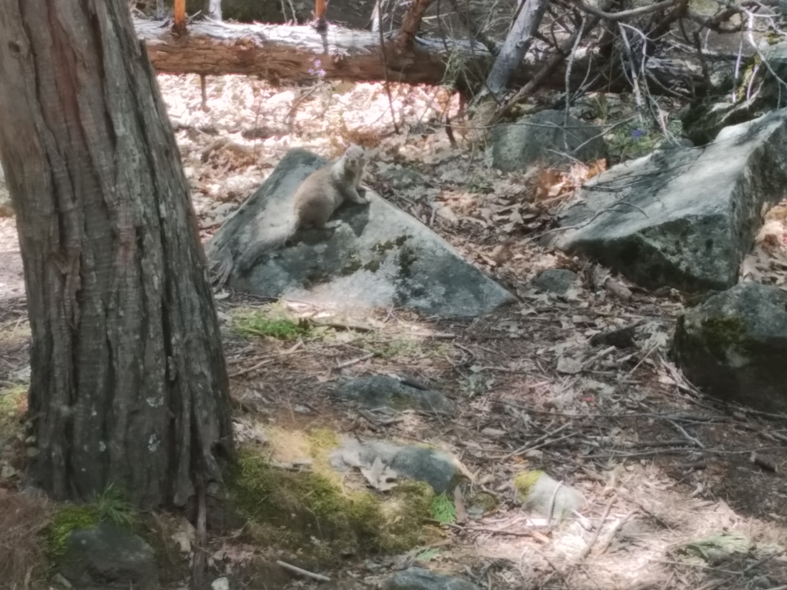

We have now had our first squirrel encounter. Even saw a dog chase one off. They were cute. They’re no cats though.

> “What? You never seen a squirrel before?”

Next on the list of “Animals Americans are probably sick of but we haven’t experienced” is raccoons. Might need to hang out around some dumpsters at night.

There’s also a fair number of birds in Yosemite. Either that or its the same blue bird every single time, no matter where we go in the valley. It looks the same, so we can’t rule out that it isn’t.