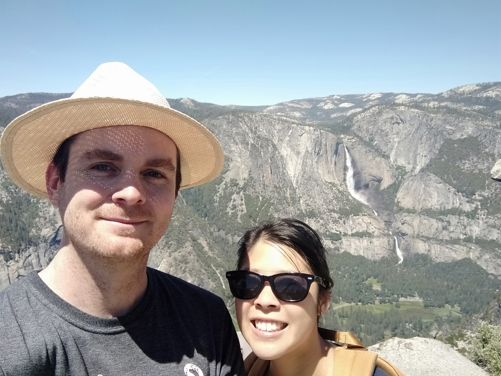

Here’s some photos from Glacier point. Instead of explaining how amazing this place was, I am instead going to mostly complain about the crowds while sprinkling in the images which made bearing them worthwhile.

Glacier point is a one minute walk, wheelchair accessible viewpoint only a one hour drive from Yosemite central. While Sentinel Dome had views of the entire landscape, Sentinel Dome offers better views down into Yosemite Valley (as well as some decent views of the landscape).

> Upper and Lower Yosemite falls again

Glacier point is located within walking distance of Sentinel Dome. We decided to drive there. That was a bit of a mistake. It took about five minutes to drive there and another 15 minutes to get into the carpark and find a carpark. It was now in the late morning and the crowds were gathering. It was also a Saturday.

> Half Dome rock again. Betty is not in this picture.

We squeezed into a carpark, walked past several smelly outhouses (all with queues) and jostled for positions at the viewing locations. Okay, it wasn’t too overcrowded – but mostly because the views were everywhere and the queues to get into the carpark prevented too many people from arriving at once.

> Even queues for the best selfie spots

When leaving, the queue to get into the carpark had quadrupled in length – if not longer. We were super lucky that we were not half an hour down from Sentinel Dome, otherwise we might never have made it to the Tioga Pass road (which was only open for one hour – more on that later).

> “Oh rock. Why are you so pleasing to look at?”

After we left, we had to go back down into part of Yosemite Valley in order to get back up the other side and continue on our way. At this point is was 1pm and we got delayed for 30 to 45 minutes in a traffic jam of cars trying to enter Yosemite.

> Selfie camera doesn’t appear to be the best in high light situations.

Yosemite is a treasure but clearly everyone knows about it. The takeaway for this is that to get the best experience from anything while travelling, you need to get up early. We only got up moderately early these last two days and we had a good time, and we had a good time but then we got stuck in queues in the afternoons. Hopefully we can manage the willpower to get up earlier in the future.