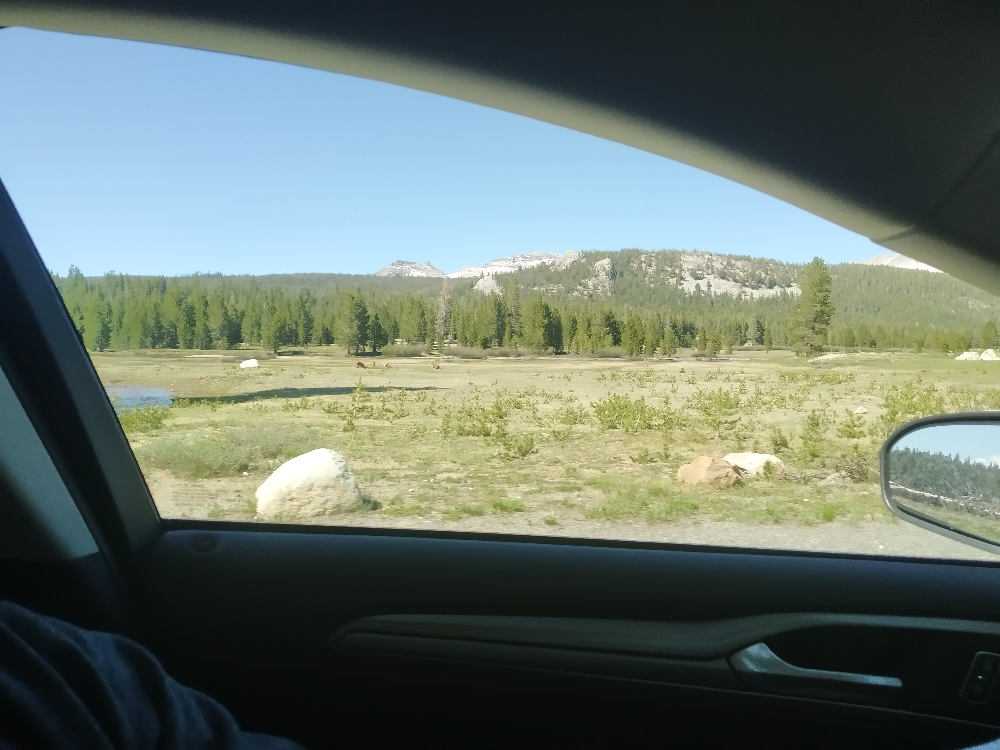

The Tioga Pass road is a road that runs over the Tioga Pass (name makes sense). When we flew out of New Zealand, and four days before we were planning to use the Tioga Pass road, the road was still listed as “closed” with “no expected date to reopen”. Without this road, we would have to either choose to do a 3 hour detour through a different pass, or forgo one of our accommodation bookings and go the non-scenic way to Las Vegas. Both acceptable choices but neither were ideal.

But good news. The road’s website announced that they had finished clearing the snow. Unfortunately there was still other non-road maintenance that needed doing. But they were willing to open the road for small windows, twice a day.

These temporary re-openings started the day before we needed to use the road.

> Waiting for the road to open

Phew.

It meant we had to be at the start of the road at a certain time. Fortunately we were able to do everything we wanted to beforehand (Sentinel Dome, Glacier Point) and get through the traffic jams at Yosemite to make it on time.

And I am glad we did. The road was rather scenic.

It was just a pity we were instructed by the rangers not to stop. Several deer went by unphotographed. Many great vista points went by unappreciated. Large banks of snow went by un-snow-angeled. But at least we were able to experience it and get to our desired destination.

> If you look closely you might spot some deer