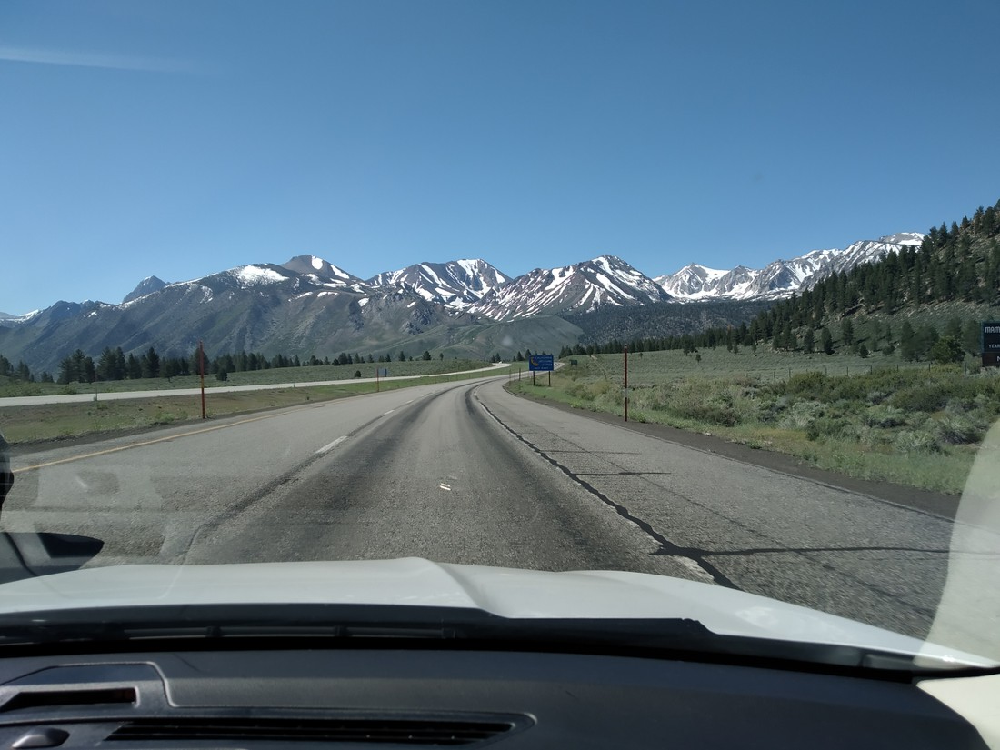
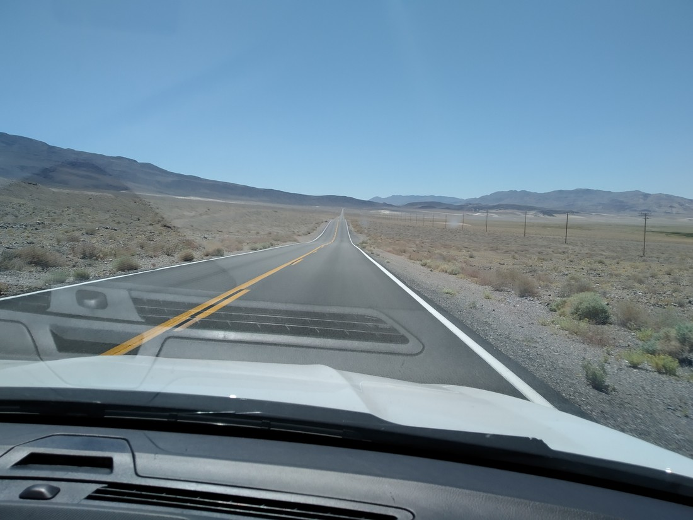
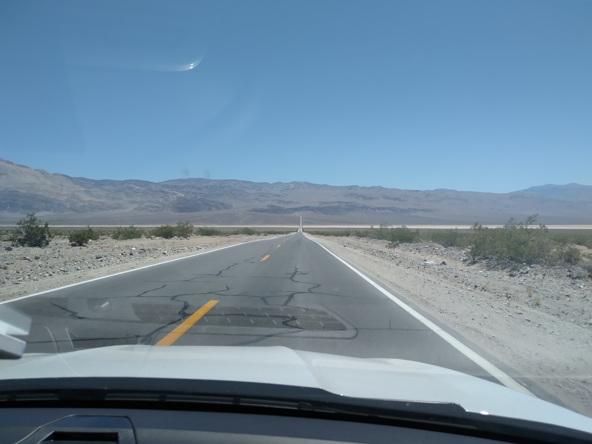

Today was a driving day. 340 miles – slightly more than the distance from Hamilton to Wellington.

Not much to do other than to look at the scenery and try and take photos without reflections on the window glass.

Saw some trees. And some rocks.

I thought I saw a bear once. Either it was a cow, or a bear that could transform into a cow.

In other words, nothing interesting happened worthy of a blog post. But I made one anyway.