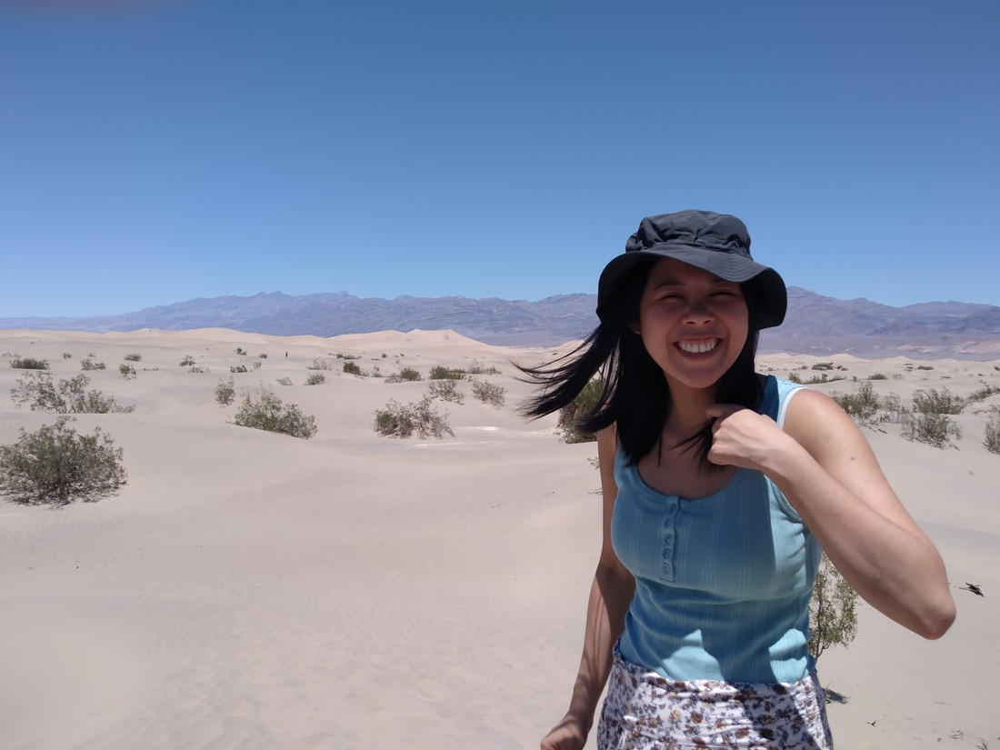

We travelled south from June Lake. Our accommodation that night had been near a ski field (not currently in use due to summer). Leaving our accommodation we were greeted with a wonderful view of the mountains, still with some snow, and a rather scenic waterfall. It was a nice climate.

Our route for the day went through another National Park. But this was a different kind of National Park. A more sinister National Park.

> Windy

An article about the park recommended, “Don’t visit it in summer”. It literally has the word “Death” in its name.

> We were there around noon

Death Valley is a desert. A hot desert. Like all good National Parks it had information panels at interesting sites which might have explained why it was so hot. We didn’t read any of them – because it was so hot, we didn’t want to be out of the car any longer than we needed to.

> 108 degrees Fahrenheit is just over 42 degrees Celsius

It was mostly rocks. But pretty rocks. We won’t deny that it was scenic. There was rocks of many different colours. Also, some salt flats and one large patch of sand dunes.

But for our whole time there we were too preoccupied with the heat. First it was a game, watching the temperature climb on our car’s dashboard. Then once we actually got out and experienced it, it was amusing how warm it was. When we were back in the car, naturally the question came up, “Do we even want to get out again?”

> Why get out when we can see things from our air conditioned car?

We did will ourselves out one more time to look around the remains of a 1700s era settlement. I’m guessing at the date. As I said we didn’t stop to read the sign. It might have been nice to read more about why people were crazy enough to try and settle here but once we were half way round the loop, we decided to get back to the car as fast as we could.

> So far away from our car!

Death Valley is a place worth visiting. But unless you don’t mind being extremely sweaty, visiting it in Summer won’t give you the full experience. We came there because it was basically right on our route. If we did this trip again, we’d probably still go through Death Valley. But after experiencing Yosemite first, they’re definitely not in the same league when it comes to National Parks.