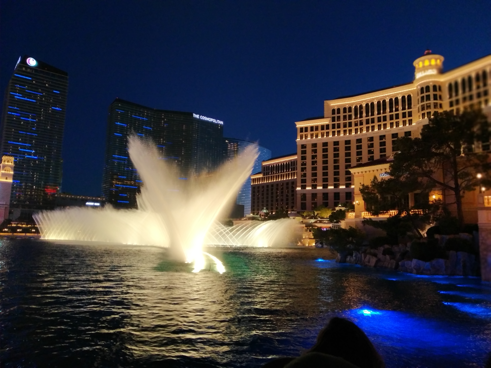

Like Death Valley, Las Vegas just happened to be on our route. We happened to want to go from Yosemite to Grand Canyon and Las Vegas just happened to be on the way. We also couldn’t do that whole distance in one day and Las Vegas just happened to be half way in between. Being known for its hotels and its nightlife, Vegas was the perfect place to stop for the night.

Interesting fact about Las Vegas hotels: they are relatively cheap. However, they all (with one exception) have a “resort fee”. This fee covers stuff like using the pools, gyms, WIFI, parking etc. The fee is also not optional – it has to be paid. Therefore accommodation isn’t cheap – its about normal (but still not too pricey).

The place we stayed was rather nice. Not too pricey, easy parking, and still relatively close to the main strip. We came from Death Valley but Las Vegas was still really hot. After arriving late in the afternoon, we retired to our room and waited until 8pm which was both cooler, and just before the sun had set. Then we hit the town.

We identified the Bellagio hotel and Casino as somewhere we really wanted to check out. Fortunately we were staying only two blocks away. Every 15 minutes the Bellagio puts on a water fountain display. This was featured in the movie Ocean’s Eleven but what that movie doesn’t tell you is that the pavement is crowded with people watching it.

Then we headed inside to check out its hotel lobby and conservatory – which were both over the top amazing.

> Glass flowers adorned the lobby ceiling

We then figured we may as well walk up and down the strip checking out the other hotels and casinos. What we didn’t realise was exactly how much walking was involved to get from one casino to the next. We only checked out two others before we got tired of walking and decided to head home.

> Ceiling in the foyer of the Venetian casino

We got back shortly after 10pm and went to bed. Yeah, we’re not Vegas people.

It’s just not for us. While it was nice to see the lights and the spectacle that is Vegas, there was a lot about it that made us uneasy. Trucks advertising “Girls direct to your room” constantly drove up and down the strip. We’d be frequently walking along inside the casino and smell the unpleasant odour of someone smoking (apparently that’s legal). And it’s not like the movies – casinos aren’t filled with people laughing and celebrating. It’s filled with people grimly watching the screen or cards in front of them. I was shocked to see so many kids walking in and out of the casinos (with their parents – tourists I presume as I don’t think I saw any gambling).

Like Death Valley, it was worth experiencing but we didn’t need to spend much time there.