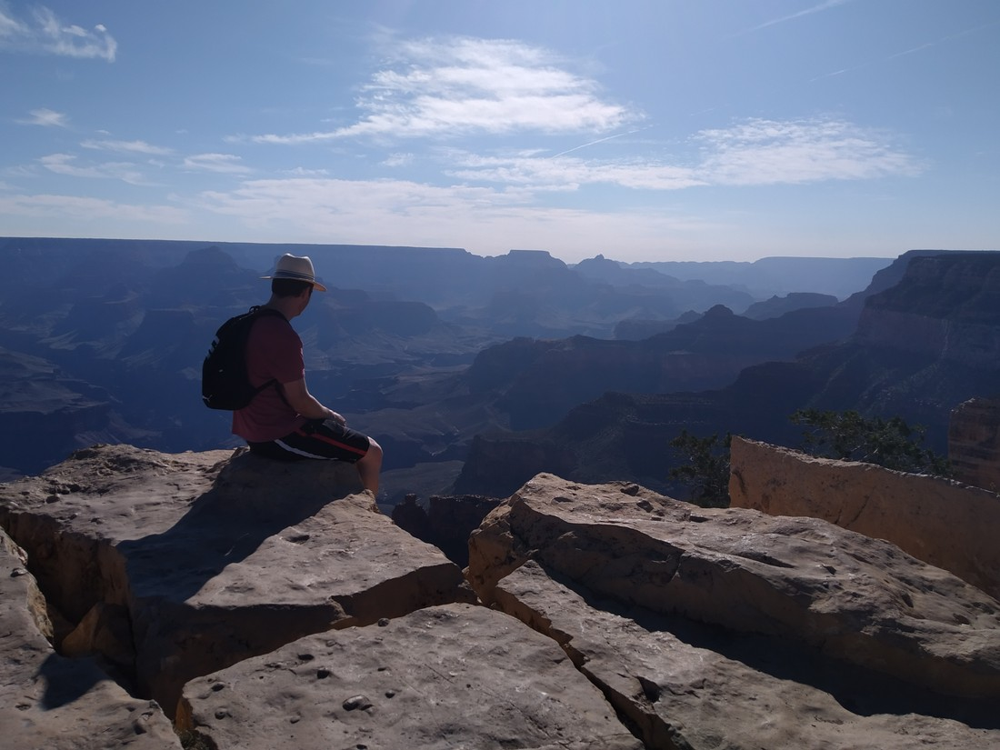

Our next stop after Las Vegas was the Grand Canyon South Rim. The South Rim is one of three places the Grand Canyon can be viewed by the public. The other two are the North Rim (which is extremely isolated) and the West Rim (which is more commercialised due to it being much closer to Las Vegas). If someone says that they’ve been to the Grand Canyon, check which part they went to because there is only one true rim (that’s right, we’re now Grand Canyon snobs).

The big advantage of the South Rim is that there are numerous viewing spots and a 12 mile trail basically along the rim itself. And it is gorgeous.

It is really hard to grasp the scale of the canyon. It does suit the name “Grand”.

At first I was like, “Why would we want to walk along the rim?” We can see so much from near our accommodation. But we had nothing else to do the night we arrived, and exercise is apparently a good thing. So we started walking East along the rim. It turns out I was wrong.

The Grand Canyon is a very strange shape. The rim walls are not straight, or flat, or close to any shape imaginable. This meant that every viewing point felt slightly different and slightly new as we could see slightly different parts of the canyon.

> And as the sun set, in different light. The blue tinge you see appeared closer to sunrise and sunset.

We walked for a long time. Almost to dusk. Then we caught the shuttle back to our accommodation and called it a night.

The next day we got up early and walked the other direction along the rim.

Once we had enough of that, we caught the shuttle back to our accommodation and started walking down into the rim.

I was reluctant to do so because I figured, “Why lower the elevation when we can see so much from the top?”. Again I was proved wrong as the path provided a slightly different way to experience the canyon.

We even stopped several times on the drive out to view it.

I took so many pictures while we were there. It really is so photogenic, so pleasing to look at.

It was definitely worth the Arizona heat.