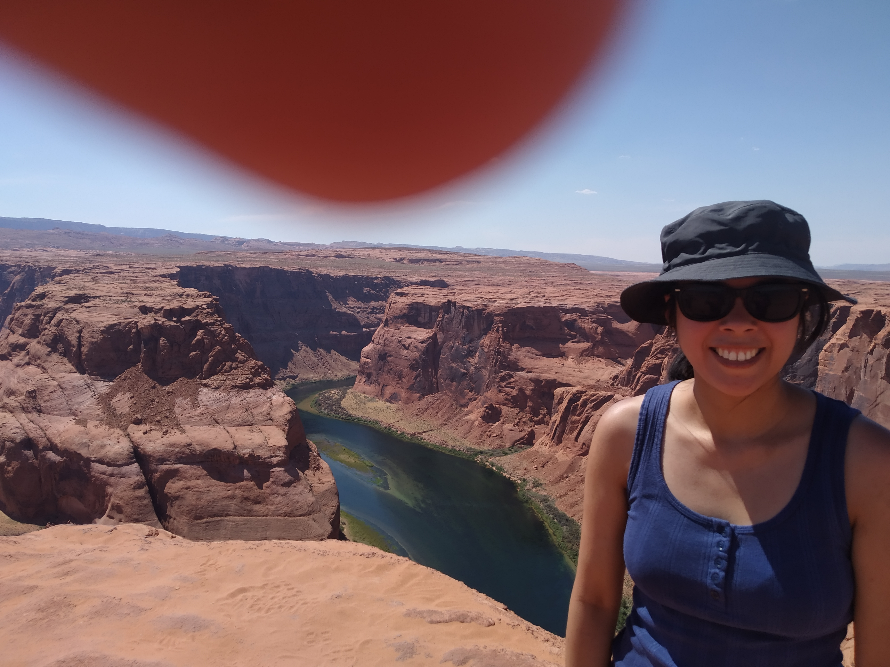
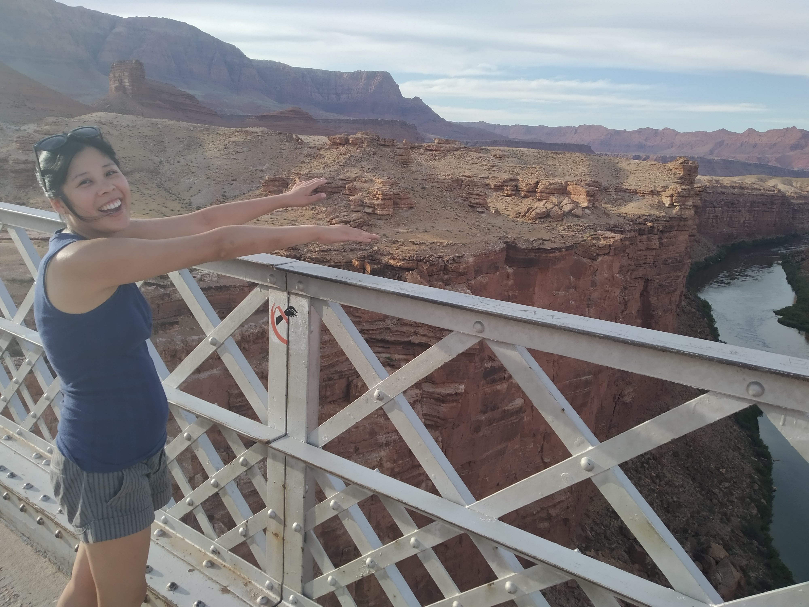

This is the story about how we spent a day in the hot Arizona sun, visiting canyon after canyon.

We started our day with the Grand Canyon. It’s big. It’s grand. It’s also quite cold at 7am in the morning. Fast forward two hours and we were wishing it to be cold again. Trying to hike down and up the canyon wall perhaps wasn’t the best thing to do in the mid morning sun. We were quite hot and tired.

> Remember this? From my previous blog post?

On the way from the Grand Canyon, we noticed this interesting canyon on the side of the road. I don’t know the actual name of the Canyon so I’m going to name it myself.

> Me, spending some quality time with my new canyon friend

The “Not as Grand Canyon” was relatively minor compared with what we had experienced previously in the day, but we both agreed that it was still a nice canyon to visit. The Grand Canyon is sometimes too big for its own good. It’s nice to have a more intimate, up close and personal, experience with a canyon sometimes.

> Betty after being told, “act excited”

We had also identified a place called Horseshoe Bend as a place worth visiting too. It’s a section of the Colorado river that bends in a horseshoe shape (very good naming). It is very scenic, as you will see below.

It was recommended that we visit Horseshoe Bend while the sun was still high in the sky, to minimise the shadows. So we dropped by in the early afternoon. Boy was it hot. There was a ranger at the start of the 1km path to the bend warning people to take water. To get there, we literally trekked through the desert.

> Not sure why this photo was taken. I must have thought that the desert looked pretty and forgot about the people in the foreground.

It was hot. It was windy. It was sandy. The wind blew sand in our face. It was unpleasant. This was not a free attraction either – we had paid money to do this. We also hadn’t eaten since 7am so we were starving. Overall, not the best canyon experience. But it certainly was pretty.

> In my defence, it was very windy and I was gripping my camera tightly so as not to lose it. A little Photoshop magic once we get home should remove my thumb.

After finally eating a very late lunch / early dinner, we progressed on to our accommodation at a place called Marble Canyon. Marble Canyon is really just another section of the Colorado River. By this point in time we had had enough of canyons. But, we’re in the area and without internet access, we didn’t have much else to do. So we walked to the footbridge.

> “Look Ma – no hands!”

I must admit, I did like this canyon. Maybe it was just because it was now later in the day, and cooler.

> You did good canyon. You did good.

It certainly helped that Marble Canyon is very remote and dare I say it, peaceful. While our laundry was laundrying, we sat outside watching the sunset make the clouds change colour over the desert. It was nice. I wanted to capture the moment in a photograph, but I was too slow and the pretty sky colours had gone by the time I had grabbed my camera. This was the best I could get:

> In the distance, nothing but desert and hills

Overall, a lot of canyons but we’re still eager for more. Which is a good thing because packing more stuff into today means we’ll get to spend more time in Zion – which I understand has lots more canyons.