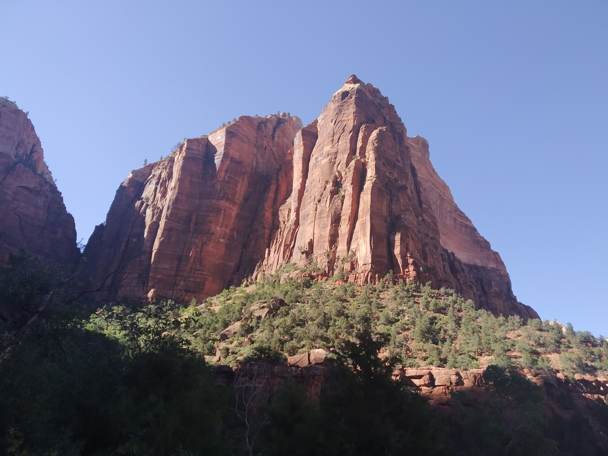

One of the definitions of “Zion” is “the kingdom of heaven”. That’s a big name for a National Park to live up to. We had heard good things about this park in particular and with it being relatively central, Zion was always on our list of places to visit.

But Zion isn’t going to be the highlight of our trip.

> “WHATT??? I’m not amazing?”

Zion is a great place and people should visit it. We still had an enjoyable time there but there were issues that limited our enjoyment. Before I start describing them, I am going to preface by saying that I am fully aware how minor and stupid some of these issues are.

> For one thing, this cute deer with furry antlers had ruined this garden.

We decided to leave Grand Canyon slightly earlier than we had anticipated when planning this trip. We also decided to visit Horseshoe Bend on the same day – which would mean we could skip visiting Page. The reward of this unexpected ahead-of-schedule-ness is that we could get to spend much more time in Zion.

The first trouble was traffic. We were travelling a scenic byway. It turns out that scenic byways aren’t very wide and when its windy, overtaking slow traffic can involve a lot of patience.

The second trouble was road works. The road into Zion had two different spots that had been reduced to one lane. It was peak summer visiting season so this resulted in further delays.

> Zion’s 1.1 mile Mt Carmel tunnel (not pictured) was so tight that it had been reduced to one lane to reduce the risk of accidents

The third trouble was parking. We already knew that parking in Zion was unlikely at the hour we arrived. It turns out that there’s barely any parking in Zion. That’s fine. We continued on to Springdale, where most people park before catching the shuttle in. It turns out parking is a premium in Springdale too. The city hasn’t build any large parking lots. Instead it has built several small ones along the main street, all of which charge $15 to $20 USD. Many of these parking lots aren’t even near the park entrance, and so you have to catch another shuttle to get there.

The fourth trouble was road works again. Springdale’s main and only street had been reduced to one lane – so more queueing. To make matters worse, the roadworks divided the usable lane and our accommodation.

By this point it was much later than we had anticipated arriving. I had given up trying to figure all this parking out. We just paid the $20 USD (about $30 NZD) just so we could park conviniently and enter the park. After all, we’re here to experience places, not to waste time being a cheapskate.

The fifth trouble was the heat. I’m not sure of the exact temperature but I estimate it to be low 30s. Not problematic, but not pleasant if you plan to be out in the sun all day. Our first walk resulted in us consuming all of the water in our watered bottles and led to us darting between what limited shade there was. It turned out that once we fully entered the park, the canyon walls provided ample shade to lower the heat. It was just unfortunate that the first walk we attempted was outside the canyon.

> Savouring the precious moment of shade

The sixth trouble was the people. Zion has a lot of shuttle buses, and each shuttle bus has another bus sized trailer. It was a hassle having to queue and squeeze into the buses. It wasn’t as bad as Yosemite, but still not great.

The seventh trouble was that a large number of Zion’s walks were closed. Winter had been quite harsh and there had been a lot of rockfalls. It sounded like the park still hadn’t decided how to try and clear them. The few walks that were open were either busy, or dull.

> Zion – your “Emerald Pools” are a bit lacking in emeralds

I think that all these troubles led to our first experience of Zion being tainted. Any of these factors by themselves would not have dampened our mood. For future days, I will try and not be in a “we need to rush in order to maximise our time there” mindset. Instead, we’ll be taking our time in order to better enjoy the journey. And perhaps keeping expectations lower might help too.

> Sometimes you just need to go with the flow

Eventually, after resting and walking a squirrel heavy trail, we found enjoyment in our time at Zion.

At least until our room neighbours at the motel checked in when we were trying to sleep.