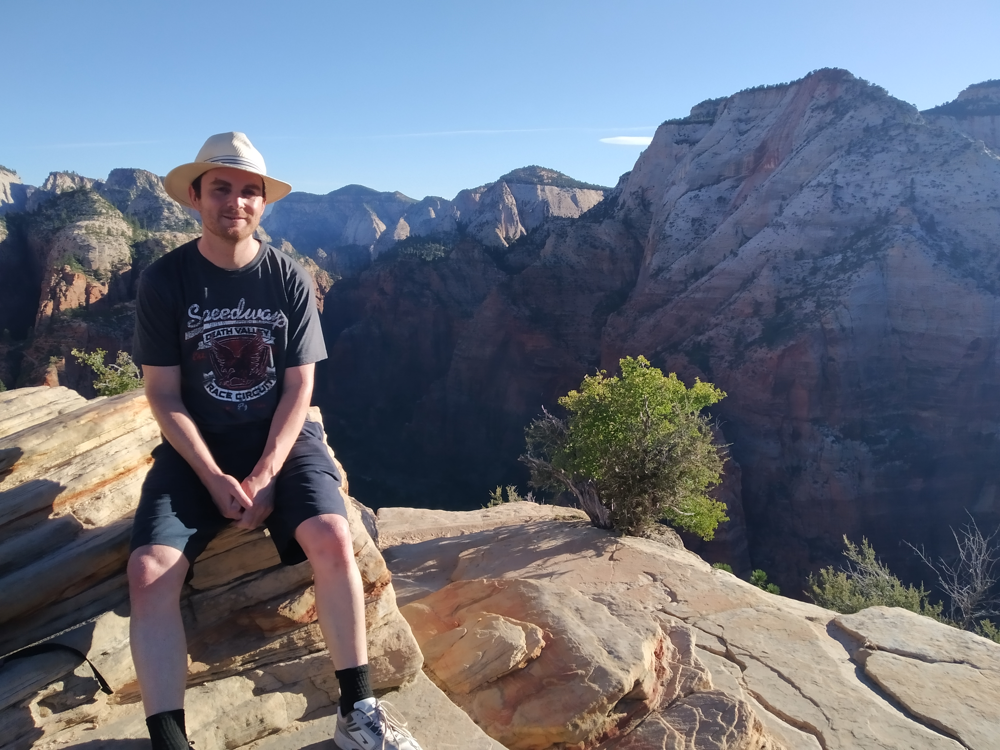

Angels Landing is a hike inside Zion National Park. It is a hike up the wall of the canyon to a place “so high that only angels can land there”. Well, we hiked up there today so either we’re angels, or the name is an exaggeration. Also, why is it not “Angels’ Landing”?

> The summit is in the top right corner. I don’t know why Betty is pointing to that guy in the tan t-shirt.

Part of the appeal of this hike is the views. The peak is in a central part of the canyon with a full 360 degree view.

The other part of the appeal of Angels Landing is that it is a “dangerous” walk. Part of the hike takes you along a narrow ridgeline with unsurvivable drops on both sides. Signs warn not to attempt the hike if you suffer from fear of heights, balance issues or are a young child. Nine people have died on this track.

So the good news Mum and Dad is that you don’t need to worry. We’ve already done it and survived. We figured the chance of survival was relatively high because this hike would be attempted by many hundreds of people each day. And therein lies the problem. I mentioned before that Angels Landing involves a very narrow, dangerous, and quite long ridgeline and climb. Climbing this part would be slow by yourself. Climbing this part along with hundreds of other people involves a lot of patience.

> Here’s the same photo as above, but from a different angle

Upon discovering this hike while planning our trip, we decided we had to do it. Then we found out that the dangerous part of the climb involves queuing for one to two hours. In the hot sun. It’s popularity is a problem.

After spending some time at Zion on Wednesday afternoon, we had run out of hikes to do. The other main hike, “The Narrows” didn’t interest us much as it involved walking up the Virgin river that runs through Zion. There’s no path. The river is the path. Other than that, Angels Landing was the only other strenuous or moderate hike left that wasn’t closed due to rockfalls. After having our confidence boosted by overtaking people on the hikes that day, we decided that we’d do Angels Landing and we’d do it properly.

Which meant waking up at 4:45am.

> Why are we up before the sun?!?!

Starting early in the morning meant we could beat the crowds and the heat. The only way into Zion is by bus and the earliest bus left at 6:00am. So we got up before dawn, packed everything into our car and headed into the park to claim one of the precious free car parks. Then we waited for the bus.

The bus didn’t start its route where we waited. It started back outside the town of Springdale on the edge of the park. As we waited, we joked that the bus might be full, and it would just drive by leaving us shivering in the wind on the side of the road. I found this thought hilarious. Surely there would be some people, but not everyone was as crazy as us.

I kid you not – the bus was full.

Fortunately it still stopped and we were able to squeeze in, standing where we were potentially not supposed to stand. The bus would have carried about 100 people almost all doing the exact same thing we were doing – trying to beat the crowds to Angel’s Landing.

> See those two buses – completely full.

Being last in, we were first out of the bus, but we didn’t hurry to get onto the track. This is a strenuous hike, not a race. Once we were ready, we started along the track, walking in a loose group of other hikers. As the track progressed and started its ascent up the cliff wall, the group dissipated. Some left us behind. Others we left behind. By the time we reached the top of the normal part of the track, we were all relatively spread out. So, mission accomplished then? Crowds beaten (mostly).

Following the ridgeline up to the summit was actually not all that dangerous. It was never thin enough to feel like we could slip and fall.

But it does look scary. That drop on the right side is almost as long as the drop on the left.

>Don’t go near the edge.

There was almost always solid, heavy chains to hold onto. But thinking too much about the drops on both sides could paralyse a person.

> Nothing but darkness on both sides

Reaching the top, we met the sun and were able to celebrate our success at not dying and progress to take photos to make our friends and family envious of our accomplishments.

> Wish you were here?

Annoyingly, the photos turned out to be only okay. You see, Zion looks amazing. It’s lush green valley floor. It’s terrifyingly vertical red rock walls. It looks spectacular. Except it was still before 8am and the sun wasn’t reaching much, muting the amazing colours..

> The canyon floor is down there somewhere

What’s the point in hiking somewhere if you can’t show the amazing view you saw?

(That’s a joke – we’re still proud of our achievement).

We stayed at the top for quite a while, to enjoy the view and the wildlife. For some reason, the peak of Angels’ Landing is a popular home for chipmunks. There was also this:

> That’s right. Someone brought their housecat along

On the way back down, we hit the start of the crowds. Climbing back down from the peak was a slow affair with hikers having to take turns navigating the thin route. Queues formed. And this was still very early in the morning. There was likely going to be a whole day of this as the flood of people walking in the opposite direction to us never lessened.

> Here we are, waiting for this large group of people to pass

When we reached the bottom, we found that we had mixed feelings about the hike. We were definitely glad we had done it, but we had been prevented from experiencing the view at its most beautiful due to the crowds and sun’s heat. After looking round for other hikes we could attempt that day, we found none (all were closed or not worth our trouble) so we left Zion – feelings still mixed.

> “Goodbye rocks. Goodbye trees.”

As I reflect on the hike by writing this blog and by reviewing the pictures I took, I am finding that the memories are fond. We flew to America to do this – I can hardly fault it that hundreds of other people wanted to experience it too. It is what it is and it still produced enjoyment for us. I’m just not sure this hike will even be the highlight of the day we did it – as you will no doubt hear about in an upcoming blog post.