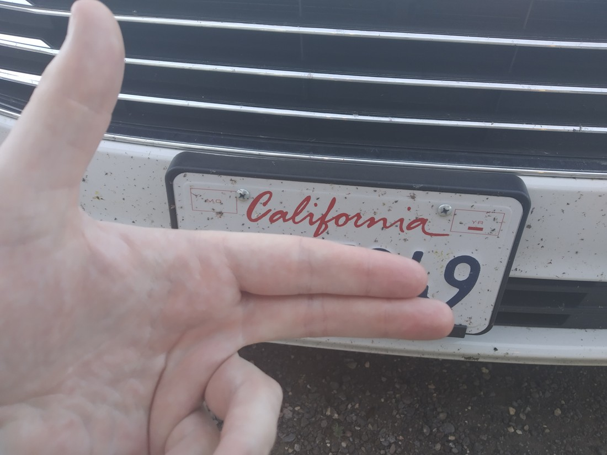

Travelling has been really fun. But that doesn’t mean we don’t need a bit of entertainment on our travels.

Licence plates in America have the state on them that the plate was issued. It’s a bit of a game for us, spotting a licence plate from each state. We’re not the only ones doing it – I’ve seen two separate groups shout excitement when they spotted one they didn’t have. (Those groups both were mostly kids – are we too old for this?)

> Figured it might be wise to censor this before posting it on the internet. Also, how many bugs have died to make this trip possible 😦

These are the ones we’ve seen so far:

Alabama
Arizona
Arkansas
California
Colorado
Florida
Georgia
Idaho
Indiana
Iowa
Kansas
Kentucky
Louisiana
Maryland
Michigan
Minnesota
Missouri
Nebraska
New Jersey
New Mexico
New York
Nevada
North Carolina
Ohio
Oregon
South Dakota
Tennessee
Texas
Utah
Virginia
Washington
Wisconsin
Wyoming

33 out of 50 so far (although I doubt we’re going to get Hawaii and Alaska might be unlikely too).

We’ve also collected two *rare* Canada plates:

British Columbia
Ontario

And two other non-state plates:

District of Columbia
US Government

Stay tuned for more exciting developments on Luke and Betty’s 2019 American Licence Plate Hunt!