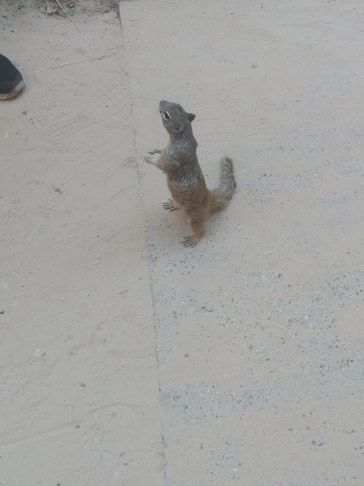
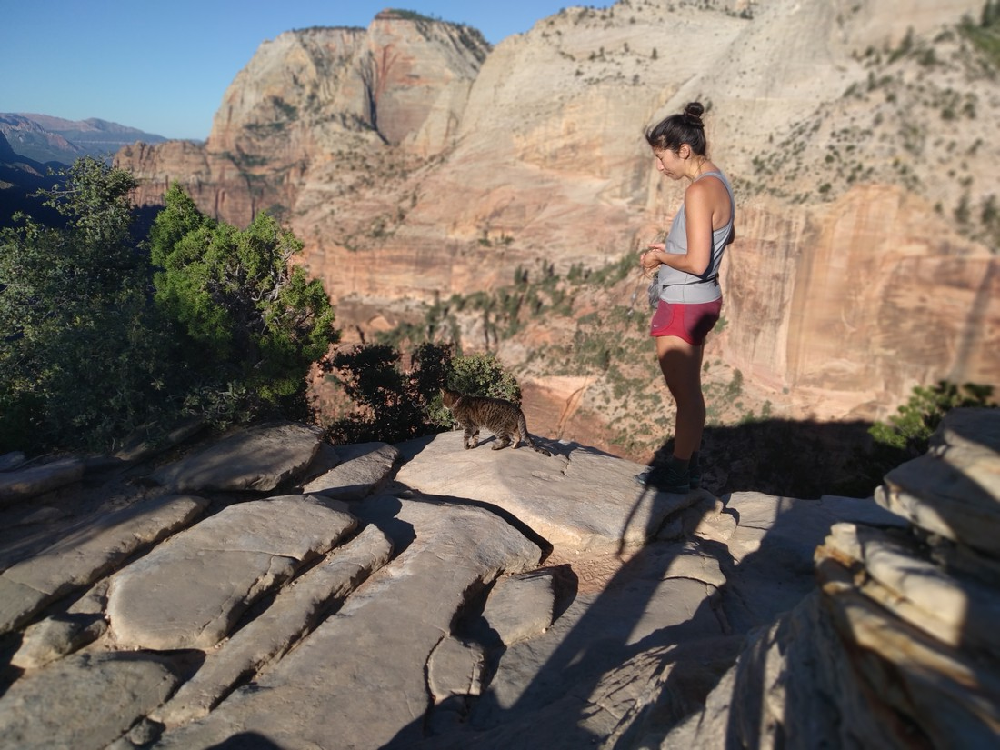
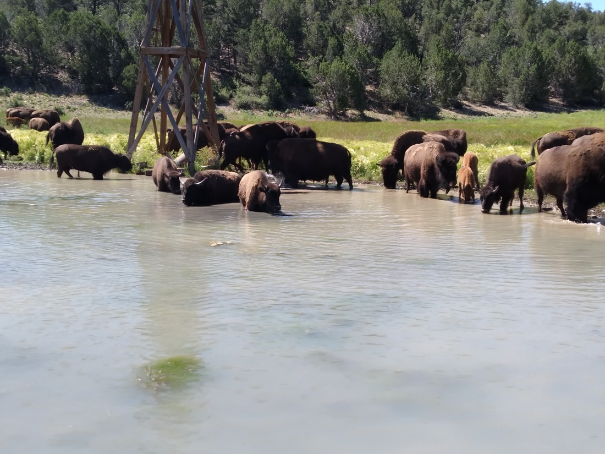

Due to popular demand, here’s a list of all the animals we’ve seen (so far):

Squirrels

> Many spotted in Zion – particularly on the Riverside Walk

> Perhaps more up close and personal that I ought to have done

> Remember, human food is not squirrel food

Deer

> Many were spotted in Zion

Chipmunks

> For some reason, a very popular hangout is on top of Angels Landing

A cat

> Also usually found on Angels Landing

Bison

> Spotted this heard drinking and bathing just outside Zion

A snake!

> It seemed afraid of being stepped on. Managed to swim across a small stream which was nice to see.

A couple of wolves

> Wolves love pats

And many birds, cows, lizards, and butterflies we didn’t photograph.

Soon we’ll be in Yellowstone. Hopefully there’ll be many more animals to add to this list.