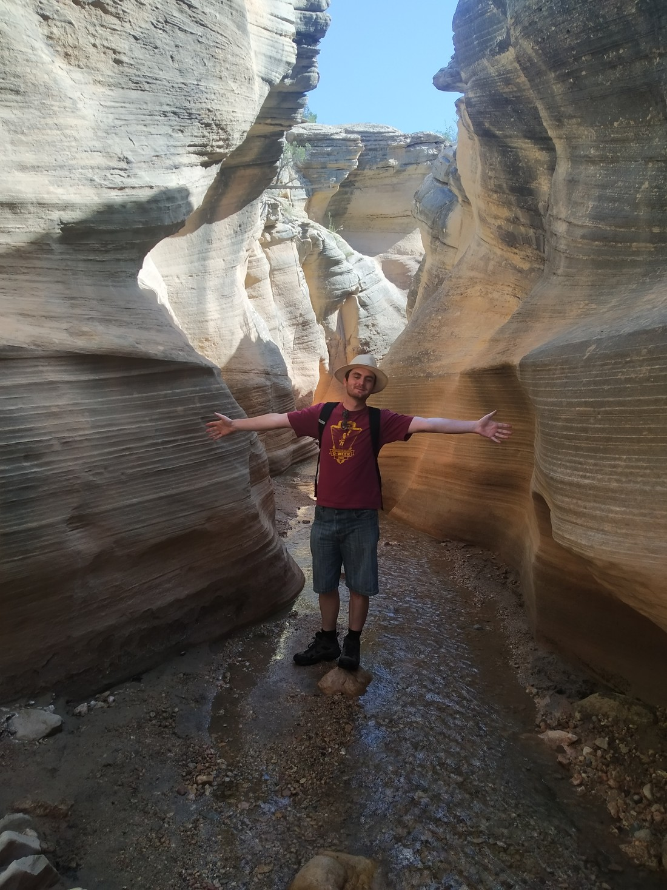

So its the day we’re due to leave Southern Utah and start our two day drive up to Yellowstone National Park. (Full disclosure – it’s not this day. I’m writing this four days late because I sometimes write blog posts out of order). We have a five and a half hour drive to do. But we’ve been doing a lot of walking lately and we’ve kinda become hooked on it. We figured that while we’re still surrounded by natural wonders, we could fit a walk in before we start driving for the day.

Plus we never got round to visiting any part of the Grand Staircase Escalante National Monument. This is a very large portion of land (about 50% larger than the Grand Canyon National Park and 500 times larger than Bryce Canyon National Park) created by Bill Clinton during his presidency. Due to its enormous size and a few other factors, it is still very undeveloped. I think there was only a single paved road in the whole area.

We found a walk called Willis Creek Canyon trail near to where we were staying and figured, “Why not?” It’s a slot canyon, and except for a small portion in Bryce Canyon, we haven’t walked through a slot canyon yet. Getting there took a bit longer than anticipated, but the view was relatively scenic.

Upon parking, we struggled to figure out where to start the walk. We hadn’t really done any walks outside the big parks so this was a first for us. What do trails even look like?

Eventually we figured out that the path goes downstream not upstream and we set off.

I don’t know the official definition but a slot canyon is basically just a canyon caused by a single stream. The canyon is usually not much wider than the stream itself. I don’t know what other factors go into making them. Probably certain types of rock and possibly periods of heavy rain or snow.

> Some very unusual rock formations

Antelope Canyon was a slot canyon we considered visiting. But that would have set us back about $150 to 200 NZD whereas this one was free. And free from people too. I think we saw five other groups in the two or three hours we were there.

While the Willis Creek Canyon may not be the prettiest of slot canyons, it was still very interesting.

> The canyon just got bigger…

> …and bigger…

> …and bigger.

A very small stream still ran through the canyon. But we could largely avoid getting our feet wet.

> Who needs stepping stones?

I imagine it would be a lot bigger when the snow is melting, or there are thunderstorms. The Narrows at Zion is also technically a slot canyon and we were warned that thunderstorms can caused deadly flash floods in slot canyons.

No such worry to us though – the day was gorgeous.

> Can’t show you any nice photos of the sky since we were stuck in this canyon

Eventually the canyon widened. We continued walking for maybe another half hour but with no end in sight, we decided to turn around and return to our car.

> ♫ What’s around the river bend…? ♫

Here’s where we saw our first wild snake. While Betty was less than enthused, I enjoyed finally seeing one in the wild – and being able to see how it coped crossing the stream and climbing a small embankment. I think the only reason we saw it was because I was walking towards where it was hiding, and it was probably worried I would stand on it.

> Was to busy keeping my distance to remember to use the zoom

We were really glad we got to do this walk. After reading about other parts of the Grand Staircase Escalante, I would often think, “I’m sure it’s nice, but we’ve probably seen stuff like that in Bryce Canyon.” It was nice to still be experiencing new things in this wonderful (but hot) environment.
