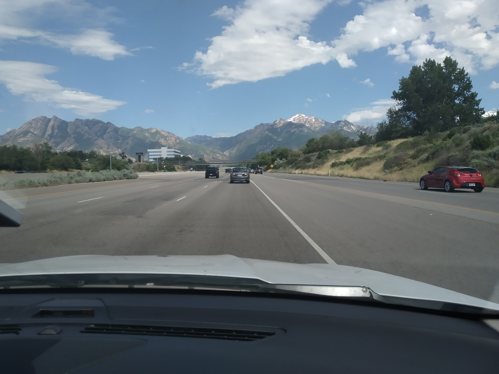
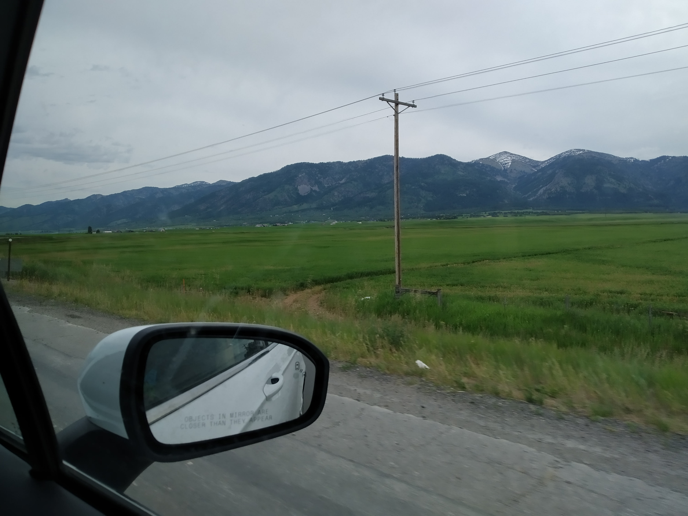

Bryce Canyon to Yellowstone – not much happened on this trip.

Something interesting was that the speed limit on the highway to Salt Lake City was 80 mph. I was surprised that everyone was maintaining this speed (or something close to it. Even trucks. At one point we were ascending up a hill. I kept thinking, “There’s no way at home I would/could drive my car up a hill at 130 kph.” Maybe cars in the USA are just better.

> Also, Salt Lake City has some really nice mountains right beside the city.

It took two five-hour stints to get to Yellowstone. We stayed the night in between. They went by relatively quickly.

During the second day we had entered Wyoming. Wyoming is a very green state (at least in June). Paddocks everywhere. It was a nice change from the desert of Southern Utah but less novel to us.

> Also, it rains now occasionally.

This probably wasn’t a very interesting article, was it? I’m writing some of these filler articles for my own future reference. Thanks for sticking with it to the end. As a reward, here’s Luke in the cereal isle of Walmart holding $8 NZD of sugary cereal

> Fortunately for his own health, he did not buy it.