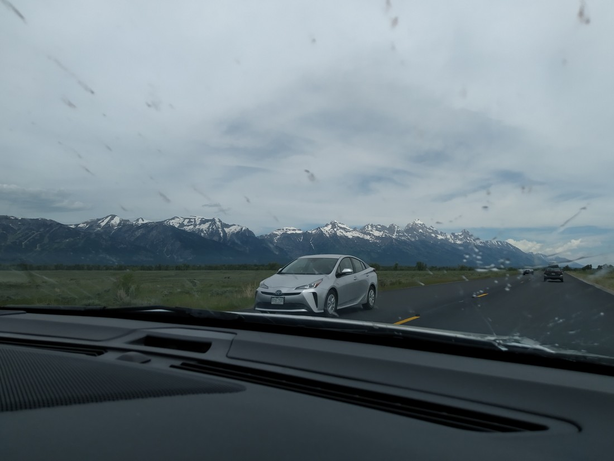

Not all beautiful pieces of land get “National Park” status. Some are “National Monuments”, others are “State Parks”, while others are “National Forests”. There’s probably more – I don’t do a lot of research before writing these.

Grand Teton is another National Park. If you are entering Yellowstone from the south, you’ll drive right by Grand Teton National Park. Unlike Yellowstone, we knew nothing about Grand Teton (other than it was a National Park). We figured we didn’t need to spend more time in Yellowstone than what we allocated so we decided to stop by Grand Teton and check it out.

> Also America has bugs now. Insects had been relatively rare in Utah. Now there were hundreds – and they were all hitting our car windscreen.

The core of the park is a mountain range that runs parallel with the road leading to Yellowstone. These mountains were lovely. It felt like you could just walk towards them and straight up them to the top.

> It said stop, so I stopped.

Driving towards the mountains, we officially entered the park. Like the others, its a network of roads and overflowing parking lots at various points of interest. We picked out one walk around Jenny Lake to the Hidden Falls and Inspiration Point and set off.

Upon arriving at the falls, we were met with a crowd of people. Most had just caught the ferry across the lake. We looked at each other and thought, “This walk, the falls, and the view aren’t that impressive. Why are we doing this when we could be at Yellowstone?”

> Pff. We have waterfalls and mountains back in New Zealand.

Yep, we’ve been spoiled on fancy desert parks. Water just don’t do it any more for us.

Fortunately, on the way back we spotted something we hadn’t seen before, or since.

Beavers!

> Here’s a second one.

People were standing on the path, staring down at the rocks below them. Once we got closer, we noticed a head sticking out of the rocks, watching us.

We don’t fully know what it was (I overhead “gopher”) but our best guess was a beaver. Once the second one popped its head up and started walking around, it certainly looked like a beaver with its beaver tail.

> Is he stuck? Why isn’t he moving?

Eventually the second one disappeared down the hill into the rocks, but the first stayed where he was for the entire 10 to 15 minutes we were watching him.

He did nothing but watch us back. And occasionally scratch himself with his mouth. It’s like he was a lookout. Something to draw our attention while the other… not sure, robbed us maybe?

> If so, they’re terrible at it.

And shortly afterwards we saw this:

> …notice anything unusual in this picture?

So, Grand Teton wasn’t a total loss.