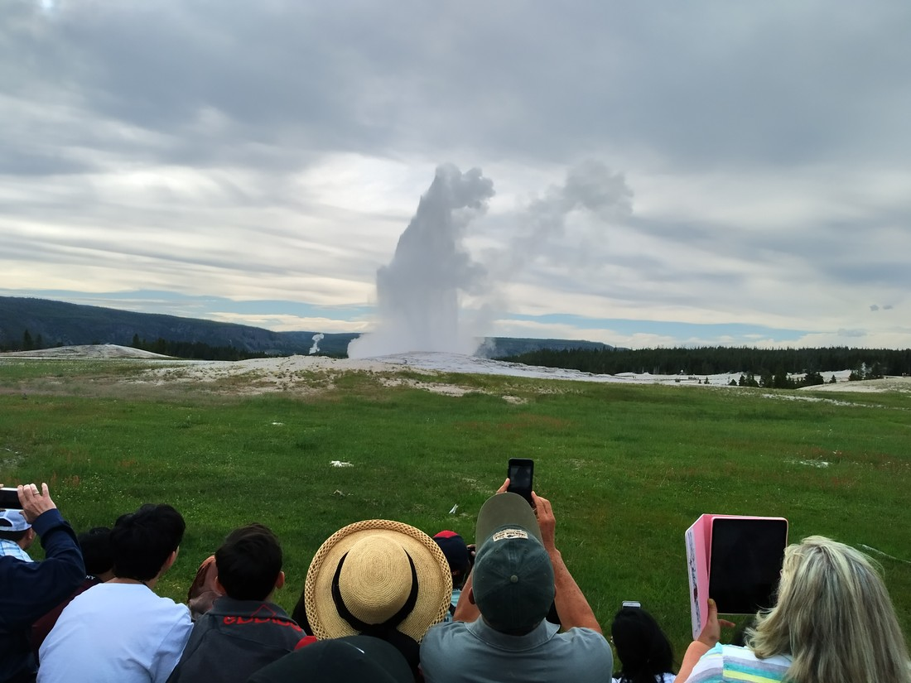

Yellowstone National Park is the oldest national park in America – and arguably the world too – a real trend-starter. It is perhaps the most talked about national park. It is absolutely huge (although not the largest national park we’ve been to – Death Valley was larger even if there was nothing there). It has a lot to live up to. It was also the last national park in America we’d be visiting.

So what is Yellowstone?

> Trees, fields, mountains, and sky. What more could we ask for?

At times, Yellowstone feels more like a National Forest. We entered Yellowstone from the south entrance and we drove for about 30 – 40 minutes to get to our accommodation. For that entire time, both sides of the road were thickly forested.

> We’re so used to thick undergrowth – it’s nice to be able to stare into the forest

On the next day we were able to climb to higher altitudes and get views out over Yellowstone. The views towards the South – basically nothing but forest with the occasional mountain.

> The tree on the top row, second from the left is my favourite

This is certainly nice, but a bit disappointing. You see, you can’t see much in a forest other than trees. It was certainly pleasing to look at – just a bit samey. While we drove, the passenger would stare out the window, hoping to spot some wildlife. But only the trees would stare back.

> The clouds were also very scenic this day

Yellowstone also has some mountains. The hike up Mount Washburn is recommended in the park newspaper as the most popular hike in Yellowstone, reaching an altitude of 10,223 feet. We were about to do it, except the time and effort required were just too much for the day we had planned.

> Do you like steam?

Yellowstone is also known for its volcanic activity – in the form of geysers and hot springs. Yellowstone is basically one big crater for a dormant supervolcano.

Our first night in the park, we stayed in the Old Faithful Lodge which is situated next to the Old Faithful geyser. This geyser is world famous and consistently erupts about 20 times per day, sending hot water up to 180 feet in the air.

> I wish I got a better angle of this

As well as other geysers, Yellowstone also has a number of hot spring areas. In a way, its very Rotorua-esque. Some are reasonably pretty with many being named after the colour of the pools.

> This one might have been called “the artist’s paint pot”. (It also might not – there was one by that name).

> This one was called the “black” pool. It’s blue, right? I’m not going crazy?

> This one also had a name!

But perhaps the main attraction of Yellowstone is the wildlife. Yellowstone claims it is home to just under 5,000 bison as well as bears, wolves, mooses, deer, mosquitoes and more.

> Like a big cow with a jumper

The wildlife was also one of the big drawcards for us. With the exception of deer (and mosquitoes), we aren’t used to seeing any of those animals.

> Deer (they looked closer in person)

And we sure did see many of them.

> Unfortunately this was a close as we got to a moose

But overall Yellowstone left us wanting. It didn’t feel like a park. Yellowstone is so large that it felt more like we were still on the road, and we were stopping at various attractions along the way. Some of those attractions were must-stops, others were not, while some where unplanned.

Yosemite and all the parks in Southern Utah nicely had all their attractions in one place and/or had shuttle buses going around them to alleviate traffic. Yellowstone is too large for such a system. While traffic wasn’t really an issue, parking was. Our second morning, it rained somewhat heavily. We didn’t mind – we just took our time and when we reached our first destination, it had fined up. But that ended up being our only stop in Yellowstone because we couldn’t be bothered queuing just to get into a car park at 11 am in the morning.

> Carpark was half full five minutes ago when we pulled up

Another issue we had with Yellowstone is that there is basically no WIFI or mobile data access anywhere in the park. (Maybe some phone carriers might have some luck – but in some parts only). The brochures claimed this was part of the charm of Yellowstone – a chance to unplug and become one with nature. Except, it prevented the latter for us.

Yellowstone says it has 900 miles of trails throughout the park. It also says it has 6 trail guides to help trail junkies. Those trail guides turned out to be useless – most of them documenting 1 – 2 miles of trails that were all walks to or around an attraction from a carpark. Without the internet, we had no information about the other tracks. Before we set out, we really need an idea about the trail’s difficulty, how long it will probably take, where it leads, and (importantly for us) how dangerous it might be. In regards to the latter, we hadn’t picked up any bear spray and besides knowledge, we had no other bear prevention methods. Without sufficient info about any but the most well trodden paths, we were always kept close to our car.

> Mind you, there are usually cool things to see on the boardwalk walks

In every other park we have been given a newspaper or another guide which contained all the details we would need to do any walk (except the most obscure). I guess, once again, Yellowstone is just too big for that. We didn’t know we had to research every trail we might want to do prior to entering the park.

Like Zion, Yellowstone is another excellent piece of nature but with problems. Coming from New Zealand (which has environments that resemble Yellowstone’s), I’m not sure Yellowstone in Summer is something I would be recommending. Excluding Death Valley and Grand Teton (as we only did these because they were on the way), I would recommend every other park we have been to so far.

> But that doesn’t mean we didn’t have a good time.