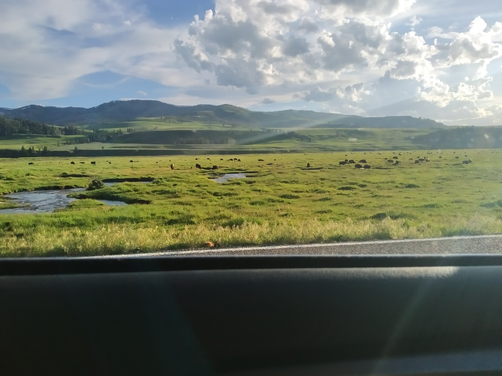
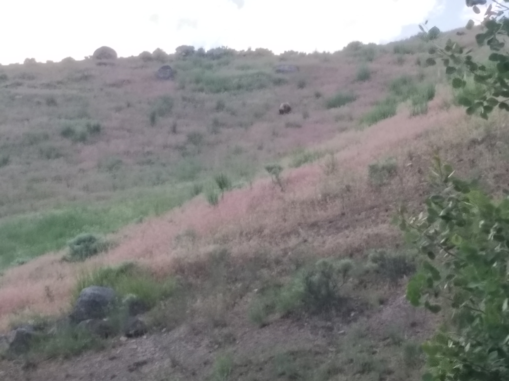

Someone recommended to me that we play the music from Jurassic Park when we entered Yellowstone National Park. I can’t confirm exactly, but I think they were smart enough to know dinosaurs don’t exist in America.

> This little guy was probably the closest dinosaur ancestor we found

I think the idea was that we would get the same feeling of wonder that the characters in the movie had when they experienced the wide open plains filled with creatures never before seen (by them).

Yellowstone does have some wide open plains – but they’re not exactly near the entrance. Okay, they are near *an* entrance, but it’s the north east entrance which isn’t near any major cities. Seriously, I think Regina, Canada is the largest city in that direction within 1,000 miles.

So after checking into our second accommodation in Yellowstone (at Tower Junction for the geography nerds out there), we found ourselves with little to do. We decided to drive towards the north east exit of Yellowstone to a place called the Lamar Valley. We did so late in the evening after reading that animals are most active soon after dawn or just before dusk, when the temperature is cooler.

It was here that we experienced some magic from Yellowstone.

Hundreds of bison roamed these plains. I mentioned previously that we had been told there were slightly less than 5,000 bison in Yellowstone. After visiting the Lamar Valley, I would suggest that this number may be an underestimate.

> See, hundreds! …somewhere down there

> Here’s a better angle with less mood lighting

Of course, these photos do not fully capture the huge number of bison we could see (because I am using a simple phone, not a camera with a zoom). Fortunately, some wandered close to the road.

The plains in this valley were enormous. I was glad I had bought some binoculars prior to our visit, even my eyes were too far apart for me to use them properly.

> I look ridiculous

Write this down, “Lamar Valley is the best thing about Yellowstone”. Had the binoculars fit me better, I probably would have been content to stay here and watch for a very long time.

And to top it all off, on the way back we got to see *another* bear.

> Yep, that rock coloured, rock shape is actually a bear

Although, I have yet to tell you about the first four bears we saw. That’ll be coming soon.