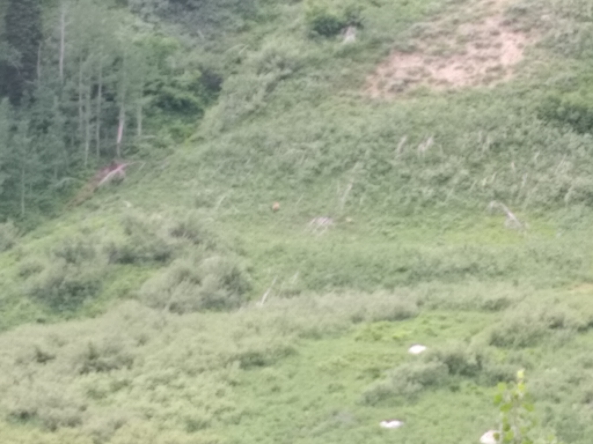
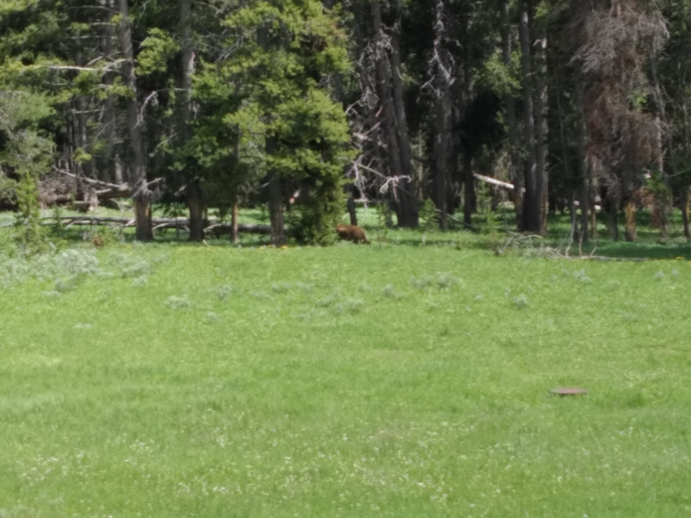
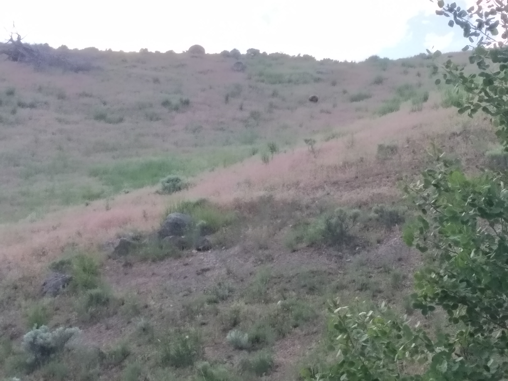

Before coming to Yellowstone, I had read about a thing called “Bear Jam”. It’s a traffic jam caused by people slowing down / pulling over to have a look at a bear.

Our first encounter of bear jam was in Grand Teton National Park. We were returning from the Hidden Falls (still walking) and we noticed some people on the side of the trail staring off towards the side of the mountain. It was certainly a nice view – here’s a picture of it:

> Remember this picture, from a few blog posts ago?

But the group was abnormally focused. Curious as to what they were looking at, we heard them mention that there was a pair of bears in the grasses. Can you spot the two bears in the above picture.

These bears turned out to merely be brown splodges because at this distance, no detail could be made out. Stupidly, I had failed to pack the binoculars I had bought the night before. Fortunately, someone briefly lent us their’s and we were able to confirm that the brown splodges we had seen were in fact vaguely bear shaped brown splodges.

> Can you see the bears now? Still no? Well, we couldn’t really see much better even with binoculars.

We walked away able to truthfully say, “We’ve seen a bear in the wild with our own eyes.” But deep down, it felt like a lie.

The next day while driving through Yellowstone, we noticed a large number of cars parked on the side of the road. Once we were close, we noticed a large group of people arranged in a slighly curved line, staring into the forrest.

We pulled over, got out, and sure enough there was a bear nearby. If you couldn’t spot either bear in the last photo, try spotting the bear in this one:

> I’ll give you a clue, it’s between some trees

That’s right, this is another case where the bear was really hard to see. When we arrived, the bear was lying on the ground, obscured by some logs. People kept saying, “You can see its ear.” We could spot the black splodge they were talking about but weren’t convinced. Fortunately this time we were much closer and we had binoculars.

> Instead of wasting my time trying to zoom in on a tiny bear ear in the shadows, I took this nicer photo of the rest of the scenery instead.

We stared for a while, waiting for the splodge to move and confirm its bear-ness. We were on the opposite side of a swampy body of water so the mosquitos were out and about. But had it not been for that body of water, we probably wouldn’t have been safe enough to get as close as we did – and the view would have been much more tree-filled.

Occasionally the splodge moved. Sometimes small ear movements. Sometimes larger head movements. Then it rolled over. It turns out the the darker splodge some distance away from the splodge we had been staring out was its back. This bear was huge!

Unfortunately it was approaching midday and the bear seemed intent on napping. After having seen enough to justify to ourselves that this was a bear and unwilling to be bitten any more by mosquitos, we moved on.

Later the same day we were on our way to a walk and I had taken a wrong turn. Lo and behold, we found another bear jam. This bear was walking along the edge of a woodline not too far from the road.

> There it is – although by this point I felt like were were trying to capture a picture of Bigfoot and our equipment is sabotaging us for conspiracy reasons.

Finally, we got to see the whole bear! It wasn’t just a splodge in the distance – this was definitely a bear.

He was just walking about, doing bear stuff. And within five minutes he disappeared into the woods.

Later that day, leaving Lamar Valley we encountered another group of cars watching a bear on the hill. This was the closest, clearest we had seen it, but it quickly disappeared over the ridge of the hill.

> Attaching another awful picture as proof

Finally, on the last day we actually got to see a bear crossing the road. This time it was gone quickly, but it was certainly nice to see an extra bear on our way out of Yellowstone. This also might have been our only black bear sighting. The rest appeared to be (or if we couldn’t see them, we were told) grizzlies.

We had stayed at a nice B&B near Zion and the couple that ran it had mentioned that they hadn’t seen any bears in Yellowstone. To be able to say that we saw 3 – 6 (depending on your measurement criteria) means that we were counting ourselves very lucky.

Even if our pictures cannot capture these moments.