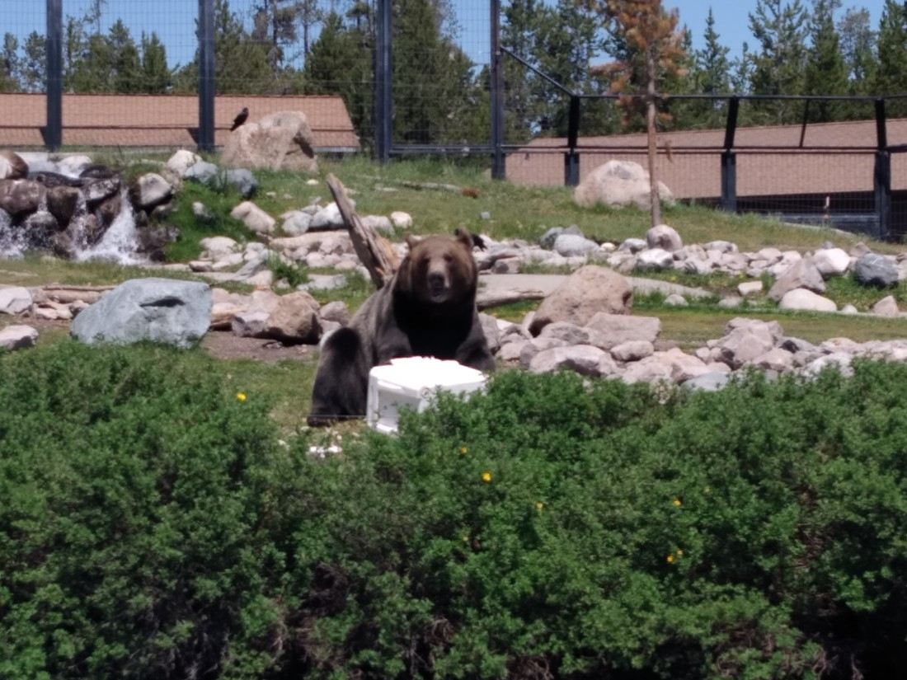

We had allocated 48 hours of our trip towards Yellowstone National Park. That probably doesn’t sound like a lot, but that’s roughly twice as much as any other National Park in the States got from us. Due to factors explained previously (number one being that it rained the second day we were there), we ended up leaving Yellowstone early.

We’ve encountered this before in our trip. What do we do when we want to leave early? We’ve already booked our accommodation so we can’t just jump ahead to the next park. Well, in some cases we could. In this case, there were no more parks to jump to, and we’d already paid for the accommodation just outside Yellowstone.

So we had found ourselves in West Yellowstone (it’s a town) with no plans just after noon. We couldn’t even check in until 4pm. Well, the couple that ran the B&B we stayed in near Zion favourably mentioned a wildlife park in West Yellowstone. A quick google search (yah, I now cell coverage again) revealed that it was a small-ish park run by a non-profit organisation with a very reasonable entry fee ($13 USD). We figured, “Why not?”

We skipped the boring part with all the facts and went straight to the outdoor area with all the animals.

The first thing we saw was a couple of keepers introducing some young wolves to a pair of adult wolves. The guide explained that while they’re not anticipating any problems (adults in wolves understand that young wolves are a thing, and that they need looking after), they were just being cautious.

> Wolves are basically just pretty dogs. Who knew?

Each group of wolves were clearly interested in the other. It might have been nice to see them together, but we counted ourselves lucky that we just happened to be there when this event occurred.

We then walked twenty metres and found ourselves at the bear enclosure. There were no bears in sight but very soon, a guide started speaking over a microphone announcing that they had just hidden food throughout the enclosure and that they would be letting the bears out soon.

We were obviously keen to stick around and check out more bears. We learned that each bear in this park had been removed from the wild due to concerning contact with humans (all food related). Rather than risk the lives of both humans and the bear, the bears were placed in captivity where they could do no harm.

In the enclosure there was also a white cube-like box – a cooler / chilly bin. Apparently, this facility does “testing” for how bear proof various things are. The bears are given an hour, footage is recorded, then the product is sent back to the company who provided the product. I thought this might be interesting to watch. At Yellowstone and Yosemite there were are ton of warnings about leaving food in places accessible to bears – it probably would be interesting to see what bears are like in those situations.

We didn’t have to wait long until three bears started walking out of their pens. The first thing I noticed is that these were large bears. Two were brothers – the other, large bear was no relation.

They proceeded to hunt around for the hidden food. One of the brothers did toss the cooler around a bit before moving on. The largest bear largely ignored the cooler at the start.

Then perhaps ten minutes later, with the enclosure largely emptied of food, the largest bear turned its attention to the cooler.

> “Who left this here?”

The cooler itself was very smooth with a couple of padlocks securing the lid closed. The first thing the bear was doing was to try and hook its claws into a join, or weak spot.

Initially the cooler had four wheels on the bottom. Those disappeared reasonably quickly.

But as much as the bear tried, it couldn’t pry the lid open. It spent perhaps five or ten minutes and except for the wheels, it got nowhere.

At times it literally sat down with the box (taking a break) and turned it over, looking for weak spots.

Occasionally it would use its teeth. When it did this, I got a bit scared. It clearly was intent on getting into the box, but the box wasn’t budging at all. Whoever had built this cooler, clearly knew what they were doing. I was worried for the bear. How strong are bear teeth and gums.

> Someone’s hungry.

Well, maybe fifteen minutes after is started, around the time it looked like there was no hope, something notable happened. It appeared that the bear had punctured the lid – near the centre.

It stuck its claws in the small hole, trying to get at the food inside. When that didn’t work, it started widening the hole, and ripping the plastic.

This was incredible to see. We were close enough to see the effort the bear was exerting. This was definitely not weak plastic. But within minutes, it was torn back as if it were an orange peel.

Sometimes the bear would climb onto the box, trying to use all its weight to break the plastic. Many people laughed at the sight of the bear, standing on the box, pressing down on it like a gorilla would. But I was amazed. Clearly this bear was intelligent. We all started rooting for the bear.

> “Hey guys. I’m taller now. You all have to listen to me from now on.”

Inside, the bear found nothing. It had breached the lid, but it was only into the insulation. All that insulation was quickly pulled out by the bear (I hope it wasn’t toxic – some might have been eaten).

> “Nothing but yucky marshmallows. Why does box smell so good but taste so bad?”

Poor bear. It had put in so much effort. It had now been maybe 40 minutes. It was almost out of time and it had nothing to show for it. I was wondering how they would separate the bear from the box, as it was still very interested in it. Whatever inside must have smelled delicious.

By now you might be thinking, “Wait, weren’t there three bears?” Well yes, there were. The other two, the brothers, were about – doing brotherly bear stuff. At one point they wandered near the box, however the larger bear sent it away. (I don’t blame it. It had been working so hard trying to open the box. It deserved all the rewards.)

> “Oh, I see you’re almost in. Want me to take over?” “NO! MINE!!!”

Later, while we were entranced by the large bear and its box, we turned to notice that the other two bears had climbed into the pond / river in the enclosure and were “fighting”.

While it certainly looked fierce, with teeth and claws out, their bites were always without power. This was just two brothers play fighting.

> “Ew, you’re wet. Don’t touch me!”

It was a great sight to see.

But that’s enough about them. They eventually bored themselves and wandered back to their pen, leaving the larger bear alone with the box.

It continued working on the lid of the box. At this point, I was really rooting for the bear.

> “Thanks. Your support is very much appreciated.”

Eventually something changed. The bear’s attitude changed, and it was no longer trying to force the box open. Instead, it was trying to claw something inside the lid.

> “Oh, there’s food in here? How fortunate.”

It had pierced the inner layer.

It made short work of this last part and not long after, it was fishing inside the box with its claws and pulling out the delicious food inside.

I’m not sure if I cheered. I certainly cheered on the inside.

> Someone’s a happy bear.

Soon after he was done, he went and basically submerged himself in the water. Can’t blame him. I was hot just watching him.

The park had on display a number of bins, coolers, and other various objects which they had subjected to their “bear proofing” test. Turns out, unless something is solid metal, a bear will get in.

> Why do they make these bear feeding devices so hard to open?

Made me kind of glad to be leaving bear country – and not having to worry about it.