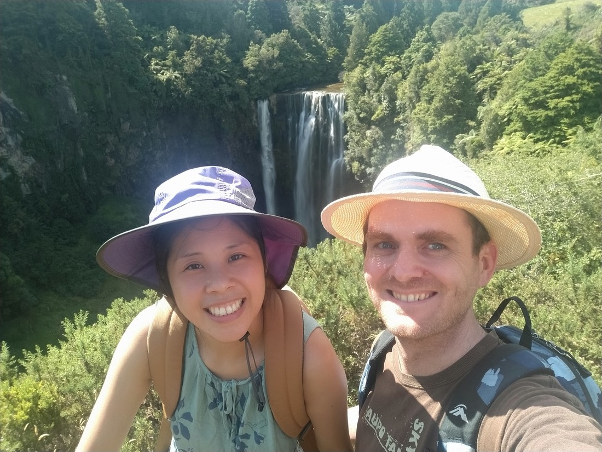
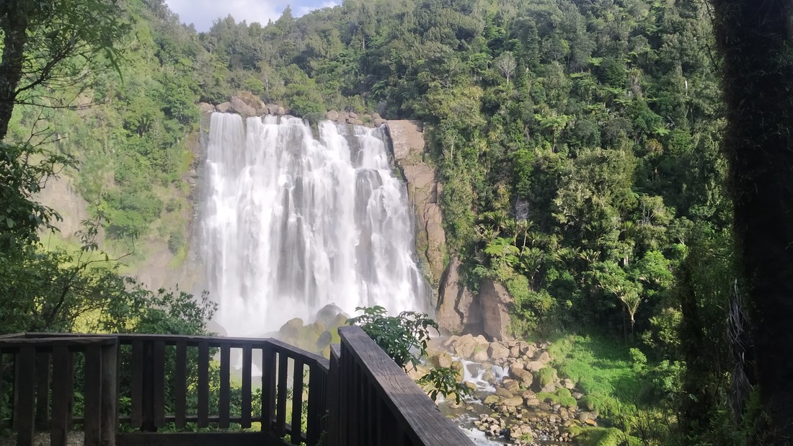

New Year's Eve 2022 - first day of a four day weekend.  Weather is looking excellent - perfect situation for a day trip.

I convinced Betty that we should spend a day in Waitomo, and Te Kuiti area.  The walks out there were just a little too far to be worth the drive.  For roughly the same amount of time we could drive to the Kaimais - which tended to have more interesting trails.  But if we make a whole day of it, then we should be able to scrape together enough interesting things to be worthy of a blog post.

(Spoiler - this blog post exists so we probably did).

The walk began in the main Waitomo carpark (opposite the Glow Worm Cave) but then we took a sharp right through a glade and out into farmland.

I picked this trail to start with because it was the highest rated Waitomo trail on AllTrails.com.  But the first half hour or so was through ordinary farmland.  At first I wasn't sure why this was so highly rated, but on reflection I think I have figured it out.  Despite being known for it's natural formations, Otorohanga doesn't have that many hikes.  Also, the hikes that they do have tend to be quite short and I imagine AllTrails users aren't going to be too impressed by a 500m walk - they probably want something more substantial.

So it wasn't too enjoyable.  It didn't help that it was hot and farmland doesn't tend to have much shade.

> We were all a tiny bit grumpy - even these locals who got annoyed that our path ran through their precious shady spot.

But there was actually a reason why this farm walk was actually notable.  After the first 45 minutes to an hour the track came to a carpark (we could have just started here angry face) and then entered a bush trail alongside a stream.  Now, this part of the walk was really nice.  Not only was it shady, it also had several cave viewing opportunities.  Unfortunately caves don't photograph very well.

> Not really my cheap, old phone's fault.

So that was nice.  Of course we then had to trek all the way back through the farmland to our car.

Two and a half hours of walking done and it was now quite late in the afternoon (we hadn't left home very early).  We drove on to Te Kuiti for lunch and found... basically nothing open.  Turns out even the things that are open on Saturday close by 3pm on New Year's Eve.  We did manage to grab a couple of things right before a place closed - but it wasn't enough.  Fortunately there were also some fish and chip shops open and even though we didn't want anything deep fried, there was something really nice to have on a hot afternoon.

> Although we kind of wanted the cup with the giraffe.

Next walk I found was one 25 minutes south of Te Kuiti, along the road to Taumaranui.  It was a 40 minute walk to a waterfall called Omaru Falls.  And somewhat surprisingly it was rather nice.  While we had farmland all around us, the trail ran through a forested reserve area alongside a stream.

> And also over a stream

Funnily, I had no idea what the falls look like.  Occasionally we would hear loud water noises and we'd wonder, "Is this 20cm drop the waterfall?".  The walk was nice enough that I wouldn't feel cheated of the hour or so we were spending here, but it would be ice if it was more substantial.  But eventually I spotted something that definitely looked like a waterfall.

> Okay good - there's actually a fall.

Only thing was, we still had to walk another five minutes.  The viewpoint at the end of the trail also wasn't much more than a side of a hill.  But when we got there it was clear why we had to walk the extra five minutes.

The whole land just dropped away - and the stream dropped with it.  

So this was a great walk to do.  A nice and easy stroll with an excellent payoff at the end.  I also don't think we saw a single other person (not surprising considering the out-of-the-way location and the lack of signage from the main road).

We decided on one more stop to do on the way back to Hamilton - to another waterfall called Marokopa falls.  It was actually quite a large detour back along the Waitomo road, more than half way out to the coast.  The walk was really short but the waterfall was also impressive.

In fact, probably more impressive than Omaru Falls - more water and a bigger drop.  Betty asked me which I preferred and oddly it was Omaru falls.  Not because it had an easier walk - more the opposite.  A waterfall doesn't really feal "earned" unless there's a bit of a walk to get there.  Though there was one thing we did see on the short walk to the waterfall - a Kereru pooping, from almost directly underneath.

> Fortunately its aim was off - but only slightly.

Annoyingly the actual viewing platform was fenced off for safety reasons.  This also happened when we tried to do a short walk to the Mangapohue Natural Bridge (which was nearby) - the entire track was fenced off.

The last thing we did was the Piripiri Cave Walk (also nearby).  This was a short walk with some steps and then down into a rather round cave.  No pictures from that one as it was completely dark.

And by the time we had eaten and were back in Hamilton it was completely dark.  After a big day out walking in the sun you would have thought we would be ready for an early night but we actually stayed up to see the New Year.  Glass Onion certainly must have been a good movie since it often doesn't take much for Betty to doze off while watching something.

And so that was our day out.  Definitely need to be doing more of these.

