Here's another story about a fine long weekend where we had no chores or anything important that needed doing.  Bay of Plenty was another area that was just too far away for a casual day trip.  This weekend we decided to do an overnight trip to Bay of Plenty - that is until we realised that last minute accommodation was a bit... scarce.  In our defence, I had checked and advance and there was plenty - but we then discovered I was looking for the wrong weekend.  Makes sense why the prices seemed so reasonable.

So we decided to turn it into a day trip.

First stop was at Marshall's Animal Park.  We arrived bang on 10am when they were opening the gates - so we just drove right in, somewhat oblivious of all the other cars clearly waiting.  To make amends we didn't rush to the ticket booth, letting some families go ahead.  But upon entering we found that all the kids had rushed for the guinea pigs.  As much Betty wanted to also be amongst those tiny animals, we're not going to fight a bunch of kids for them.

So we began making our way around the park.  And of course I bought a couple of bags of animal food.

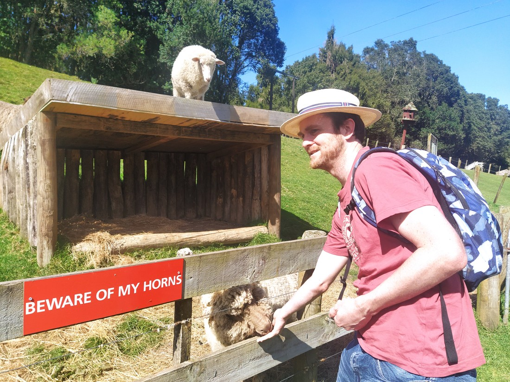

> Someone's annoyed that they weren't fed first.

Not sure what I think of myself.  Clearly these bags of food were for kids, but they certainly provide a lot of fun for mere dollars.

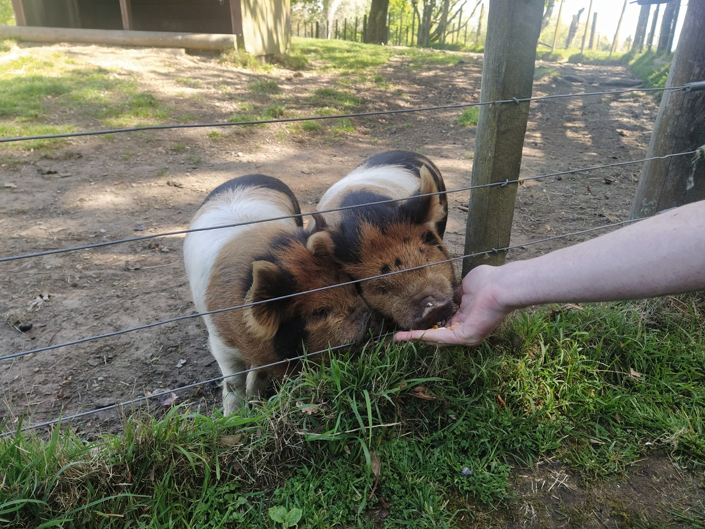

> Non-guinea pigs also need love and feed too.

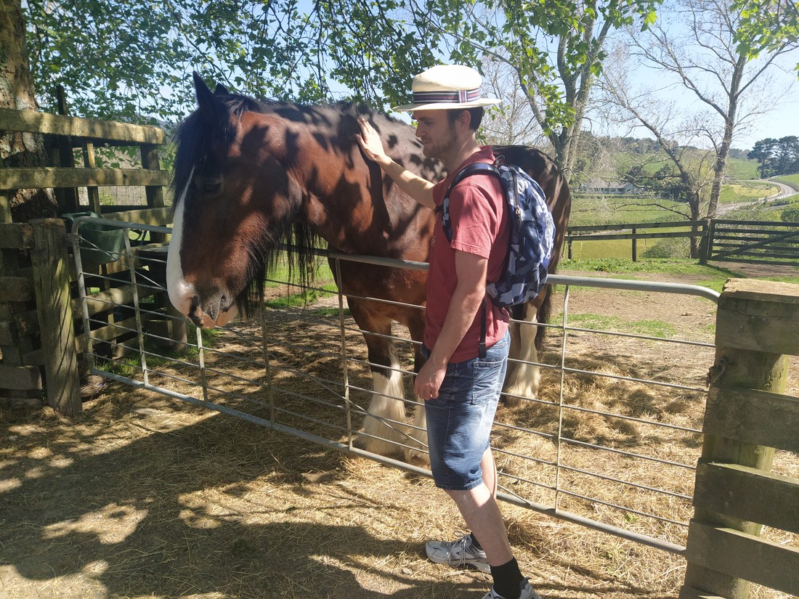

> Was a bit worried about the teeth on this one but he was really soft.

Then we progressed further up the park and we came to the ostriches.

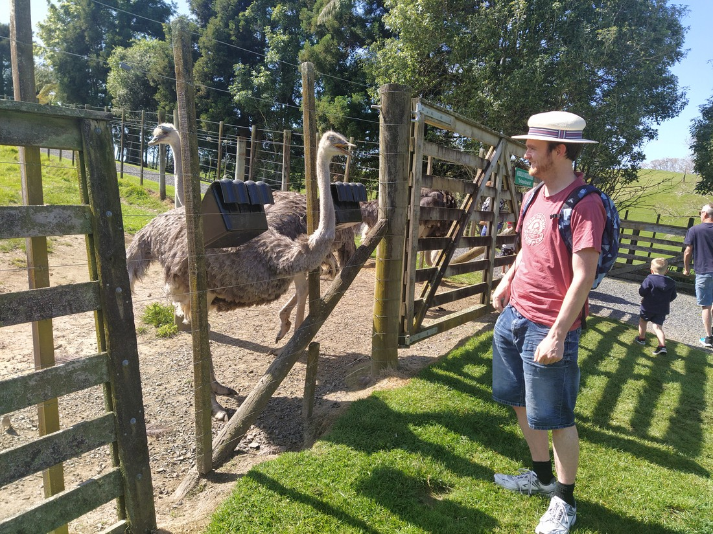

Wow - I don't know if I've ever seen ostriches before.  They are such an amazing animal, but I don't necessarily mean that in a good way.  Firstly, they're so tall.  Secondly, they're so so tall.  They have a big body to start with but it's their long extendable neck that makes them tower above people.  And what a neck - so bendable.  But they really don't seem like a nice animal.  They appear to have a permanent scowl and they definitely know how to use their height to intimidate.

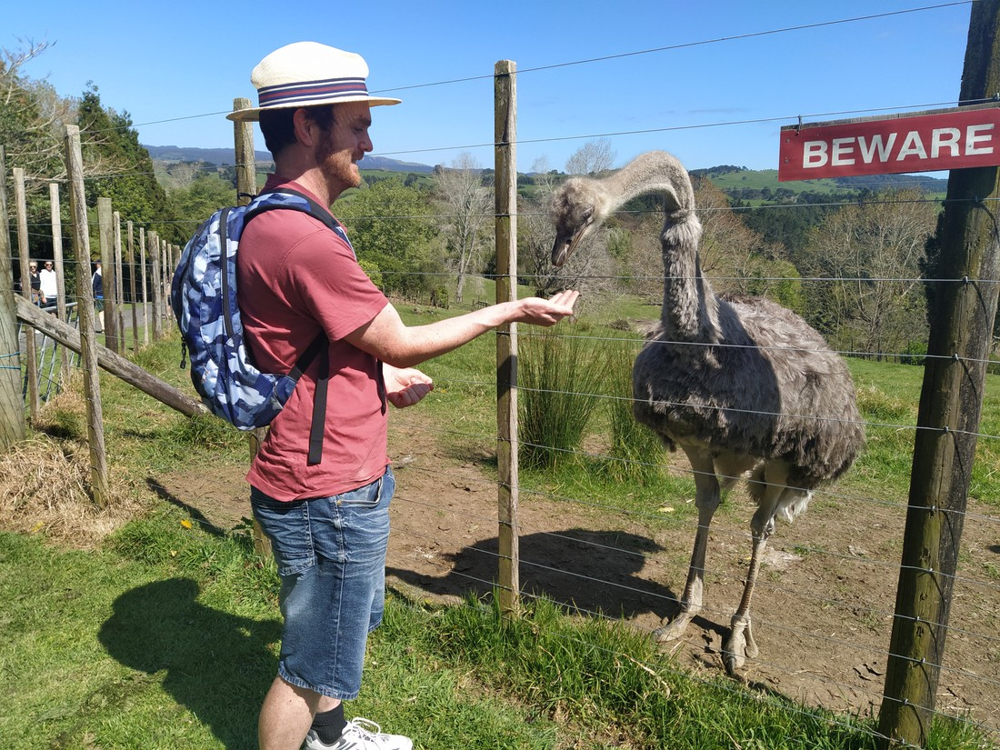

> "Beware" is fair

Fortunately even though they have a really hard beak that moves very fast, it has a very rounded tip.  But boy are they scary.  I felt sorry for the emus we saw next.

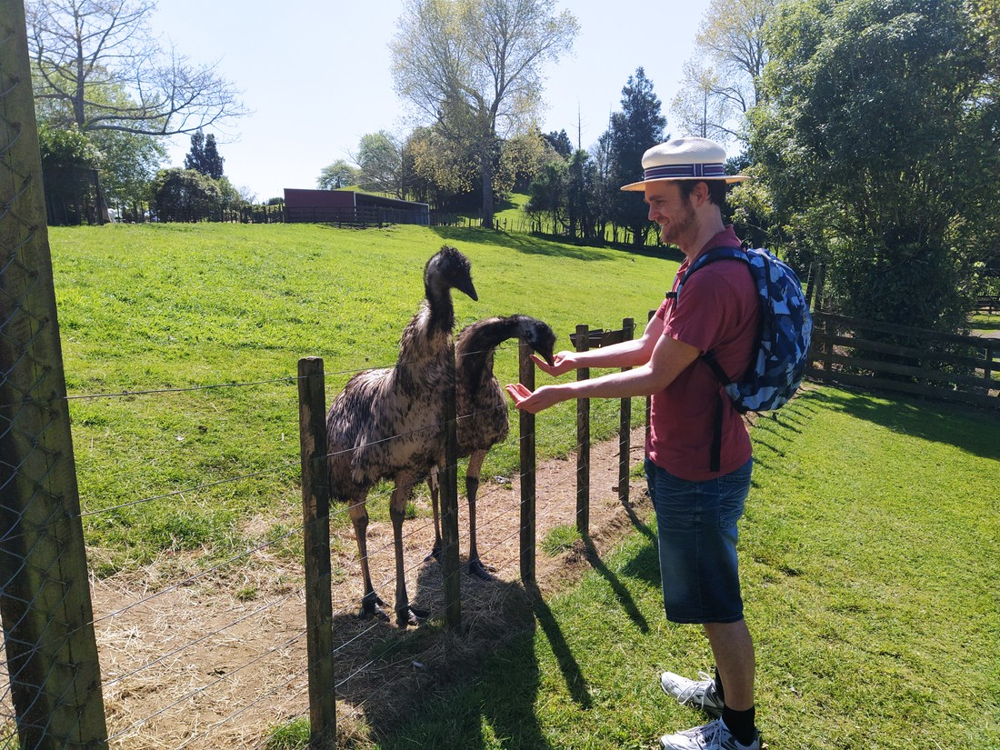

> Don't worry, you still get some food.

On any other day these emus would have been considered amazing and huge, but they have nothing on ostriches.

Soon we had done our loop around the animals and we were back at the entrance.  And what did we find?  Unhandled guinea pigs.

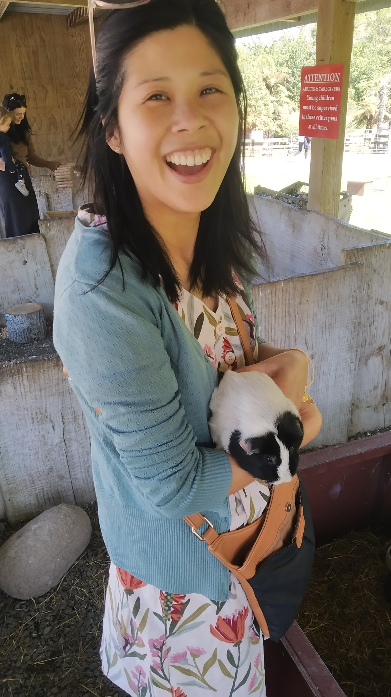

> Not unhandled for long

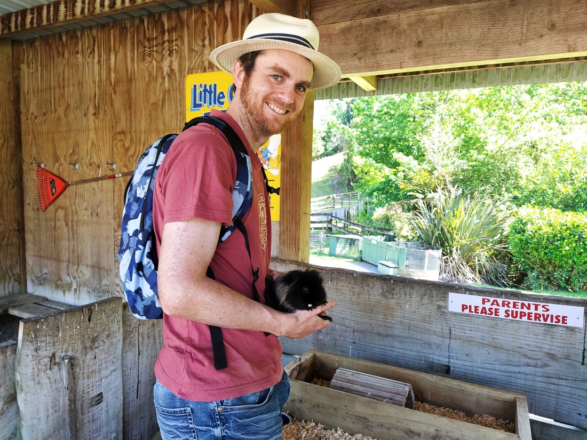

> Betty wasn't going to be the only one

After leaving the animal park we walked around McLaren Falls Park a bit.  This was nice, but for some reason we took no photos.  It certainly would have been a lovely place to spend such a scenic weekend.

Our next stop (after lunch) was the Te Puna Quarry Park.  Betty had heard that it had a variety of sculptures and stuff.  Parking on the south side of the carpark we spotted a path past the pavilion where a kids birthday party was happening and so we followed it to find... nothing.  The paths wound across the side of the hill but there was nothing to find on these paths.  The track was annoyingly steep in parts with no views or rewards at the top.  The only feature of note was a "waterfall" which turned out to be this:

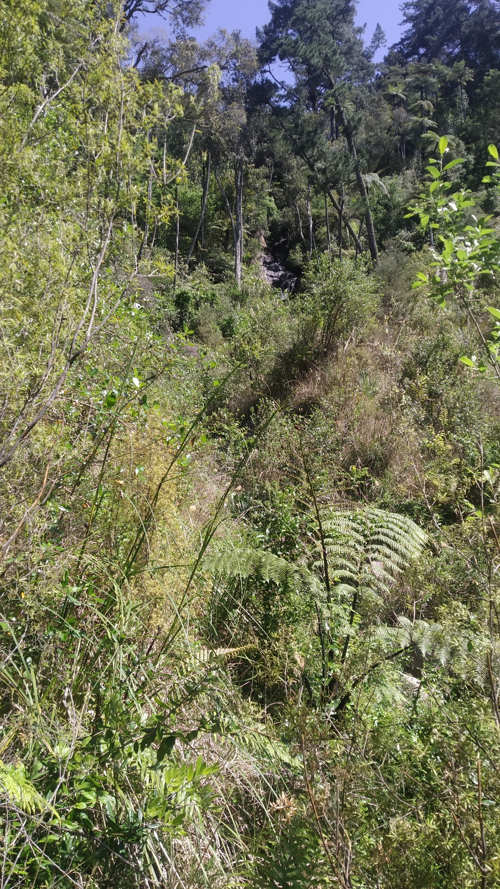

> 0 out of 10 stars - may as well be no waterfall

So the part with the sculptures and fancy plants was to the north of the carpark.  The sculptures weren't too exciting and the butterfly house might have only been called that because of the picture of a butterfly on the outside, but at least it was varied with a view at the top.

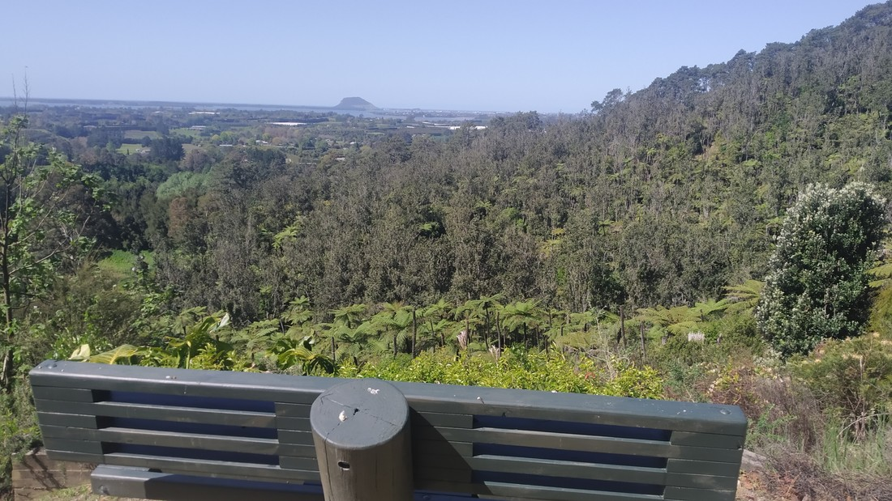

Though by this point we were a bit tired.

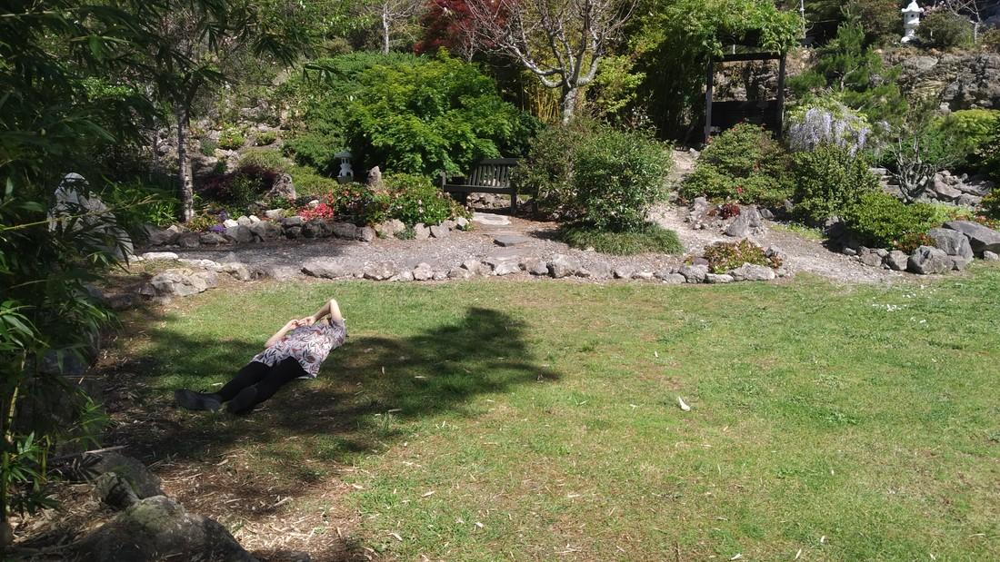

> Betty trying to have a nap on the grass in the shade.  Unfortunately the shade had other ideas and moved.

We headed into Tauranga to find.. not much.  So we headed on to Mt Maunganui and had dinner at Bayfair.

Last stop for our day trip was the one thing everyone needs to do when they're at The Mount - a trip to the summit.

Didn't take us very long - it's not a high mountain and the oncoming night had brought a welcome chill to the air.

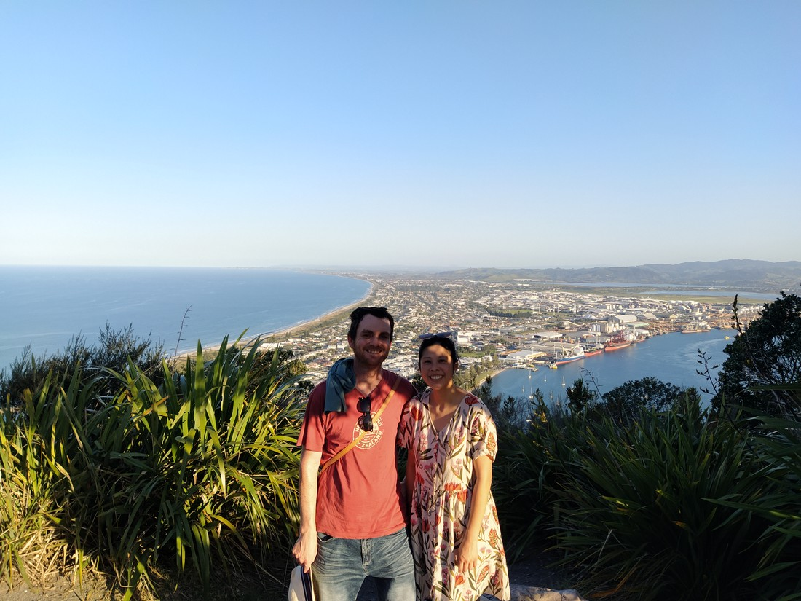

> We probably deliberately stood in the shade like this, rather than staring into the sun.  Oh well.

Overall a good trip.

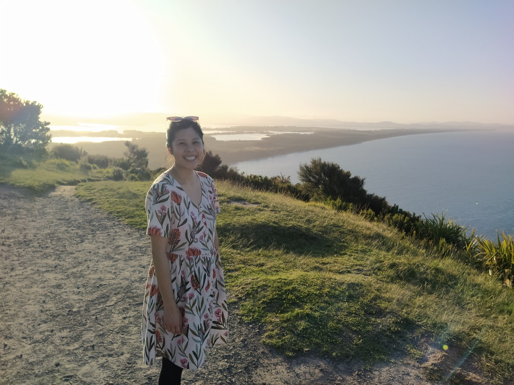

> You can tell from the happy Betty face.

Back at the bottom we actually made another small walk along the beach to the blowhole on Moturiki Island, but it wasn't all that interesting.  With dusk upon us it was definitely time to head home.

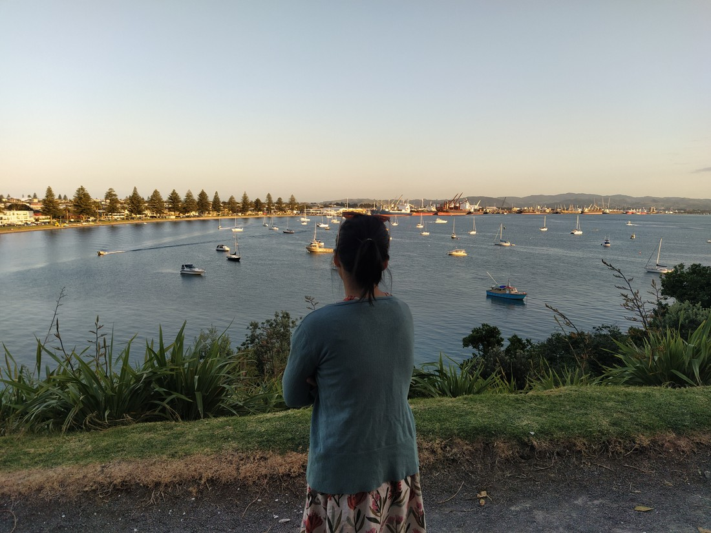

I remember driving back thinking, "Man, we're great at these road trips."  Long holidays are great but we certainly can still get the same feeling in just a single day.  Why is it again we don't do more of these?