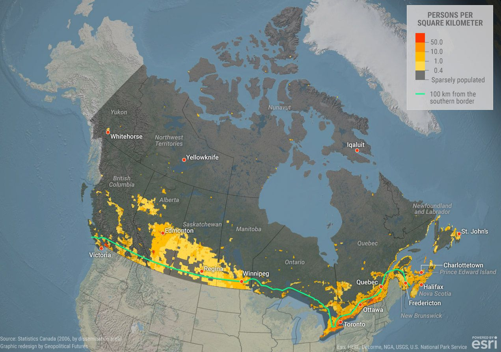
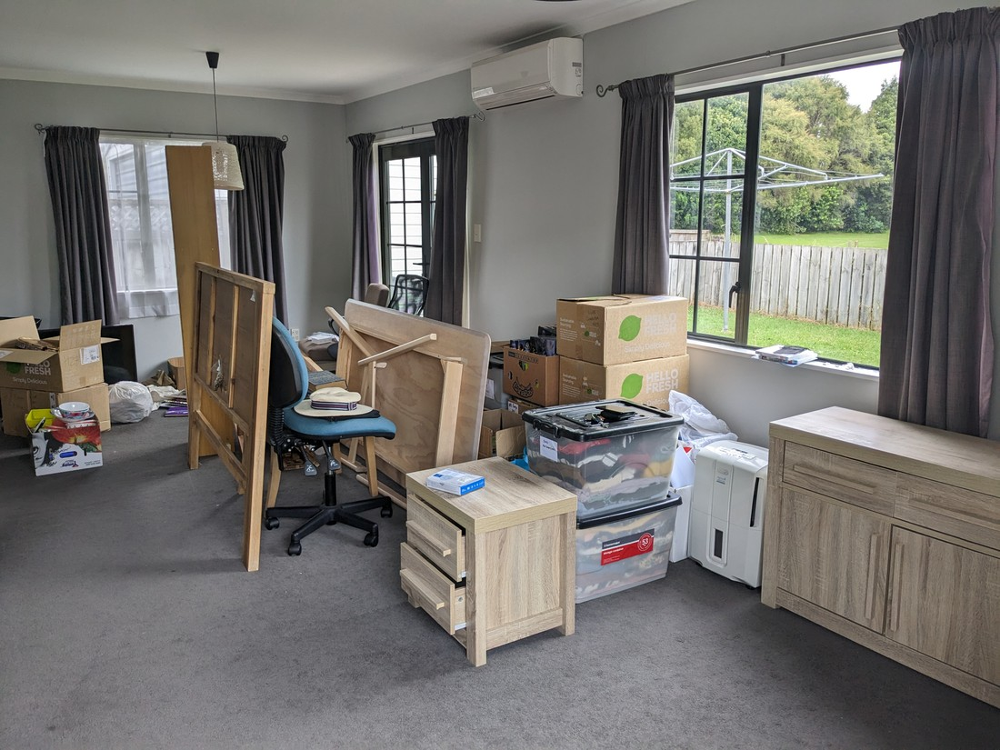
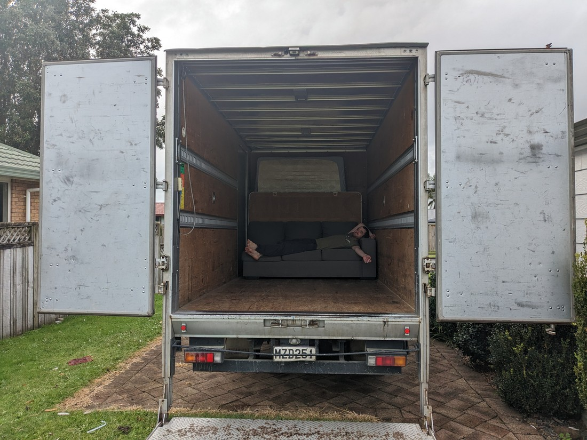

In less than two days we'll be flying one-way to Canada.

Man - this trip has been a long time coming.  Where to begin?

Some backstory: the idea of us travelling to Canada for a working holiday dates back to 2020.  We had been on a pretty great holiday in 2019 and we wanted more.  We're still young (relatively) so we figured why not try a working holiday somewhere.  Turns out most countries do not consider us "youth", but there were three that said 35 is still young.  Those three countries were Finland, Slovakia, and Canada.  So basically there was no decision.  We had loved our time in Canada in 2019, it is primarily English speaking (not required but it helps), it's huge with lots of places to see, and the people there are known to be generally pretty nice.

But of course 2020 was not the year for travelling. Borders were all locked down.  No country was processing visas.  And you might have heard that there was a killer virus going round.  So the idea remained just that - an idea.

Two years later the world had returned to some sense of normality and Luke and Betty were pondering their options.  Betty was desperate for a change of job.  Luke had finally decided that he did want the experience of living in another country.  So, in early March 2022 we started to take action.

First step to a new (but temporary) life in Canada was to enter a lottery.  Only so many New Zealanders could go to Canada on a working holiday visa and we just had to hope that could be us.  After entering we just had to sit and wait and hope.  However we didn't need to hope for long; both our names were drawn out within the week.

So our aim was to get there in early June 2023 - just in time for summer so we could do some travelling before finding jobs.  It  was then time to start planning.  First port of call was to research where we might want to go.  Canada is huge - but it actually doesn't feel as large as it looks.  Most of the good stuff is relatively near the southern border with the USA.  So our holiday plan was to travel the trans-Canada highway from the Pacific to the Atlantic.

> Population density map of Canada - most of the grey is lacking in roads and Tim Hortons.

Then we found out that due to a technicality we would need to arrive before mid-May 2023.  But despite May being on the verge of summer, most of the interesting Canadian parks would still be frozen for another one to two months.

So we adapted.  Rather than change our plans we would just add some extra travel onto the start.  And fortunately we had a great idea.  Being more southerly, summer arrives much earlier in the USA than it does in Canada.  We'd get our visas and then hop the border for a few weeks.

Then in late 2022 the world decided it was going to change again.  Inflation in New Zealand and worldwide went crazy and for whatever reason the New Zealand dollar's value also plummeted.  This might mean our pre-work holiday might be too ambitious - would we be able to afford such a long vacation.  So rather than crossing the continent we decided that after our USA excursion we'd just visit the one part of Canada that we most wanted to visit (or more accurately "revisit").

While this was all going on we were also having to start letting people know.  It wasn't the easiest thing to do to start telling our friends and families that they wouldn't be seeing us for a long time.  Nor would it be easy to tell our colleagues that they would have to be continuing on without us.  These announcements were dribbled out over months when we felt like the timing was right.

Then in November 2022 it was time to start booking.  Flights were booked.  Insurance was purchased.  And we had to start organising accommodation.  It turned out that a lot of summer accommodation in and around the national parks would book out very quickly and we had to get in as soon as they became available - which was usually at 4am New Zealand time.  So Luke had to wake up in the middle of the night about ten times over the course of five months.

To quit our jobs we also had to go through the process of going through leaving ceremonial dinners and lunches.  Without exception our colleagues were all very encouraging and excited for us, lamenting the void we'd both leave behind at our respective workplaces - which was really nice.  Certainly made us have moments of guilt at leaving these lovely people behind.

But what to do with all our stuff while we were away?  Everything needed to be either sold, dumped, or put into storage.  And over the last six years we'd accrued a lot of stuff.  Plus Betty's house would need to be rented out, which meant repairs and improvements would need to be made.  It turned out that thousands of dollars was needing to be spent.

> This may look like a mess but it's our mess.

Then once we had quit, we had to pack and clean.  We had allocated a whole week for this.  And it was not an easy week.  Our whole lives had to be sorted and packed into labelled boxes, then loaded onto a moving truck and driven up to Auckland to be put into storage.  Then six years of dust and dirt had to be removed from every room in our house.  We had quit our jobs but in this week we found ourselves working harder (and specifically more physically) then we ever had before.  When it was all done we were a bit broken.

> Tired after loading only two mattresses and a couch

This was supposed to be an exciting time in our lives but there had been so much setup to get here.  Sacrifices had been made over the 14 or so months this had been in the works.  Time, effort, sweat, and tears had been spent and as we packed the last load of stuff into our car and what did we have to show for it?  An clean and empty house that was about to be someone else's.

And the work isn't even over.  Once we arrive in Canada there will be a bunch of further tasks to do such as opening bank accounts, buying a car, getting drivers licences, applying for jobs, and finding a permanent place to live.

When are we going to be able to start having fun?

On a dark Thursday night we left Hamilton for the last time with no answer to this question.

But we found something when we arrived in Auckland.  Unbeknownst to us, instead of storing our furniture away in her spare room as planned, Betty's Mum had arranged our furniture in the downstairs area in resemblance of what it had looked like in Hamilton.  It was a strangely welcome gesture.  It reminded us that we hadn't just spent the last 14 months erasing our lives in New Zealand.  It was all still here, and would be here for us to return to when we got back.

We'll be in Canada in less than 60 hours and I hope all the planning and effort we've put in will pay off and all our friends and colleagues who assured us that this will be an amazing trip will be proved right.

