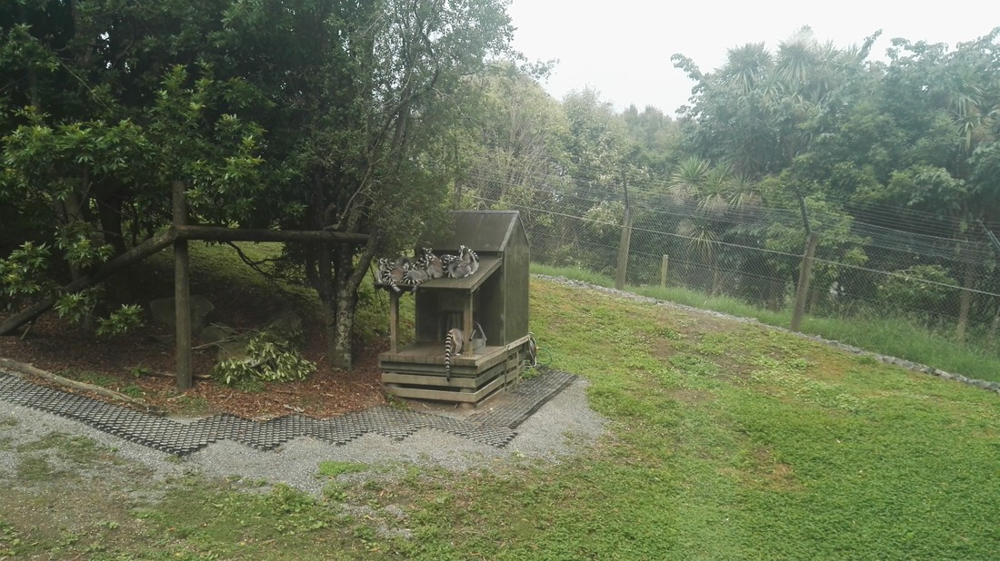
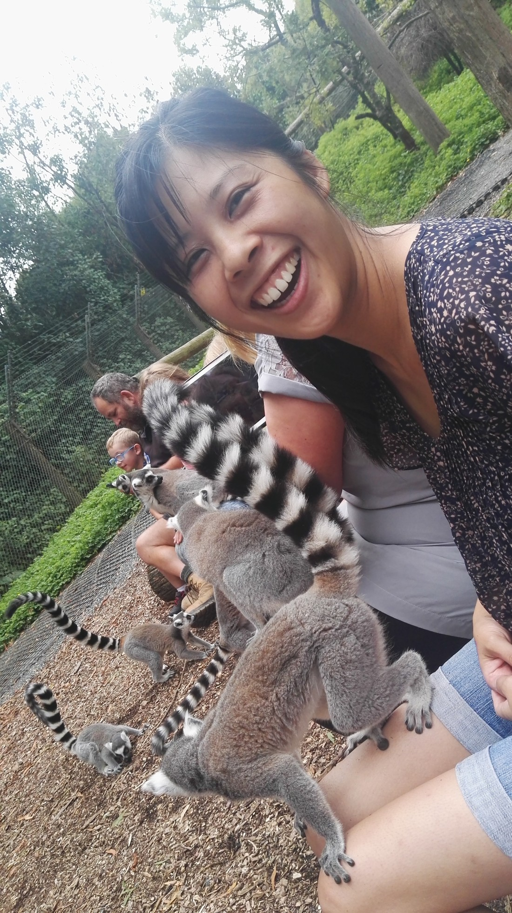
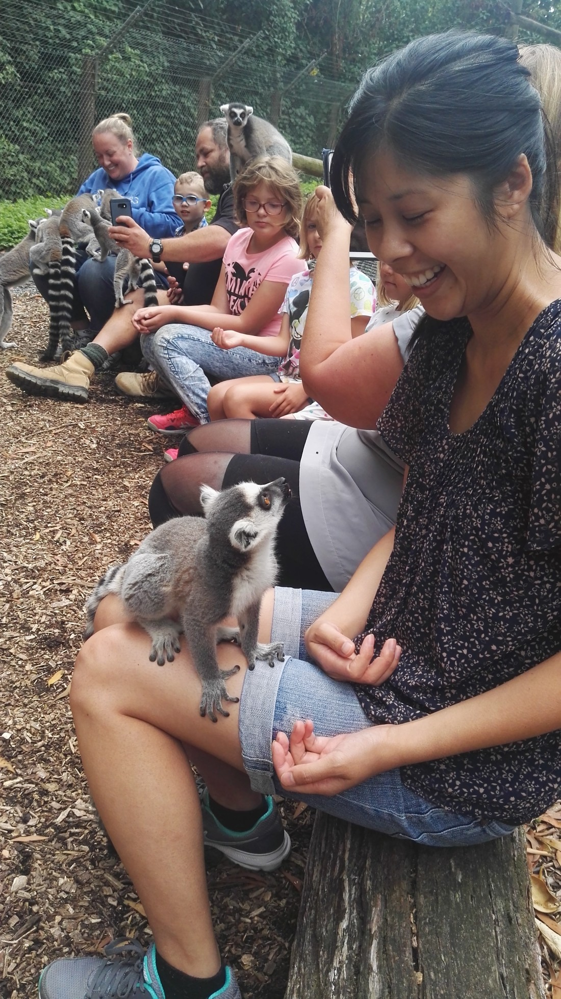
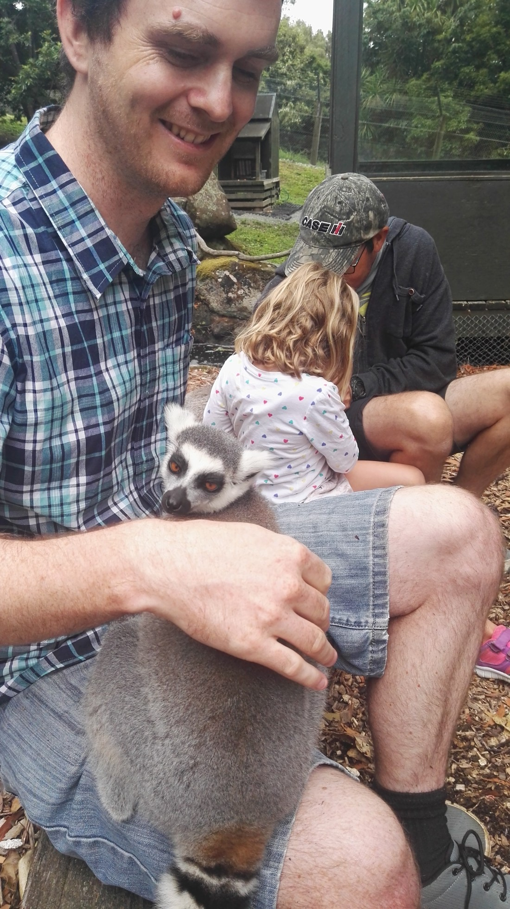
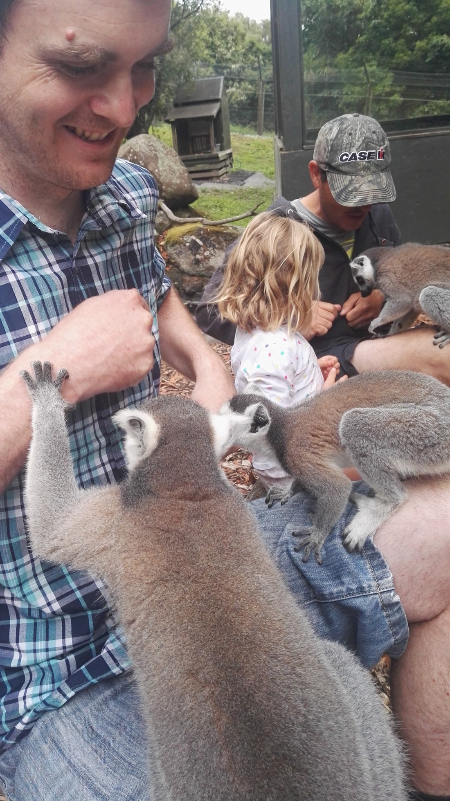
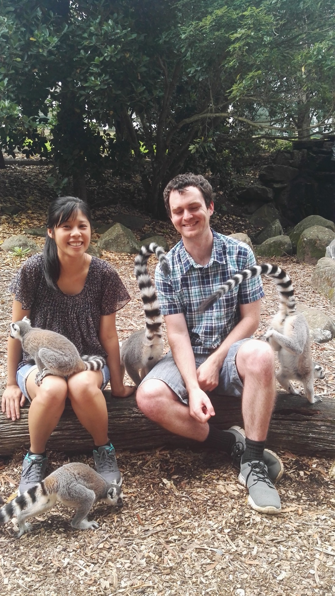
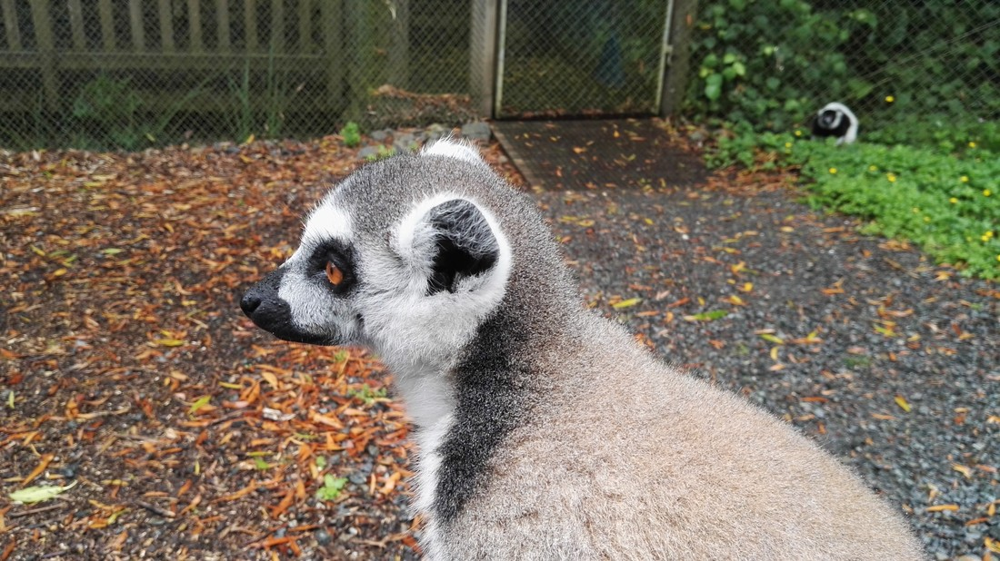

Well, our 2023 holiday is off to a slow start.  We are always very early to our flights, leading to long waits - but this time we were extra early as our flight was delayed by almost three hours.  Now we're stuck sitting in the airport waiting to take off at 11pm for Vancouver.

I don't have much to do so I decided to write about something that happened a long while ago - when Betty took me to the Hamilton Zoo and we bought passes for the lemur encounter.

First things first, this blog isn't actually going to be about the whole zoo - just the lemur encounter.  I will say that the Hamilton Zoo is pretty decent and should be visited even without a lemur encounter.  Also, it doesn't even look like the lemur encounter is a thing any more.  I noticed it was stopped during Covid and now I no longer see a mention of it on the zoo's website.  But regardless of all that, this blog is just going to be lemurs.

Basically, a lemur encounter is when they take you inside the enclosure, and then this happens:

> Almost instant chaos.

The lucky participants (which included us) are all sat down in a line on a series of logs and given handfuls of food to give the lemurs.  And the lemurs certainly know that - cause this happens daily for them.

So they jump around all over you trying to get your share of the food.  I suggest getting a seat in the middle to maximise the number of lemurs running over your lap.

I will note that something that you are surprisingly not able to do is pat the lemurs.  For some reason the oils in your skin messes with the oils in the fur or something.  Here is what happened when I accidentally (was just my reflexes) went in for a pat.

> The lemur knows the rules - this is definitely a no-no

So you're in this weird situation where you can't really touch the fluffy lemur, but they can and will touch you however they want.

> I was being stingy with my food - not giving it out too fast, much to the annoyance of some.

Betty and I are pretty cheap.  When we go to places like this, we don't really opt for any of the extra stuff that requires extra money.  But we did opt for this - because it was certainly worth the extra money.

> Clearly

If it is still going on in the same fashion, note that I think you need to be at the zoo quite early to secure a spot.

Ten months later at the end of 2018 we had a work Christmas trip to the zoo.  People brought along their partners and kids - it was a fun time.  During this event they announced that there was a competition.  Answer ten questions correctly and win a lemur encounter.  But there was a problem - the prize was too good.  We (like many others) knew how excellent this prize was and so all the young 20-30 something year old developers were sprinting round the zoo to get the answers first.  This had an unfortunate side-effect that it meant none of my colleagues with small children (who would have benefited most from the encounter but cannot sprint as fast) got to take part.

We knew this was a bit unfair - but we really wanted the prize too.  We ended up just being quick enough.  Anyway, for whatever reason we didn't take many photos that day (it was raining a bit - perhaps that was why).  This was the only one we got:

> I completely forgot to mention that there are also a couple of black and white ruffled lemurs, but they clearly get bullied by the gang of regular ring-tailed lemurs.  You can see one in the background here - cautiously keeping it's distance.

So that's it about the lemurs.  Writing this killed about an hour or so.  Still over an hour until boarding, at which point there will be another 12 or 13 hours to kill.  Probably will write some more - we'll see.