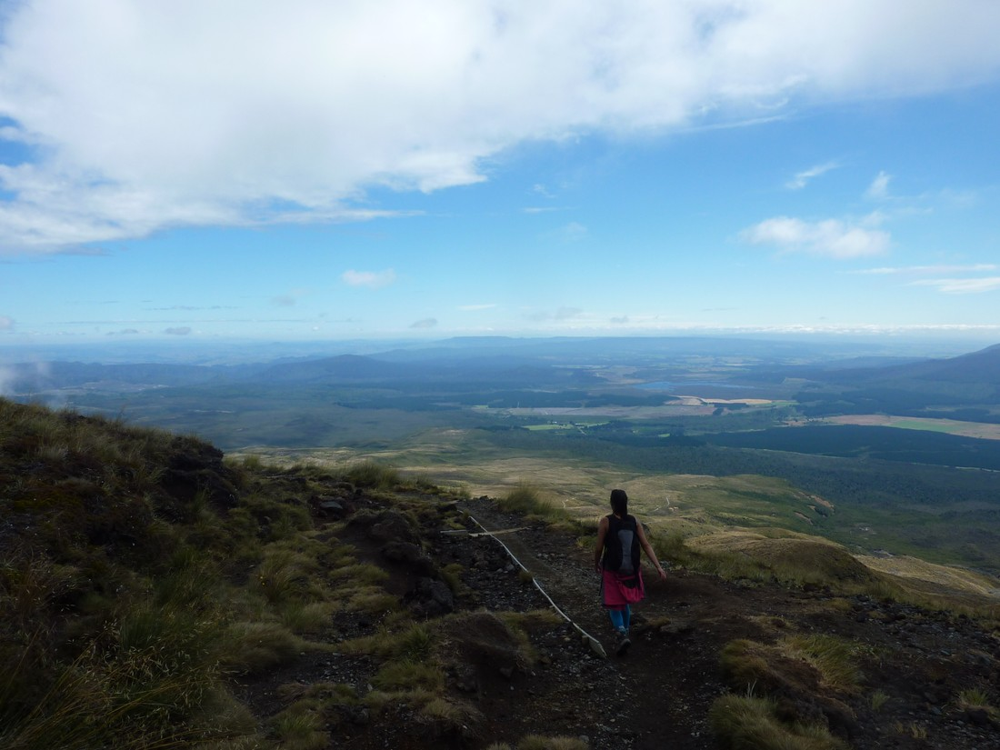

In February of 2016 Betty and I were lucky enough to be able to borrow my dad's motorhome and take it on a tiki-tour around the South Island of New Zealand for two weeks. However to kick it off we decided to attempt the Tongariro Crossing (perhaps New Zealand's most famous day hike) on the way down to Wellington.

The night before we stayed at a camping ground near the southern end of Lake Taupo. We were able to pick a site so I smartly backed into a spot on the lake edge with a gorgeous view of the lake out our back window. However this did not end up being a smart decision. In my haste to pick a site I had failed to notice the cluster of tents next to us. The occupants were sitting around drinking, and they continue to sit around drinking until... a very late hour.

So not the best night of sleep, especially since we then needed to get up well before dawn to catch the early shuttle. Waking up in full darkness, we silently got our stuff together and then started up the motorhome. Then as soon as I switched the headlights came on the motorhome started screeching terribly.

Not good. Not good. Not good.

Panicking, I turned the lights off. Don't want to disturb the other campers. I probably shouldn't have cared too much - after all the tent dwellers had spoiled our sleep already, but likely it would not only be them that we would be waking.

Anyway, I managed to navigate out of the camping ground using just the lights from the various street lamps. But then we got to the open road which was pitch black. Having no other options I switched the headlights back on and the screeching started again.

What to do? We need to be leaving now to make our shuttle - we can't just wait around until dawn. But the screeching sound was truly unpleasant to us - and probably anyone we passed on the (probably) 30 minute drive to the shuttle park.

Fortunately the noise just kind of just stopped. First it lessened and then disappeared altogether. I'm not a mechanical person so I can't really explain why that happened but that is what happened. And fortunately for the rest of the trip we never needed to drive with the headlights.

Well, that was a whole lot of paragraphs and I haven't even gotten to the "crossing" part yet. To do the crossing, usually you'll park in a giant carpark near the end and then take a shuttle to the start. The shuttle is a full sized bus, and there's probably one departing every 10 minutes or so. Point being - there's a lot of people that do this walk every day.

I think we started walking around 6am - just as the sky started dawning. It was an early start because the walk was long and we wanted to make sure we had sufficient time.

I'll take this moment to note that neither Betty or I had done much hiking before this. We also certainly had not done any training. This note will become relevant later. Well, not too much later. After half an hour or so of walking through a valley, the path then turns and goes straight up the valley wall. This was the hard part. Lots of steps and lots of stopping to let people go by while we rested.

The February sun also wasn't helping. We'd read up on the conditions and despite it being expected to be a nice day it was recommended that we pack for all conditions as this was an alpine environment. But probably within the first hour we had stripped off all our warm clothing. And it turned out to be a perfect day (weather-wise) so we never needed that clothing again, but of course it burdened us for the rest of the hike.

Fortunately once we did get to the top of this climb the path then became completely flat. Kind of amazing how flat. Can't really believe how flat this section is.

> Someone likes flat walking

Also the fine day gave a great view of Mount Ngauruahoe

They won't show up in the picture but we could spot a fair few people working their way up the mountain side. It certainly looked steep and unvaried, but maybe this would be an interesting thing to try at some point. But too much for us to attempt today in addition to doing the crossing.

After we crossed the big flat part, we then had to start climbing again. Also, gone were the nice paths and boardwalks - this was more rugged.

> Goodbye big valley of flat walking

But we were getting quite high now. Lots of views out towards the dessert road and of some interesting volcanic formations.

And lots of chances of "selfie stops"

> Definitely not "catch your breath" stops

Then the good news is that we reach the very top of the hike. Mostly downhill from here. The downside is... well, the downside. The slope is covered in scree, meaning every step feels like you're bringing down part of the mountain with you in little rocks.

> But at least we're not having to climb up it.

At the bottom of this hill is the emerald pools which generally live up to their name.

> I would say that's definitely "emerald-y"

These pools also are roughly half way out of the hike and we're feeling decent. But we're being passed a lot. In the morning there wasn't so many people (because we were on one of the first buses) but a lot of people on later buses are catching up. For a long time it has felt like we've been walking in one giant line of people. And here's a picture of those people coming down the scree:

After we ate we then continued on, which included a bit more up...

...followed by another lake. Less emerald this time but it makes up for this in big-ness.

And shortly after we passed over the other end of the crossing and began our descent.

Which ordinarily this is where the story would trail off. Except I want to recall back to the part earlier where I mentioned we hadn't done any training before this hike.

This last part was long, and while it was downhill (so should have been easy) it was again the downhill that gave us trouble. It took us three hours to walk down the last part of the trail as we were constantly stopping to ease the pain on our legs and feet. Sure, this wasn't a small distance (I would guess seven or eight kilometres) but it was definitely a distance that didn't ought to take that long. And when we stopped the line of people would just keep moving as hundreds overtook us.

And to make it just that bit more frustrating, we spent most of that three hours in sight of the carpark as the sunlight reflected off the car windshields. It certainly frustrates you a bit when you feel like you've been "almost done" for three hours.

We ended up finishing the whole hike in eight hours - exactly what DOC said it would take. Generally I understood DOC estimates to be higher than what the average person might do - and given the number of people that started after us and finished before us then I guess that is true. But it definitely wasn't our finest hour.

But overall it was a good walk and a good time. It did make walking around Te Papa a bit challenging the next day though but we came right in the end and we went on to get fitter and walk many longer and harder walks in the future. This was just a blip back when we first started hiking where our ambition exceeded our ability.

But the good news is that despite all the amazing walks we've done in the seven years since, it has never happened again.

...

Okay, maybe twice again (roughly).
