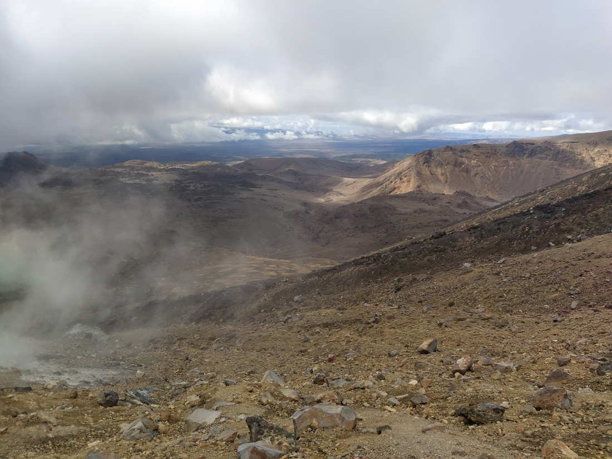

Back in the distant past of 24 April 2023, Luke and Betty were stuck at the airport. They had arrived for their 8pm flight shortly after a notice was sent out telling them that their flight had been delayed until 11pm. They now faced a long wait for their long flight to Vancouver. To pass the time I wrote some blog entries, partly to test out my new system but also partly because I was now in holiday mode and when on holiday I write blogs.

So I wrote about the first time Betty and I hiked the Tongariro Crossing. There was supposed to be a follow up about the second time we did that hike, but the blog was never finished due to... well, holidaying. Now with that trip complete, it is time to finish what I started: a couple of Tongariro Crossing stories to bookend our big journey.

We attempted the Tongariro crossing for the second time in March 2021 - six years after our first attempt - and this time it was very different.

The summer of 2020/2021 in New Zealand was both post-COVID and pre-COVID. We had spent that summer out and about after the first lockdown in the happy time before the Omicron variation swept through the country. Come March 2021 and Betty and I were in pretty decent shape having been on a 2.5 week hiking holiday as well as doing a range of other trails around the North Island. And as summer drew to a close we had the thought, "why don't we do the Tongariro crossing again?"

It was a pretty good idea. Last time it had felt like an endless lane of foreign tourists. However now the New Zealand borders have been almost completely closed since March 2020. Also last time we were not hikers - just a couple of regular Joes attempting something a bit out of their comfort. This time we're very much prepared.

So we booked some accommodation for a Friday night and drove down late to give it a go.

I will say that the weather wasn't ideal today. No rain was predicted but plenty of cloud was, which might be an issue at the elevation we were at. See the photo below - there's supposed to be a mountain behind me. All in all, the weather was very different from last time.

> Also different from last time - I have facial hair now

And naturally there was a lot less people this time. There was no line of people covering the whole trail, just occasional group. With those borders closed, the Tongariro Crossing was basically like any other trail.

> Not a person in sight. This photo would have been completely impossible last time.

To get here we still had to take a bus (even though it's quieter than any other time in recent memory, the trail ends still aren't suitable for parking). But last time the buses were running one after another. It probably didn't matter when you arrived - you'd just jump on whatever bus was leaving at the time. Well not this time. We arrived early for the 7am shuttle and had to wait in the giant but empty carpark.

But back to the trail. We did a small detour to a waterfall near the start. It was so unimpressive that I'm not even going to show it here. Hopefully we won't come to regret the extra distance this added. Then after the initial flat section comes the steps. This resulted in a lot of stopping for us last time. But this time, it felt so much shorter. No stopping - not even a problem.

> We've come a long way from the hikers we used to be

Again, weather wasn't the best. That's the disadvantage of this hike - the accommodation needs to be organised several days in advance, before you know exactly what the weather is going to do.

> Still no sign of Ngauruhoe

Another thing that has changed since the last time we were here is that people are no longer allowed to climb to the summit of Mount Ngauruhoe or Mount Tongariro for cultural reasons. Climbing the former did sound like a worthy challenge so I was a little disappointed, but there's probably plenty of other challenges we can attempt instead.

> Betty didn't mind that we can stay on the flatter path for now

Then began the climb to the highest point in the crossing. Here it felt like we ascended into the cloud layer. We were no longer able to see any views on either side, and sometimes we could barely see that far in front of us. Last time we were here it was a beautiful sunny day. Very different today.

It also got a lot colder. I had to put on my warm clothing - something I almost never do. Guess it was good we decided to bring them this time. Last time we regretted the extra weight of clothing that got taken off in the first 20 minutes.

> I cannot stress how rare this is that I am wearing extra clothing on a hike

The cloudy coldness dissipated once we were over the high point. Now it was just down the stones to the Emerald lakes.

I believe it was down near these lakes that we had lunch. We found the least uncomfortable rocks we could find and sat facing out over the Rangipo Desert. Fortunately the thick cloud layer just above us didn't ruin our view.

> It looked nicer in person

I don't have confirmation but I believe our lunch was a shared Subway sandwich purchased the previous day. Such a classic Luke and Betty lunch - quick, easy, and delicious. Sure the sandwiches get squashed a bit after being carried several hours in a backpack, but after several hours of hiking we are not caring about stuff like that.

The Tongariro Crossing is a bit of an usual walk. At this point in our journey we've done basically all the hard sections and seen most of the spectacular sights. And yet, we haven't even reached the halfway point.

Is it good that the trail is frontloaded with all the good stuff (and yes, I am calling the hard steps "good")? Well, at least it is literally downhill from here as well as figuratively.

I remember thinking after we finished our hike that we'd done it extremely quickly. There were a handful of other people waiting at the end when we arrived but we were likely amongst the first 10 or 20 hikers to finish for the day. I remember thinking that I was proud of our time to walk the 19.4 kilometre trail. However, I am writing this more than two years later and I have forgotten exactly how fast we went. Fortunately we live in the modern age and something great about technology is digital photography. Not only are digital photographs so versatile, they also contain timestamps!

The first photo I have is from 7:20am (makes sense given the shuttle takes about 15 minutes). The following photo is from 1:15pm. That means we crossed the crossing in six hours this time - which includes an extra detour at the start. That's a two hour improvement on last time. We certainly have come a long way from those naive 27 and 28 year-olds that we were back in 2016.

And like last time we chose to walk the extra kilometre rather than wait for a shuttle back to our car.

> Due to a lack of buses whereas last time where it was an excess number of people

As I have said a lot over the last 1,200 words, our experience this time was so different to last time. So few people - we barely saw anyone over the final couple of hours. So cloudy - we never did see Mount Ngauruahoe. And so quick - dare I say the walk seemed rather easy. It doesn't top the rush we got from doing this hike for the first time but it sure was a memorable experience.

And I suppose it's also an experience that we may never get to experience again. I try not to complain too much about tourist numbers wherever we go since we're usually tourists ourselves. That being said it sure was nice to experience New Zealand's popular and busiest hikes without the "busy". Unfortunately due to the circumstances that allowed this to happen, I can't wish for this to happen again. So let's just end by saying it was great that we took the opportunity when it did happen.
