Luke and Betty have been overseas for four days and this is the first blog post?  What's going on?  Well, it's not like we've been doing nothing - more the opposite.  In fact, we've done quite a lot the point where Betty and I have been amazed it has only been four days.

But the stuff we got up to in the first four days have been general "getting-to-know-Canada" stuff.  It has not been easy.  Canada has been fighting us a fair bit more than we were expecting.  We're coming out on top but overall the first three days weren't three days that needed to be immortalised in a blog.  But I will mention that what happened yesterday.

After viewing a couple of underwhelming cars in the morning, we found a Nissan hatchback that seemed good enough value that we were willing to purchase it.  Unfortunately once we found out the true cost (after taxes, dealership fees, exchange rate conversion, and exchange rate fees) it feels like it is costing us twice what we feel like it ought to be worth.  That isn't to say there would be any better choices - everything else would either be expensive or risky - but it left us in a bit of a nervous/unhappy mood.

So today we decided that it is about time we have some fun while we wait for the money transfer to go through.  It was also the finest day we have had so far.  The first three were good, but there was still a chill in the air.  Today was sunny and warm.

After a couple of short tasks in the morning were done, we drove across to North Vancouver to a place called Deep Cove.  This is a nice little neighbourhood that unfortunately can't really handle the number of people that visit every day to do a particular walk.  Of course, today we were a couple of those annoying people clogging up their roads and parking spots.

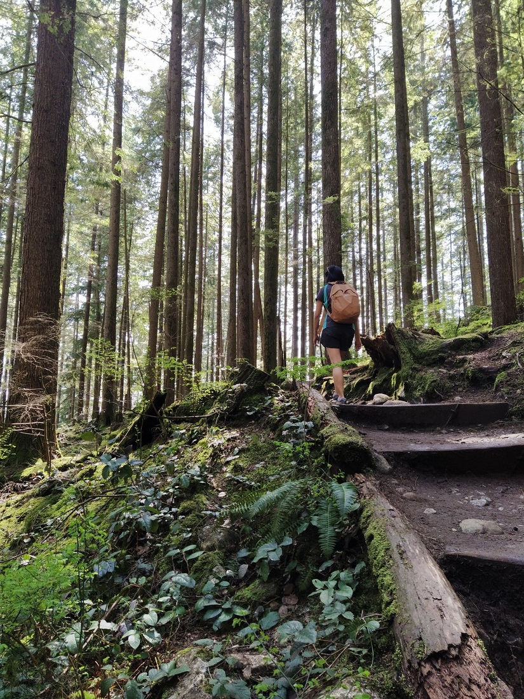

> One such annoying person

Quarry Rock is oddly named.  It is in fact a rock (a really big one) but there's no quarry in sight.  It juts out of the hill and gives good views over the bay.  It makes for a good destination to walk to and boy was the walk popular.  There were constantly people around us, with their kids and dogs.  I'd hoped with it being a weekday there would be less people, but no such luck.  However I really could not blame them - it was a really nice walk.  And I didn't care that it was busy - because the walk was still worth it.

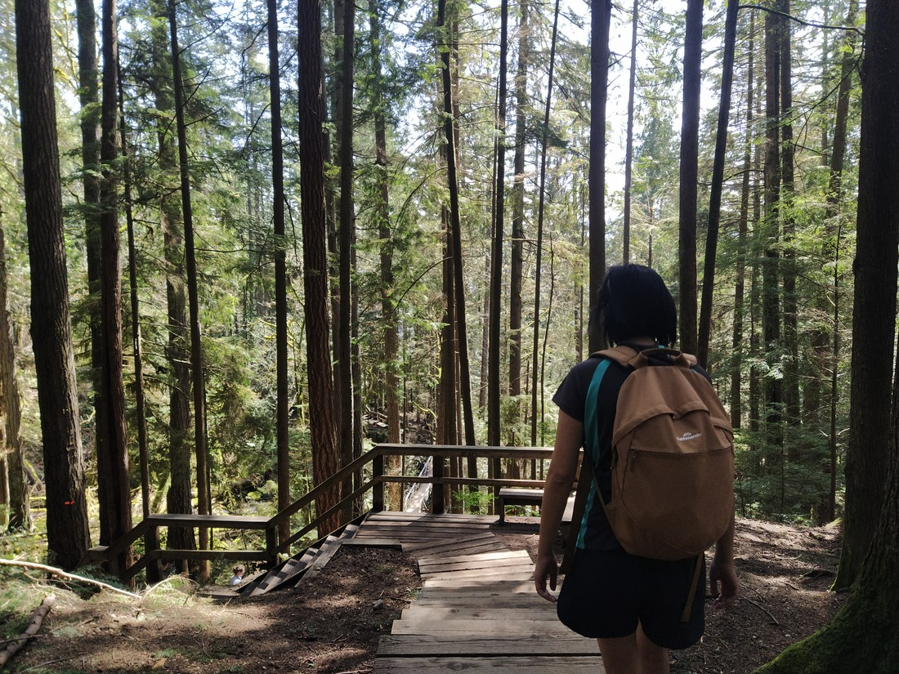

> Just the right mix of boardwalks, bridges, steps, gravel, dirt, and roots to make an interesting walk

The destination rock was as expected.  We took our customary "hooray we successfully did it" photos

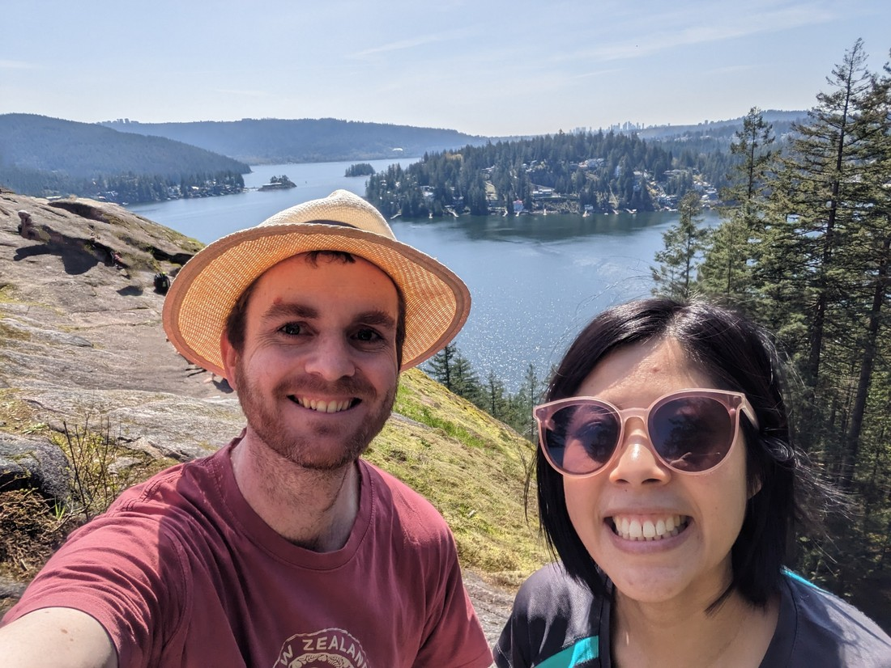

> "Horray we successfully did it"

Now you may wonder why we're standing in an imperfect viewpoint when there is clearly a better one behind us.  Well, that's because there was quite a few people here (of course) and I may have used some trickery in the previous photo.  Here's the original:

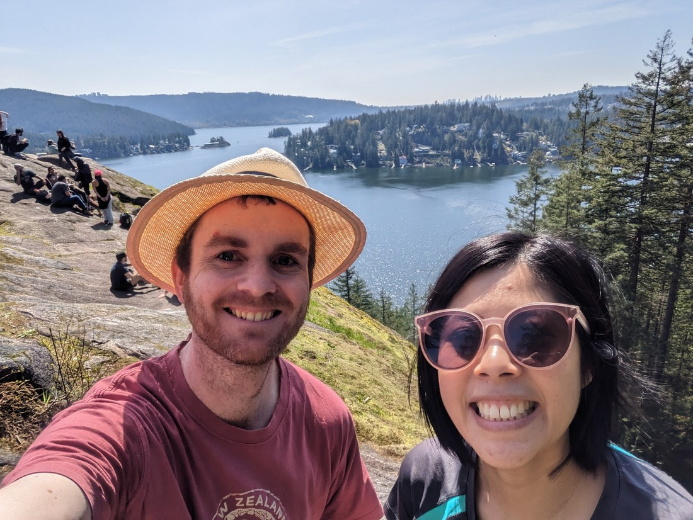

> If you compare the two photos you might notice that one person's arm and head remain visible - I guess the AI thought that he looked like a rock already

While still nice, the viewpoint actually underwhelmed.  It wasn't all that high and the view wasn't of anything too interesting.  Afterwards Betty and I compared notes and we both agreed that the walk itself was the highlight while the view at the end was just a little bonus.  Still, it does make better pictures.

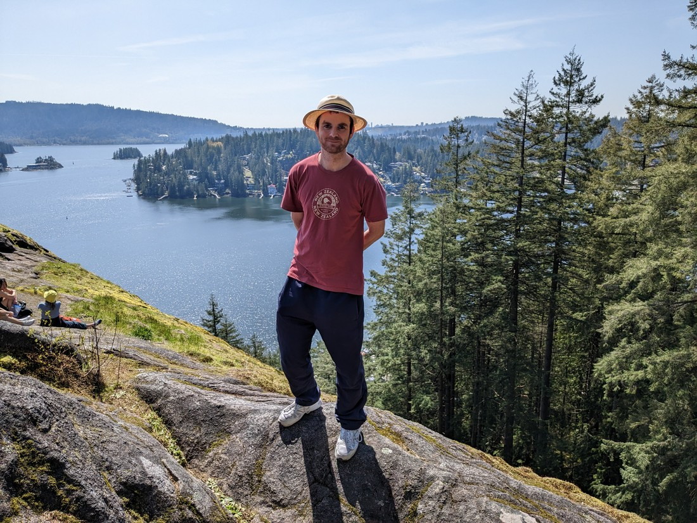

> Such a poser

Afterwards we had lunch and then the question became, "Do we have it in us to do more?" We're certainly not at peak fitness as we've had too many other things to worry about in the previous couple of months.  The morning walk involved a lot of steps.  How much more could our legs handle?  Well, it was still a nice day so we decided to do more.  After all, our legs have to get up to speed at some point.

The next walk was in Lynn Canyon Park and had a suspension bridge but wasn't going to charge us the $60 each entry fee that the other more famous Vancouver suspension bridge would charge.  Which makes sense because the suspension bridge wasn't that spectacular.  I'm not even going to include any pictures of it here.  Like Quarry Rock, the best part about this walk turned out to just be the lovely forest that we were walking through.

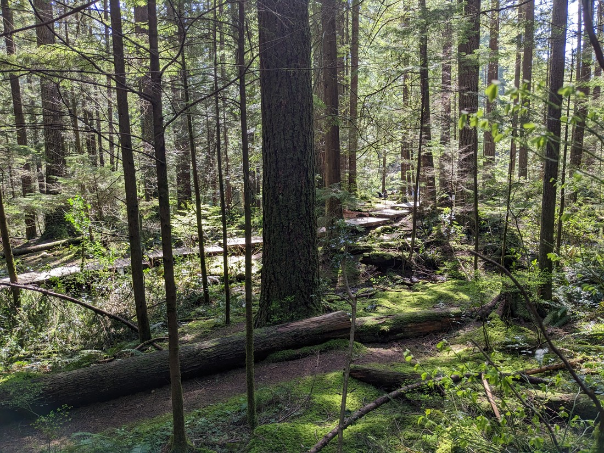

> Nature!

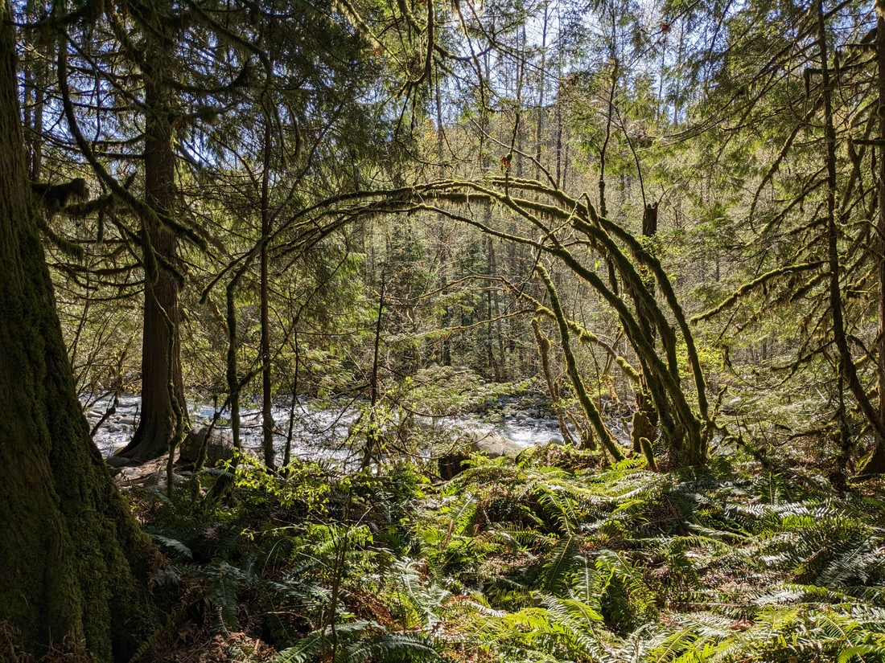

> Also nature!

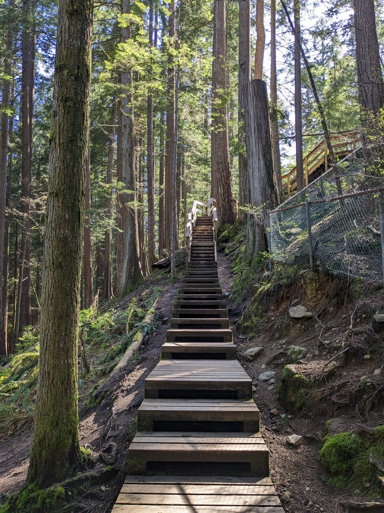

> A lot less people here than Quarry Rock

It definitely felt like what we needed after the last day or so.  But this is why we've been doing all the hard work up until now - so we can have moments and days like this.

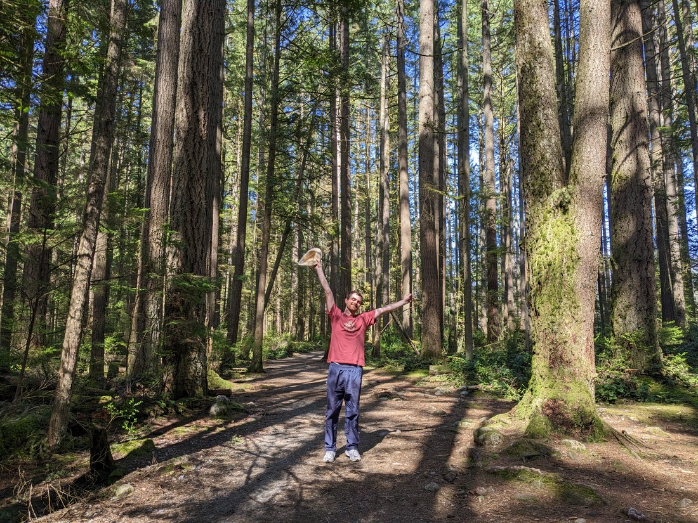

>  "Horray we successfully did it"

Despite the bridge being really close to the parking lot, we opted to do two completely optional loops around the park, taking in all the scenery and critters we could find.

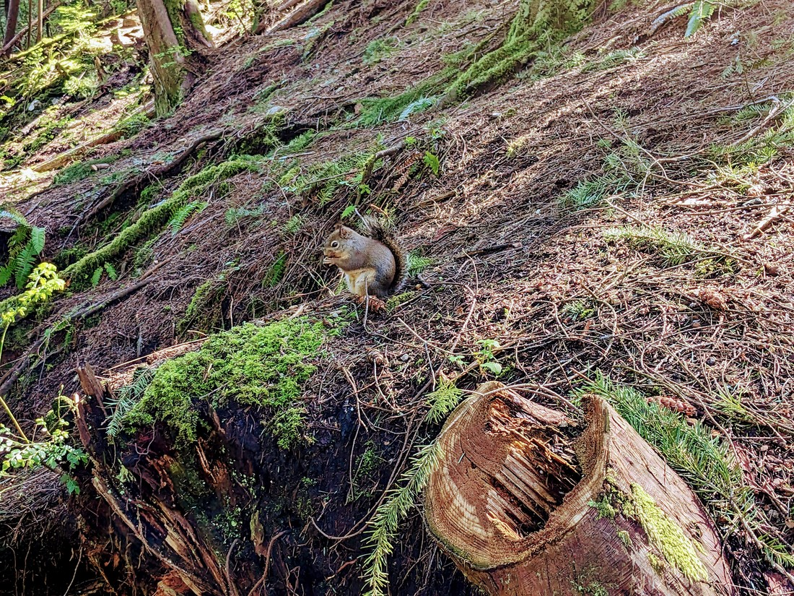

> Betty can provide the video on request

By the time we finished, we both had very unhappy legs.  Perhaps we may have overdone it.  Today wasn't supposed to be a hard day of walking, and it mostly wasn't - but I guess our legs just aren't used to all this.  We need to build the strength back up, but perhaps there were too many steps to climb for day one.

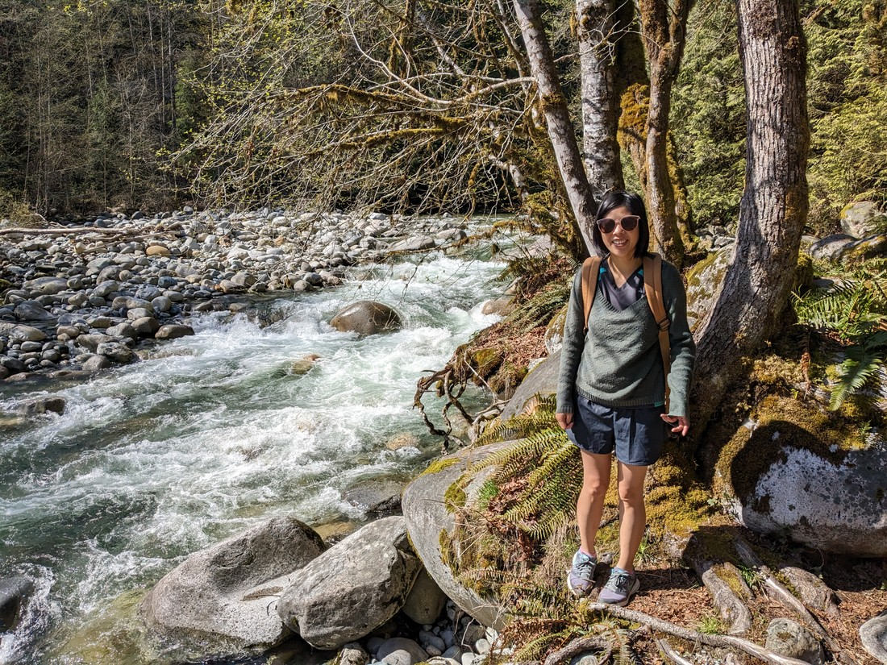

> Don't let that smile fool you - she's a bit sore

We'll just have to wait and see how the limbs are tomorrow.

