So yesterday was pretty good, right?  Well the weather is even nicer today.  Shall we just do the same thing again today?  Seems like a good idea.

Today we started by travelling an hour out of Vancouver to Golden Ears Provincial Park.

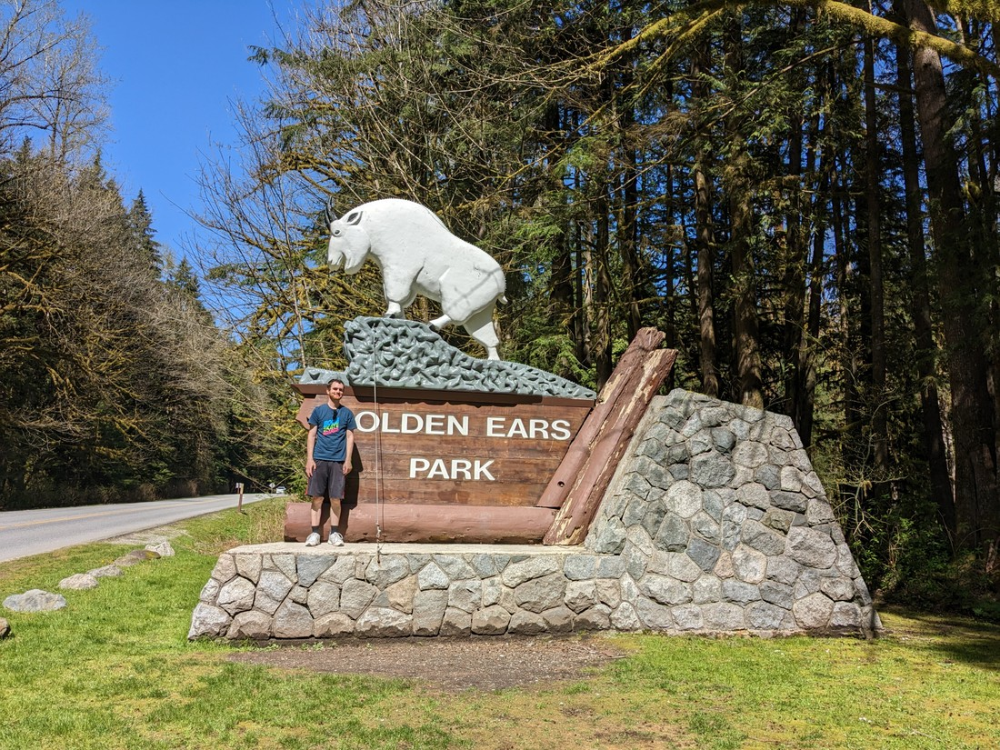

> Betty - why didn't you tell me I was standing in front of the 'G'?

First task was finding parking.  Unfortunately we still haven't quite settled into Vancouver time, so we haven't been getting up super early.  When we arrived at the trailhead carpark it was already full with plenty of other cars driving around looking for parks.  Being unable to park on the road, there weren't really any options other than to also drive around, cursing the people who left gaps not quite big enough for a car.

We did manage to snag a park, then headed off on the nearby trail.  It was a loop track to a waterfall, but clearly most people weren't doing the loop and were instead just taking the easy path there and back.

We made it to the turnoff to join the easy path and we noticed the sign said there was a bridge 1.1km further on.  It was a pretty nice day and walk so we were in a good mood, so why not add an extra 2.2km of walking?

And it turned out to be a pretty good bridge.

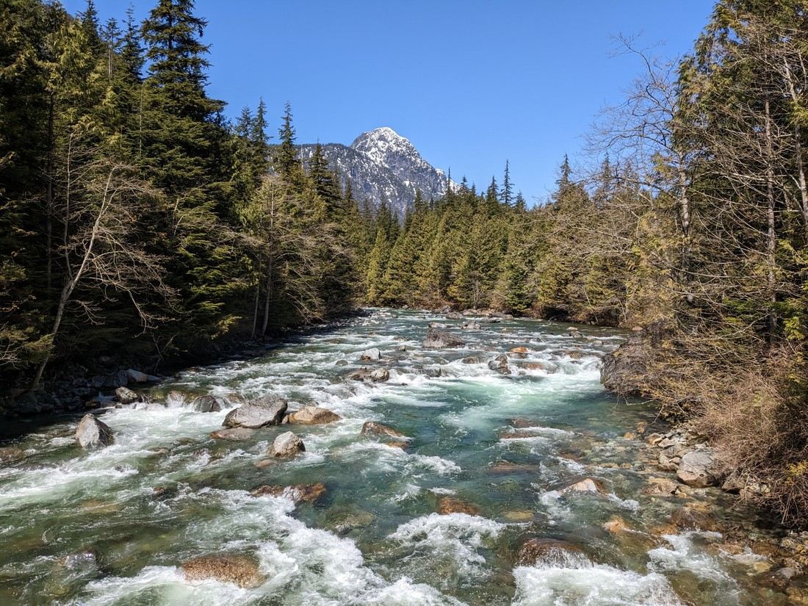

Vancouver has many mountains surrounding it and while they are mostly snow-free, there are still a number with white peaks.  Standing on a bridge in the middle of a river away from all the trees is a good opportunity to see those peaks.  Overall it made for a pleasing photo opportunity.

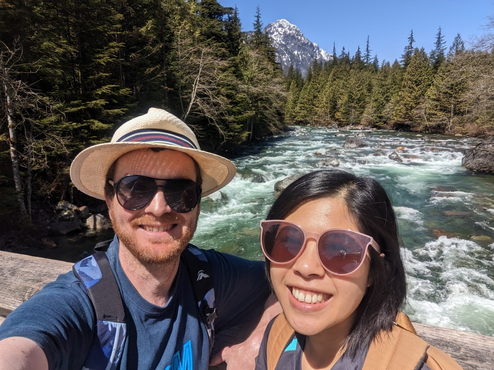

> Always glad when there aren't many people around to witness the awkwardness of trying to fit both of us, plus the scenery in the photo.  They don't all come out this well.

Then it was back up the hill that we had just come down.  Our legs are fine after the walking we did yesterday, but that doesn't mean they are "fine" fine.  Going back up was a bit slower than we are used to.

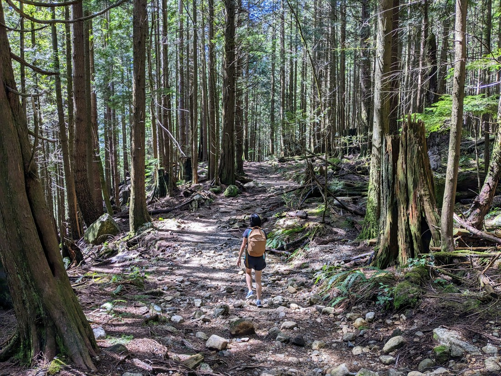

> One day legs, you'll be strong again and we can hike for 10s of kilometres per day

The waterfall was not the best.  It had lots of water - but not a lot of identity.  Just water dropping down a couple of metres.  However there was a clear drop in temperature near the waterfall.  That water was definitely cold, as it cooled the whole area around it.

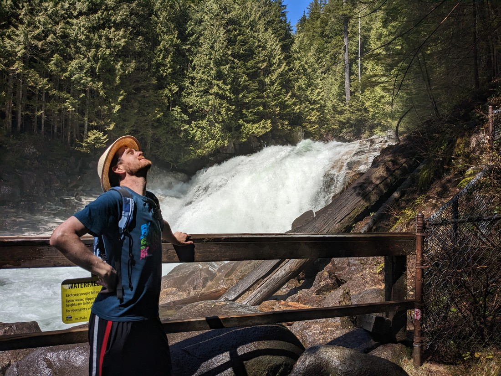

> Refreshing

Finishing the loop we had more opportunities to snap pictures of the scenery with the mountains in the background.

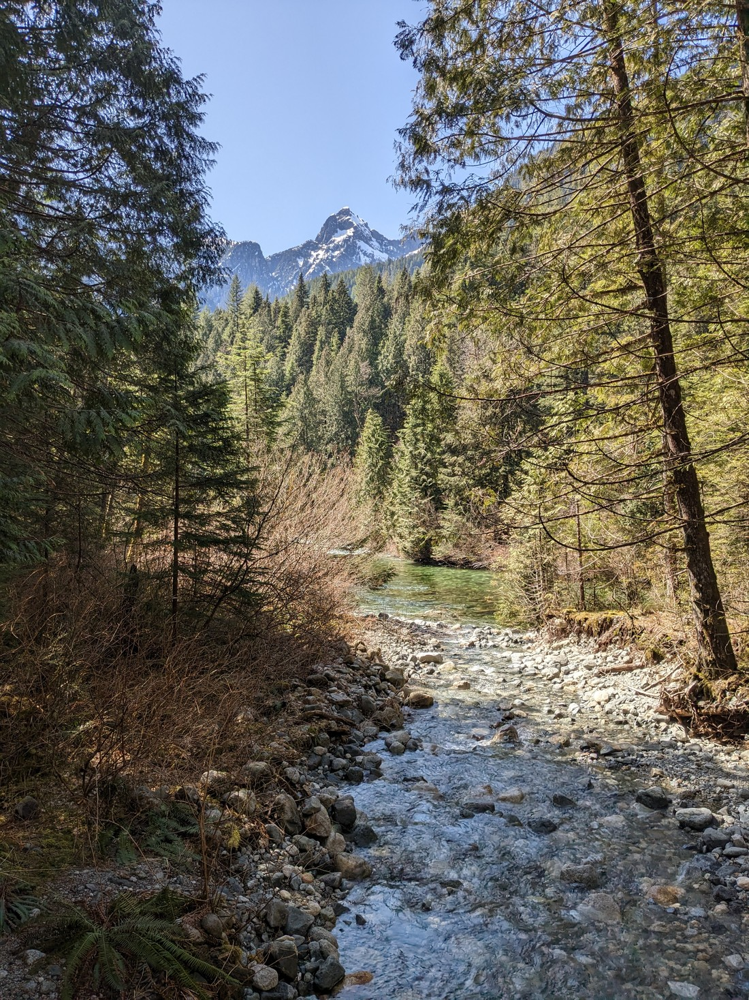

> Whenever there was a gap in the trees...

And more opportunities to be goofy

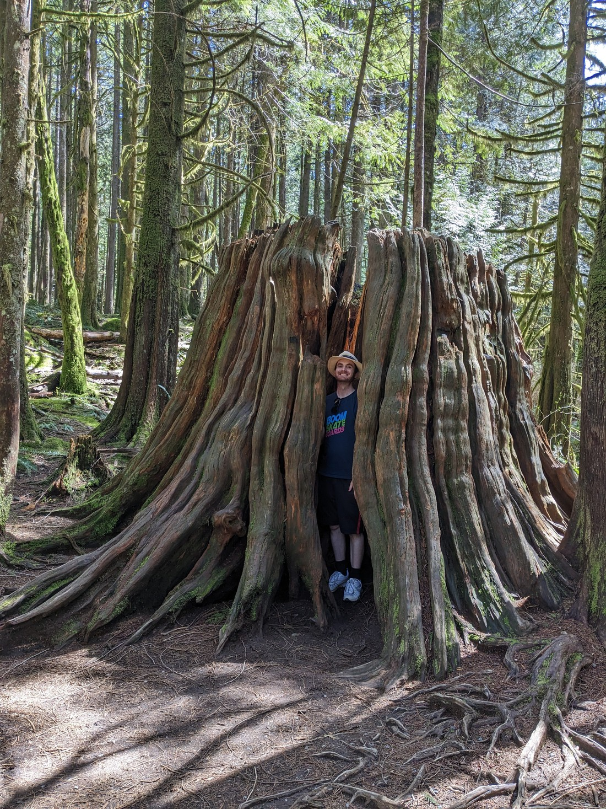

> You think I wouldn't walk past a stump with a hole just big enough for a person, and not try to squeeze into it?

Overall a very scenic walk.  The trails felt more like they cut through the forest rather than being part of the forest, but the extra views we got along the way made up for this.

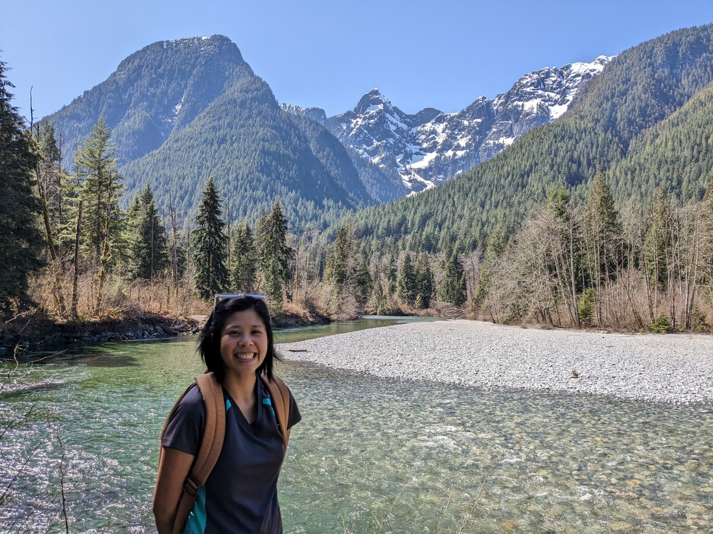

> Luke did touch the stream water and could confirm that it was very cold

After lunch (or rather, after we ate lunch as it was past 3pm by this point) we decided that some more walking was in order.  We headed over to Lighthouse Park in Vancouver West (which should really be called Vancouver Northwest since you get there through Vancouver North).

Lighthouse Park has a lighthouse in it.  Here is the view of the lighthouse from the designated viewpoint:

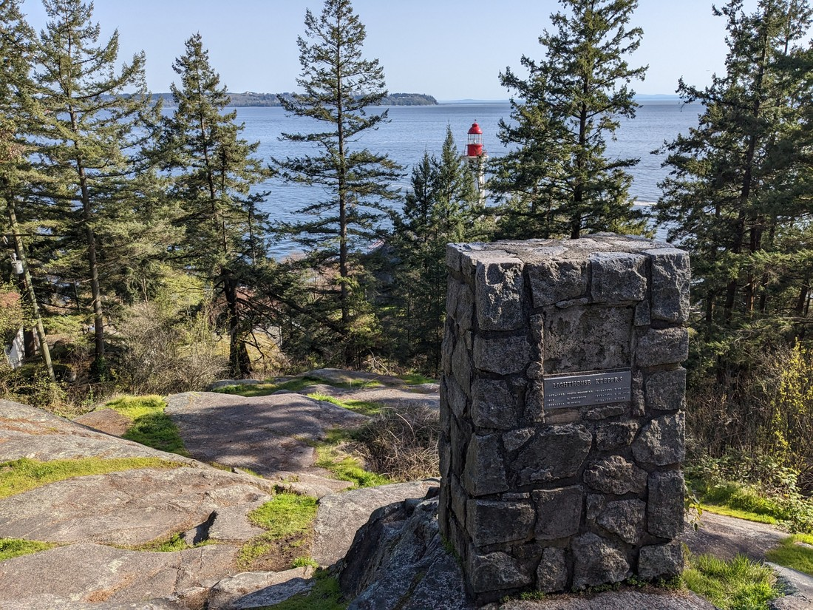

> Booo!

Seriously, those trees are not new.  Surely someone should have known not to put the viewpoint here.  If you're going to call your park "Lighthouse park" then the least people are going to be expecting is to see a lighthouse.  Mind you, we did walk a "bear trail" and a "beaver trail" yesterday and saw neither so maybe Canadians in charge of naming things are just liars.

So we walked down to a nearby beach.  It wasn't late yet but the sun was beginning to think about setting in the west.  It was quite a great place to relax after a nice day of walking.

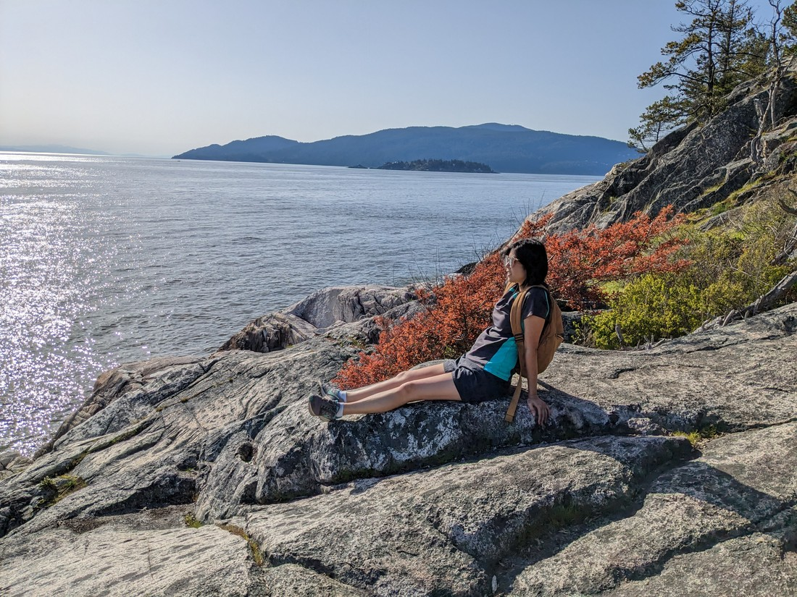

> Too much time on feet - time for sit.

And as a bonus, it actually had a decent view of the lighthouse.

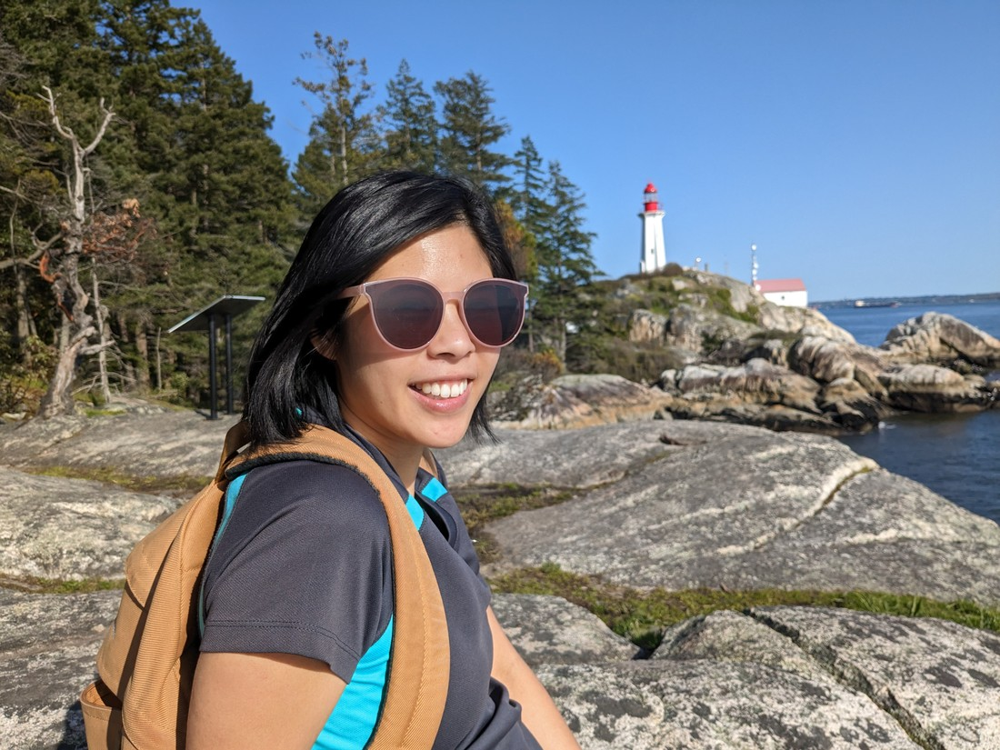

Afterwards we headed round to the other beach and looked out across the water at Vancouver.

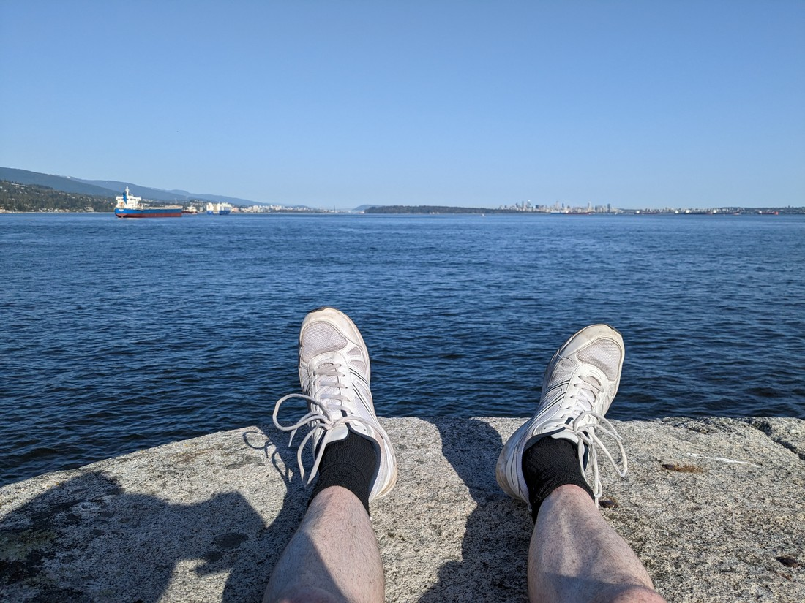

> Sorry for ruining this moment with my pasty white legs

Overall another good day.  Like the previous day we had some really nice forests to walk through.  Lots of pine and lots of spring growth.  New Zealand bush is certainly nice but there's just something about North American pine forests that make them feel so much more open and free.

We certainly look forward to seeing more of them on this trip.