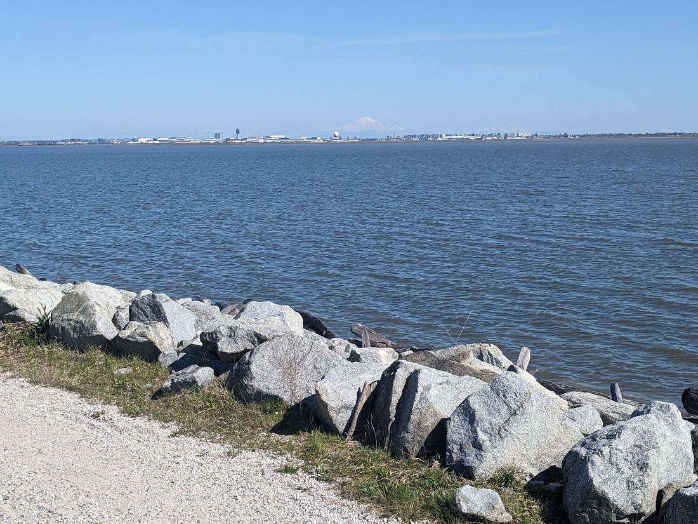

Today was another surprisingly sunny Vancouver day.

> We swear these trees must have bloomed overnight because we don't remember them like this yesterday.

But today we spent this morning researching tents.  We'll need one eventually and we may as well get it while we're in Vancouver.

Then we figured if we were going to drive half an hour to Richmond to the tent shop then we may as well do a walk of some kind nearby.  I managed to find a rather "unique" walk...

In the Iona Beach Regional Park there is a walk where you make an immediate right turn, and then walk straight out into the ocean for four kilometres.

> Luke about to walk in a straight line for four kilometres

No corners, no trees, no hills, no shade.  Nothing but straight walking along a "jetty".  Although we were near an an airport so these kept flying overhead:

> Close enough that we were able to read the airline logos

To our left was ocean with some islands.  To our right right were the mountains to the north of Vancouver.  And in front of us was Vancouver Island (a very separate place from Vancouver).  But all of this was very much in the distance.  There wasn't much else to see other than the occasional sea bird, and the dogs people were walking

> Had to take a picture with the mountains since I couldn't take a picture with the dogs

Over the 55 minutes it took us to walk the length of the walkway we wondered what it was that we were walking along.  It was clearly manmade and had a pipe or two underneath us.  Well, at the end we got our answer.

> This might also explain why the sea was browner than usual.

So not the most romantic of walks.  Very different from what we've been doing these last couple of days.  Well, it certainly was good exercise and the amount of wind and sun made it a very pleasant temperature to walk in.  Definitely worth the trip.

But right at this point we still have to walk four more kilometres to walk.

> Can't even see the start

> Same mountains that we saw on the way out

To pass the time we argued.  Betty was of the opinion that this white shape that we could see behind the city of Richmond was a mountain.  Luke was of the opinion that it was a cloud.

> Make your own guess before reading on

Luke argued that based on how blurry it looked, if it was a mountain it would have to be well over the horizon, which would make it very tall - impossibly tall.  Betty argued that it looked like a mountain and so it must be a mountain.  Luke pointed out the colour was very cloud-like - much whiter than any other mountain we could see.  Betty pointed out that it was very, very stationary for a cloud.  Luke questioned why this was the first time we were seeing such a big mountain near Vancouver, not anywhere near the other mountains?  It was also possible that we'd been walking in the sun too long and we were just sharing a hallucination.

Anyway, ultimately it looks like Betty was correct.  Looking at the map I think we were staring at Mount Baker in Washington.  We will definitely have to keep an eye out for it when we head south.

And speaking of which, there was one more thing we did today that we would need to do before heading into the next phase of our trip.  After getting home and a short rest, we walked to a nearby park to take our new purchase for a test run.

> Smile means a successful test run

Just a set up, and then teardown to make sure everything is in order before we get into more wild territories.  But that won't be happening for quite a while.  We still have four more days in Vancouver, and even after that it will still be a long time before we plan to be in a park worth camping in.

But we're definitely keen to try this tent out for real.