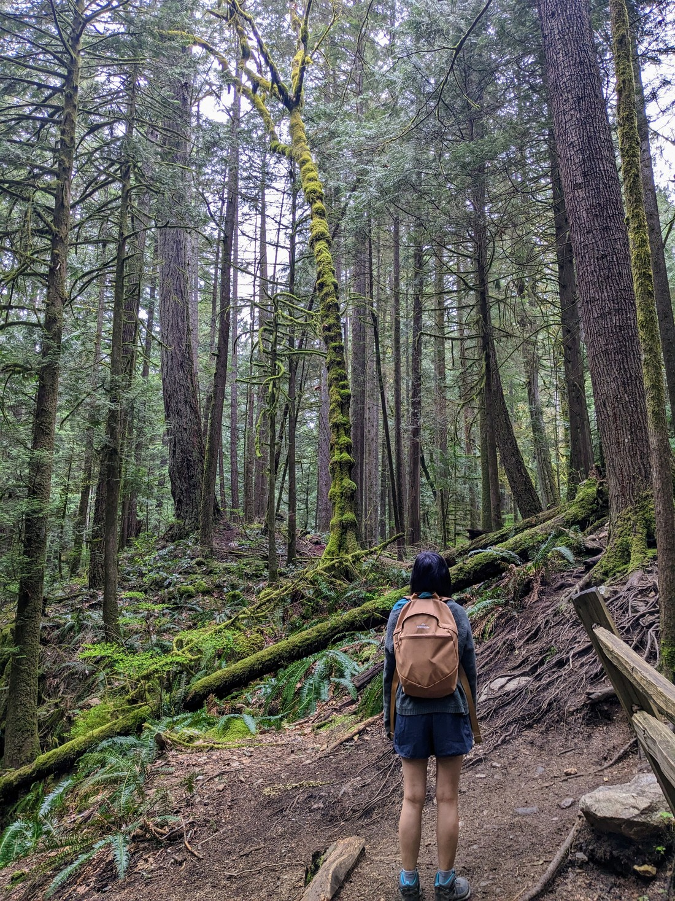

Today we stopped by a park in Surrey.  It wasn't that exciting.  Walk was longer than we were perhaps hoping but fortunately we were able to make a Tim Hortons stop at the three quarter mark, which got us the whole way round.  Only a couple of photos were taken, mostly of me being a scary owl.

> Be afraid mice!

Later in the afternoon we were debating what else to do.  It wasn't a particularly nice day - super overcast and cold-ish.  We were researching walks.  Several were too far away, but do-able on another day.  Others had warnings that they were best attempted with shoe spikes due to the snow and ice on the ground.  Several more were just "closed".

"Well," I thought to myself.  "We don't need to do anything.  We can just take it easy once in a while."  Betty sure thought so as she had nodded off for an afternoon nap - tired from waking up early to catch the end of the world championship chess match of all things.

Then I found a walk called "Whyte Lake".  I figured we might as well give it a go since we only have a finite amount of time here.  I then hoped Betty would feel the same and gave her a little nudge to wake her.  Fortunately she was not grumpy at me.

Well, she wasn't until we got to the trail and it started with a big hill.  She was probably expecting something else when I said the word "lake".  This was a walk to a lake, not a walk round a lake.

Fortunately for me the walk was really nice.

> Definitely worth waking up for

The forest was really interesting, with everything covered in layers of green moss.  There wasn't anything in particular that was particularly enjoyable, but as a whole it just felt really good.

> Hopefully this is coming across in the images

And like the Quarry Rock walk, the path was the perfect variety of terrain, making it not too boring but not too hard to walk on either.  There was a bit of an incline, but never too steep.

> Lots of mini stops to look at interesting trees, logs, streams, and other features.

Overall it was just a really nice walk.

While the trail wasn't empty, there were very few people around.  When we got to the lake we found that we were all by ourselves.

> Unfortunately I did still have to share it with this weirdo

But as you can see from the ripples in the water, it was raining a bit.  But that didn't dampen our enjoyment.  We stayed quite a while at the lake enjoying the peacefulness and tranquillity.

> Sorry for calling you a "weirdo" earlier

This is the type of walk I'd love to come back and experience in the other seasons.  I don't know if it snows at this altitude in Vancouver but I imagine it would be quite different in winter, and perhaps even autumn as well depending on whether the trees go brown and shed their leaves.  If we end up staying in Vancouver more long term then likely this will not be the last blog post I will be doing about this walk.

But that's all I have for now.  Less than two hours after we left, we were back in our rental car, happy that we had decided to fit in this late afternoon walk.

