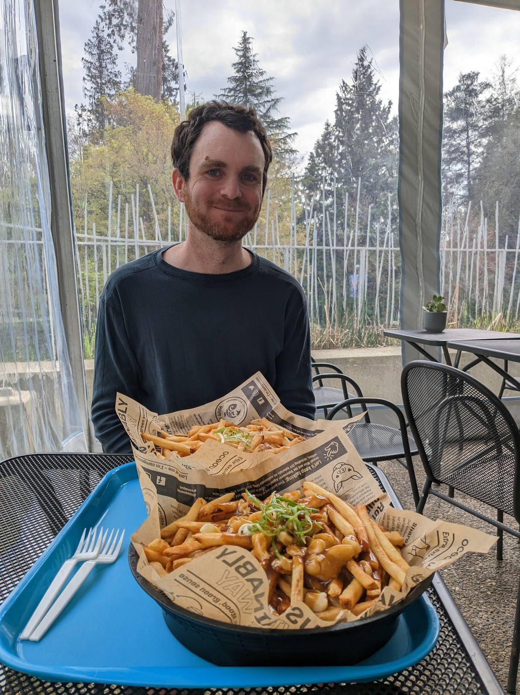
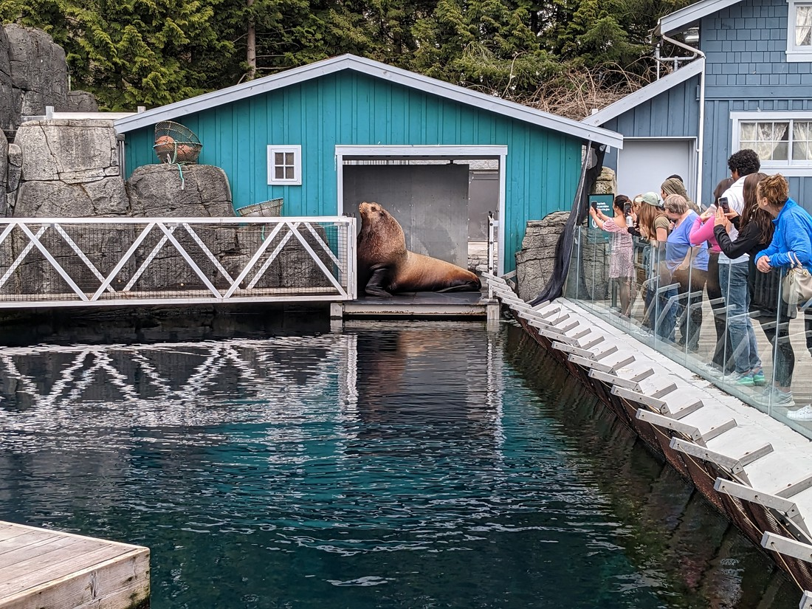

This morning involved running car-related errands then we had a visit to the Vancouver Aquarium booked in for 2pm.  These errands ended up running long so we ended up missing lunch and having to go straight to the Aquarium.  Fortunately there is a café there that sold chips.

> A serving of poutine and a serving of parmesan truffle fries

They did sell other food of course, but this was what we happened to pick.  The bowls are a bit misleading - the bottom is raised so it is less chips than it looks.  But still a lot of chips.

Once we had consumed enough potato that we could also skip dinner, it was time to hit the aquarium.

Weirdly the first exhibition we walked into wasn't about fish at all.  It was centred around the Amazon and had a hot, humid climate.  Of note was a group of scarlet ibises, which are the answer to the question, "What would a white ibis look like if its feathers were bright scarlet instead."  There was also a pair of sloths, which showed no movement whatsoever whenever we came by to check.  Then there was this fella:

Not pictured but the keeper came by to open his exhibit and give him a bunch of big body scratches as well as a cool water spray down.  The lizard didn't do much but you could tell by how it closed its eyes and the way it tilted its head that it really enjoyed the massage.

Then came a bunch of tanks that you'd probably find in any aquarium.

Though I will point out a couple.  The following image is of a plastic bag jellyfish, and you can see from the image how fitting that name is.

Then I actually took the time to read the information and learned that these were in fact plastic bags and this was to show how they might also fool sea life into consuming plastic.  Got to say, that was well played aquarium.

The other I will specifically point out was the electric eel.

It didn't really do much, but it was huge.  I feel like this isn't something I've seen before.  As a child you hear about electric eels, but you never really see them.  Well, now I can say that I have - and they look a lot like regular eels.

Then it was time to go outside.  Outside was... seals mostly.  This one had a less than one year old seal cub that was still nursing.

> That's a very big baby seal

This one was huge, and clearly just wanted to go back to its den and take a nap - but the keeper had annoyingly left the door closed.

And these two were either fighting, or seals are very aggressive with how they kiss.

And the last thing I have to talk about are the otters.  Here are a couple of otters lying on their backs asleep, holding onto each other so they wouldn't float away.

We did kind of get to see the otters get fed.  (The "kind of" was because lots of other people also were wanting to watch them get fed and so there wasn't much of a view.)  The otters have a weird habit of lying on their backs in the water and using their belly as a sort of table while they eat.  Very funny to watch.

Overall we couldn't help feel like the aquarium was a bit of a let down.  Everything we saw was good, but it just felt like it was missing something.  Maybe we just expected too much.  Maybe we only expected too much because of the premium entry fee, with limited entry to ensure the aquarium isn't over crowded.

But compare this to the Napier Aquarium.  Napier is the ninth largest city in New Zealand - but it's aquarium has one of those super large tanks with a conveyer belt pathway underneath, something the Vancouver aquarium lacks.  Napier aquarium's penguins were also very active and interesting while Vancouver's penguins were clearly just waiting until it was nap time.  And this is supposedly Canada's biggest aquarium?

Of course we can't expect just because a city is large that it must have an excellent zoo or aquarium.  Some are just better than others.  It was a neat experience that was certainly worth trying, but it goes to show that just because Canada has seven times the population and 37 times the land area, it can't also mean that New Zealand  does some things better.  Maybe this trip will help us better appreciate what we have in New Zealand - we'll see.

The only thing left to do after we left was to walk some more of Stanley Park and take my photo with a couple of locals.

> We can't not come to Canada and try and pat the geese, right?

Footnote - our trip to the aquarium was kindly paid for by Betty's former colleagues as a leaving gift.  I will say that this was an amazing gift to give Betty.  It was great that they encouraged us to see something we might have otherwise skipped.  I do feel a bit bad that we didn't enjoy it as much as we could, but that doesn't take away from the fact that it was an excellent gift to have received.
