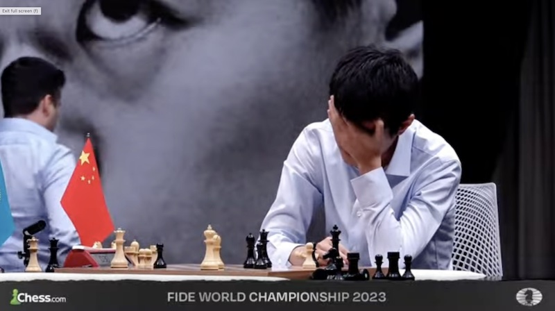

### Foreword

Since the weekend before we left New Zealand, Betty has had a weird obsession with chess.  She stayed up past midnight on three occasions watching online streams of the world number 2 and 3 playing classical chess - the most "boring" of all chess.  I've followed chess on and off for a couple of years and even I didn't feel like it was worth trying to watch these long games.  But perhaps Betty discovered something that I wasn't aware of.

Anyway, when I idly commented on it in a previous blog post Betty felt the desire to write about what she's been watching for the last fortnight or so.  So here she is to talk about it

- - -

I will preface this with the fact that I’m no chess expert. Sure, I know how the pieces move (mostly) but that is about the extent of my chess knowledge. I mostly thought it was pretty boring.

One day Luke was telling me about the world champion, the Norwegian Magnus Carlsen, and his dominance over all other players. I still wasn’t all that interested to be honest, but what I did find somewhat fascinating is the concept of how chess is played in the modern era.

I always assumed chess was based on skill… and I guess it is, but not the kind of skills I had thought. After Luke spoke it seemed to me that there’s a lot of theory involved. You see, chess is really old - over 1,400 years old, in fact. So over time we have established the best moves and lines, and variations to play. A good chess player needs to study and memorize these, and they need to be able to calculate all the possibilities on the board.

> Too hard

Still, I never really took much of an interest in the game. Then recently Luke told me one of the players in the world championship match is Chinese – Grandmaster Ding Liren. Of course, China is the best country so naturally I’m on Team Ding.

Luke kept me updated on the match progress – a world championship match consists of best of 14 games of classical chess over several days, with the players alternating between playing white and black. Rest days are included because undoubtedly classical chess is gruelling, with games usually lasting hours. For example, two games played in this year’s match lasted over 6 hours – that’s 6 hours of calculating, intense focusing, and trying not to crumble under pressure. Luke also explained that even after hours of play, most games end in draws. So no, I still wasn’t interested at this point.

Then he said the match was pretty exciting as there had been some decisive games, which is really unusual. I think it was around game 9 that I started watching. It happened to be free to watch live on Youtube, and it was a good way to show support for China, haha. Ding is the first Chinese representative to play in a world championship so it was actually a pretty big deal for the country, though I later learned that China usually dominates the women’s tournaments.

Not knowing much about chess, I didn’t really know what to expect. My very first thought was bewilderment that the players don’t stay at the board the whole time. It makes sense given the length of games, but it was still somewhat jarring to see them get up and walk to their respective rest areas, then come back whenever they’re ready to make a move. And it's so silent... I don't know if there's rules against talking, but I suspect they just don't want to.

Classical chess format means players have 2hrs to make the first 40 moves, an additional hour for the next 20 moves, and then 15 minutes for the rest of the game, with 30 second increments for each move. Players can take as long as they want for each move, knowing that the longer they take the less remaining time they’ll have for future moves. So often all we see on the screen is the table and two empty chairs. Riveting. 

> You don't wanna miss this, folks

Except, it actually is. Let me explain. What makes it riveting is the commentary and the evaluation bar. The commentary team is made up of three top players. I wouldn’t say that they themselves are super exciting, but their analysis of the game really helps. Bear in mind that without them I have no idea what is happening on the board, or who is winning/losing. And the eval bar, situated ominously on the left side of the board, is the thing to watch.

> More exciting than it looks, really

At some point in time (maybe 90s? Luke might know) computers superseded our human abilities to play and win chess. Due to the nature of chess involving calculations of optimal moves, this was inevitable. My guess is that players now use chess engines to learn variations and be better players. Anyway, the eval bar predicts whether white or black is more likely to win. Usually it sits around at the half way point (as most games are pretty even) but any excellent moves, or more likely, mistakes made on the board will cause the bar to fluctuate to either side. And because it doesn’t happen often, it’s kinda fun when it does favour one side.

The commentators explain in layman’s terms (too complex for me though) what the players are likely to be thinking about, and what they might do next. It’s fun when the players do something completely different. The commentators are human themselves, so sometimes the moves are better, sometimes worse. The players can’t see the eval bar – probably for the best, wouldn’t it be terrible to know you’re objectively losing? Having said that, the eval bar is not always reliable. I don’t fully understand this. Perhaps it evaluates the outcome of the game assuming players make certain moves but being human they don’t play with 100% accuracy.

A particularly exciting moment happened in game 6, with Ding playing white pieces. He made a move which sent the eval bar all the way up, indicating a near certain white victory.  What was really fun about this was that the commentators were shocked by this unforeseen move. They knew this meant that there’s a way to checkmate, but they couldn’t see it. Eventually they figured it out (by trialling out some moves on a digital board) but seeing their reactions was super entertaining. So despite my opinion of chess being super boring, I was fascinated by this match.

Luke was also surprised that I was suddenly so intrigued. He told me about Ding’s improbable journey just to get to the championship match, which is held every two years. The GOAT Magnus Carlsen has held the title since 2013, an incredible reign of supreme.

> So smug

Every other year the candidates tournament is held, the winner of which gets to challenge him for the world title. Remarkably, Ding didn’t actually qualify for the candidates tournament. Due to China’s covid travel restrictions, he was unable to play in several international chess events leading up to it, which resulted in him not qualifying for the candidates tournament. However, one of the Russian players who had already qualified was banned due to his outspoken support of Russia against Ukraine. This meant that one of the eight spots was now up for grabs.

At the time Ding was the highest rated player below Magnus but unfortunately he had not played enough games to meet the tournament requirements.  So China set up several domestic events which enabled him to play 28 classical games in just over a month, just in time for the candidates tournament.

During the candidates tournament, Russia’s Grandmaster Ian Nepomniachtchi showed he was the best player by far, either winning or drawing all his games to become the clear winner.

Just as it looked like it was going to be a Carlsen vs Nepo rematch (Nepo lost the 2021 match), Carlsen announces that he will not be defending his title. Even though this might have been a bit of a shock, it was also not all that unexpected. Carlsen had been saying for some time that he finds classical chess boring (can’t blame him), and ultimately he didn’t have the motivation to play yet another match, given the extraordinary amount of time and preparation involved. This doesn’t mean he’s stepped away from chess entirely, rather that he prefers other chess formats e.g. rapid, blitz or bullet which are much shorter and faster paced games. More recently he has been playing poker and fantasy football cos... why not??

> Too cool for (classical) chess

Anyway this meant the runner up of the candidates tournament would get to play Nepo for the world title, that being none other than Ding. So after a whole decade there will be a new champion. I half-jokingly said that I was on Team Ding because he’s from China, but in reality it just feels more natural to cheer for the underdog. As winner of the candidates tournament it would seem Nepo had the upper hand, and having already been in this position once before, some would say that it’s his time to win. I asked Luke and he said he’s on Team Nepo.

> You're going down

As I watched on though, it became clear that Ding is hugely likeable and hence garnered lots of new fans. At the post-game conferences, he comes across as incredibly innocent, humble and unassuming.  Probably not helped by the fact that he struggles somewhat with the language barrier. When you’re visibly trying hard to find the right words, there isn’t much room for sarcasm or arrogance.

Some people said they should have organised a translator for him (I later read that they offered, but he declined). I would argue that he didn’t need one. Sure, it meant that there were some awkward pauses and at times his choice of words felt odd, but his nature came across in a way that it wouldn’t have otherwise.

Plus, we would have missed out on some surprisingly poetic zingers:

When questioned about why he didn’t make a different specific move instead, he said he tried to calculate but “it was some dark ocean kind of position so I didn’t go further.”

At the final press conference:

_Ding: I think I did everything. Sometimes I thought I was addicted to chess because sometimes without tournaments I was not so happy. Sometimes I struggled to find other hobbies to make me happy. This match reflects the deepness of my soul._

Nepo, on the other hand, often appeared short and abrupt, if not rude. He likely didn’t want to be there – I’m sure he would rather have a rest after an exhausting game than have to answer questions from the press but Ding is in the same boat!

Anyway, Nepo sometimes gave one worded answers, and if not, he might as well have:

When asked why there are more decisive games in this match compared to previous matches:

_Nepo: Ask me this another day_

When asked if he was superstitious because he was wearing the same coloured shirt multiple days in a row:

_Nepo: Does it really matter?_

_Reporter: I guess not_

_Nepo: So then I’ll skip it_

_Reporter: Can I ask the same question in a different –_

_Nepo: No_

_Reporter: So you just like pink colour?_

_Nepo: I suppose yes._

After game 13 (Ding beat Nepo in game 12 to even the score):

_Reporter: After a very painful defeat the next day you should look for a quick draw but on the other hand today you were playing white for the last time in this match. I wonder if you had this kind of dilemma before the game?_

_Nepo: Yeah obviously I had the dilemma._

_\*Reporter waits for Nepo to expand, he doesn’t.\*_

To be fair I was sometimes appalled at the questions, some seemed like they should have very obvious answers, others were not related to chess at all. It makes the conferences both cringey and hilarious to watch. I can certainly see the argument against having them, but I think being able to see the players’ personalities is important.

> Dumb questions only please

Mostly likely, Nepo wanted to keep his cards close to his chest. You don’t want to potentially give anything away to your opponent – chess, after all, is also a very psychological game. And yet, Ding always answered earnestly and transparently. Is this more evident than when both players were faced with the same questions after game 14?

_Convenor: Which of the games was the most difficult for you?_

_Ding: The most difficult moment I think was the 7th game, during the time trouble I suddenly lost in thought and couldn’t make a move or decision. Also the game afterwards, it influenced me._

_Nepo: All games were difficult in its own way. I think I wouldn’t specify one._

_Convener: How difficult was it to prepare for today’s game as it was last of the match and have you felt any more pressure compared to previous games?_

_Ding: Since the situation has changed today I’m not the one who must win with white pieces so I can decide to play which opening and in the end I play this line. I guess it’s not so risky but afterwards it turned out to be very … I’m wrong. The preparation is not … yeah it’s more about mentally._

_Convener: What about you, Ian?_

_Nepo: I don’t know what to say._

_Convener: do you want me to repeat?_

_Nepo: yeah you can repeat but anyway I won’t be able to say it._

_Reporter: After almost one month of playing classical chess will you find it difficult to adopt the rapid?_

_Ding: Well at least we have not one day but half days to rest, to think about the rapid game._

_Convener: What about you Ian?_

_Nepo: Sorry what?_

_\*Convener repeats question\*_

_Nepo: Yeah we will see._

As you can tell there is this interesting narrative taking shape over the course of the match, not too dissimilar to that of a unlikely-protagonist-vs-villain story (sorry Nepo, I’m sure you’re really nice in real life).

An unexpected bonus of the Nepo-Ding match was all the wholesome clips of Rapport and Ding’s  postgame meetings we were treated to. Hungarian Grandmaster Richard Rapport is Ding’s second, meaning he helps Ding with his preparations during the match. If you were to ask the chess fans who Rapport is, they would say he is the friend we all need. His support for Ding for was there for all to see, and their friendship was truly heart-warming. So who is Nepo’s second then? Well he refused to say, until the match was over.

> We all need a friend like Rapport...

> ... and we all need more of these two! Also Rapport says China is the best

So yeah, I was hooked. I stayed up really late to watch the games, which were held in Astana, Kazhakstan. It was even trickier when we came to Canada.

You may have noted that all 14 classical games were played in the match. Despite having 6 decisive games the scores were still even at the end. So they went to a tie break, which consists of 4 rapid games. These are 25 minute games with 10 second increments for each move.

I was keen to watch the tie break but didn’t have it in me to stay up. I did, however, wake up in the middle of the night and decided to check in. Game 4 was just about to start, and I could see that the scores were even. So I continued to watch, and I have to say the rapid format probably does make for better viewing, though I imagine there will always be fans of classical chess, the purest form of the game.

And it was an amazing game. Ding plays black and appears to have come out of the opening stage in the better position. However the advantage slowly dwindled as the game progress, perhaps even in Nepo’s favour due to Ding being low on time. Ding has frequently had time troubles during the match and actually lost game 7 by running out of time. So whenever he is in a tricky position with not much time on the clock it makes for nervous viewing.

The endgame looked set to be a draw though. The commentators called it, noting it will go to a blitz tie break for the first time in history. And it sure looked that way, as Nepo initiated repetition, which signals a draw. But then Ding played an unexpected move, thereby declining the draw. With 1minute left on his clock, he took the chance for an unlikely victory.

I never thought my heart would race so much during a chess match. The move alone doesn’t win the game, but Nepo was probably taken aback by Ding continuing to play and likely hadn’t been calculating other moves. So he made a blunder. Having to re-evaluate the board, suddenly he is the one low on time. And that time pressure caused him to make yet another mistake, while Ding continued to play accurately.

It’s hard to describe, but it was heart breaking to watch. You can see it dawn on Nepo that it was all over. At one point he glanced over at the trophy, knowing it will not be his. 

His hand shook and fumbled, knocking over the pieces on the side of the board off the table. And with that he resigned, and Ding was overcome with emotion as he became the first ever Chinese world chess champion. 

As one commentator said, chess is beautiful and equally brutal.

Given how close the match was it would be unfair to say that Nepo was any less deserving of a victory, but the difference was that Ding won when it most mattered. Incredibly it was the first and only time he led in the whole match. Previously Nepo would win to take the lead and then Ding only evened the score. Kudos to Ding for being so resilient when he was frequently on the backfoot.

Some would say that the absence of Carlsen overshadowed the whole match. How can they be chess champion if they did not get to play the best? After all, he is the no.1 ranked player and is likely to remain so for a long time. In my opinion it doesn’t matter. The winner is truly deserving of champion status. Others say that his absence turned out to be a blessing, as it gave us such an exciting match with many dramatic turns. Who would have thought that chess could be so enthralling to watch?

It is hoped that Ding will inspire a whole new generation of chess players in China. But I  like to think that he inspires people everywhere in other ways too. He showed me what it means to be so earnest, open, and unguarded. And it seems a great way to be – especially having moved to a new country. It's good to assume the best in people.

What’s going to happen for the next world championship? 

Will it be third time lucky for Nepo?

Will we see a Carlsen comeback?

Could we potentially see a Ding-Rapport showdown?
Will Betty still be interested by then? It’s hard to say. And while I can’t quite call myself a chess fan, I am unreservedly a Ding fan. 

> When you're good at chess you get to wear the cool clothes

