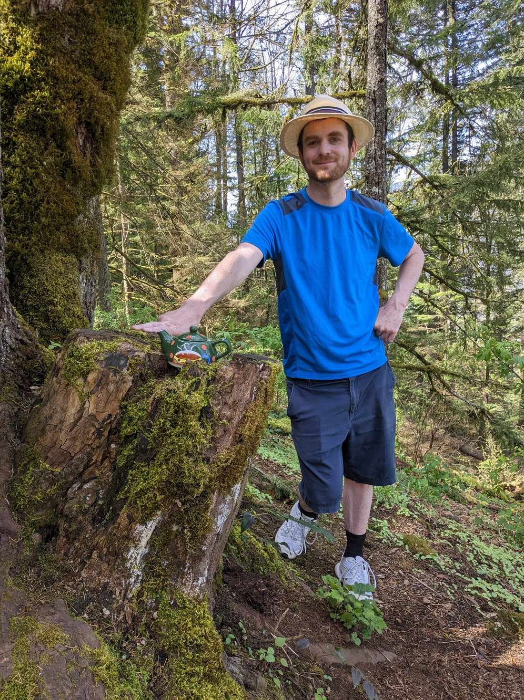
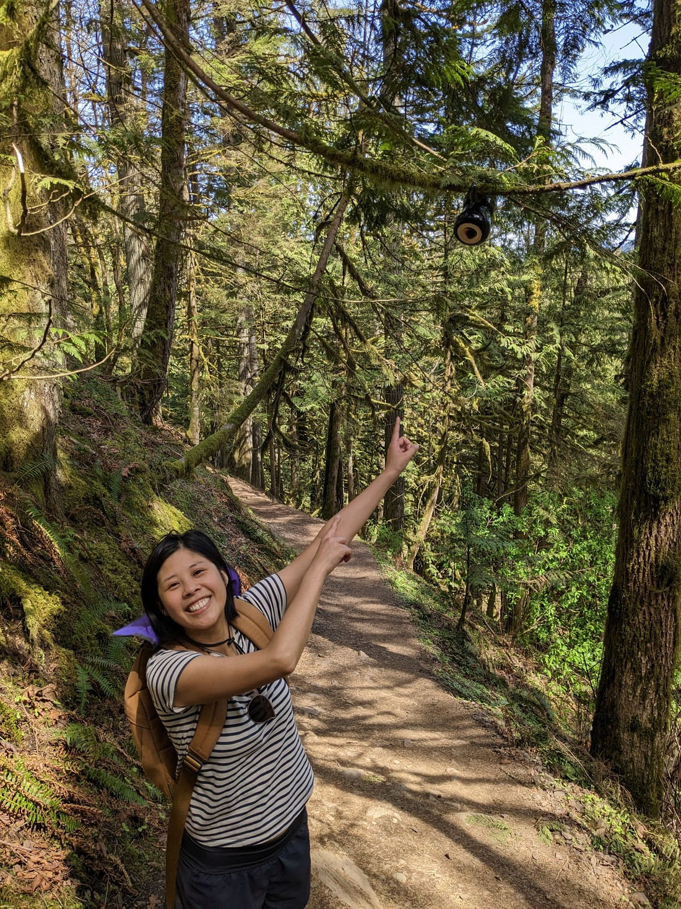
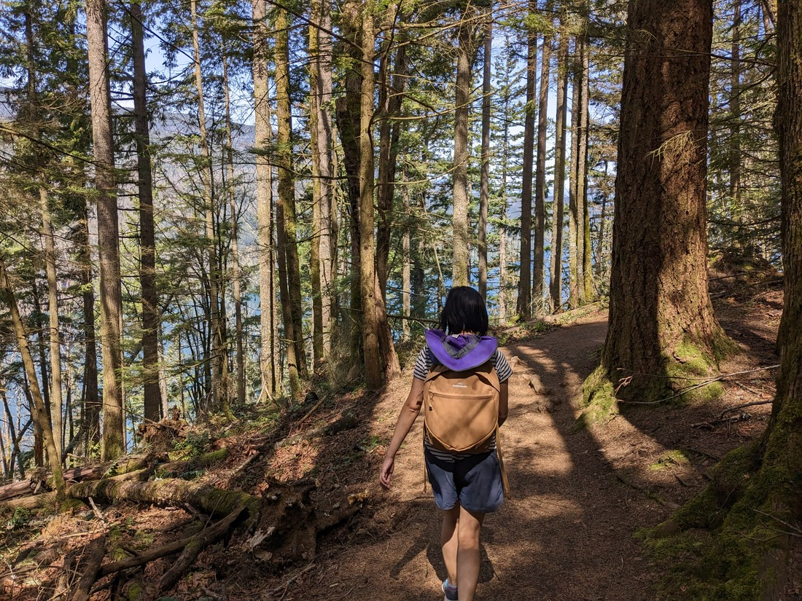
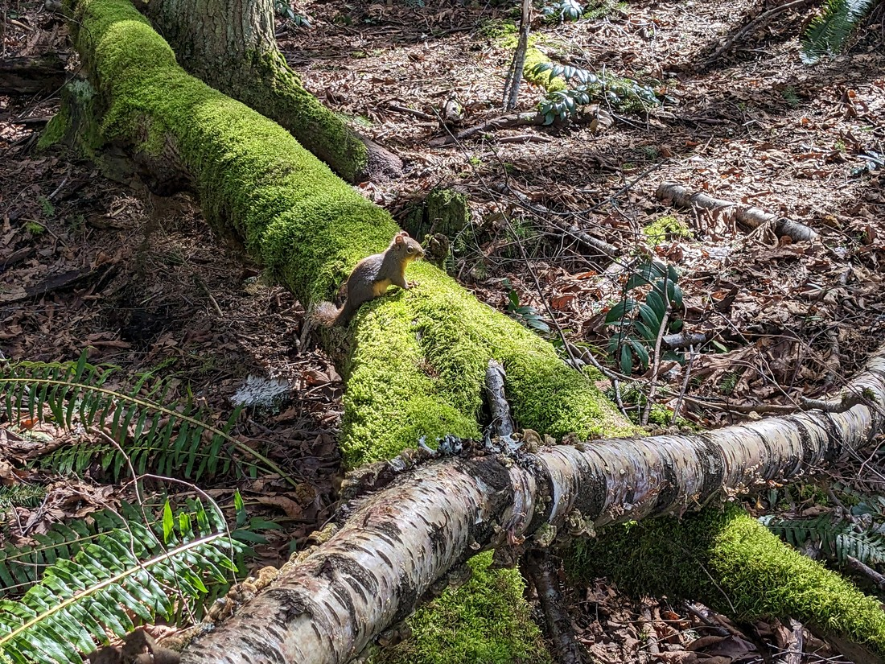
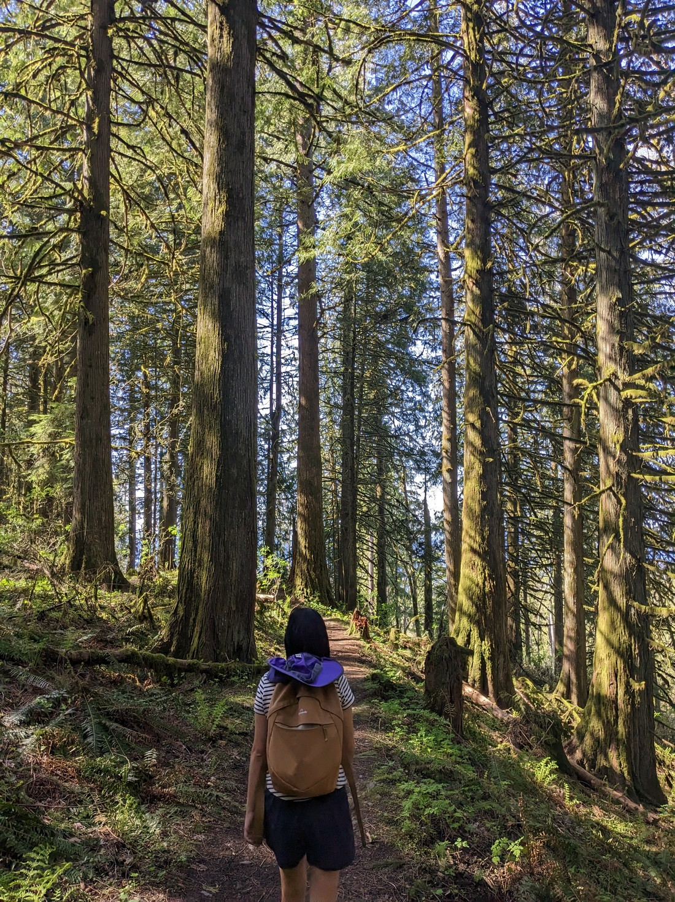
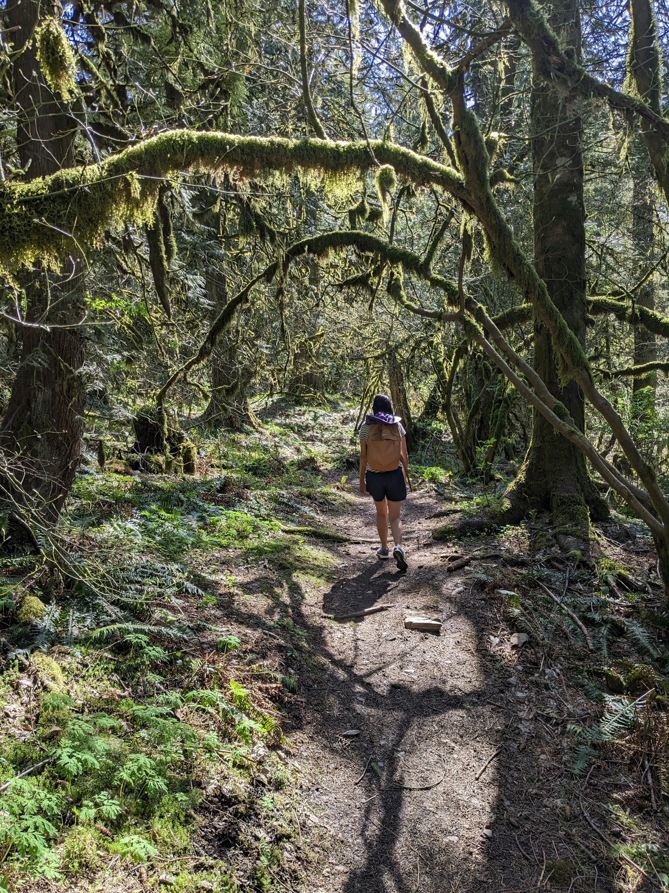
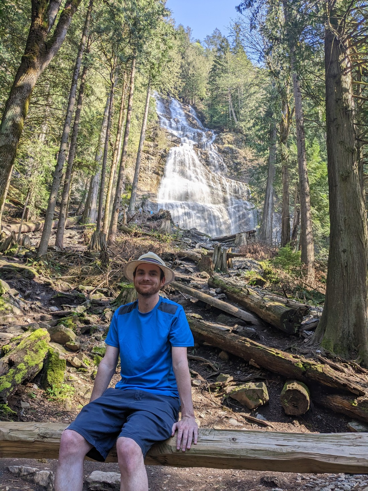
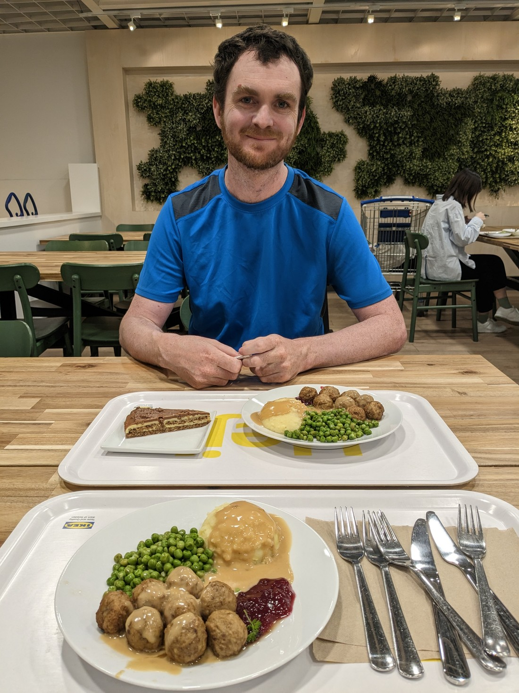

Today we decided to travel east of Vancouver and do a bunch of small walks out that way - partly to give our new car a bit of a test, but mostly because they sounded interesting.  Overall they weren't anything too special so this will be a quick-ish blog post.

The first was called the teapot trail in Cultus Lake Park.  The trail was named because of all the teapots that can be spotted along the trail.

> I did not know that British Columbia was home to wild teapots

So naturally it became a race to see who could spot the most teapots.

> Some were hidden quite well

Ultimately it was quite a stressful walk because there was a lot of uphill, but also we can get quite competitive so we were both eagerly trying to spot all the tea-related stuff first.  Perhaps our over-competitiveness is a symptom of the fact we haven't been getting our usual board game fix.

> There were glimpses of a view towards the lake but not much

Betty ultimately took the win with over thirty cups and pots spotted, but Luke started a new game - spot the squirrels, which he won easily.

> Score was 2-0 for this game

Next we visited the Chilliwack Canyon Community Forest.  There wasn't anything special here (not even a canyon) but overall this was a really nice walk.

Obviously this wasn't a popular walk.  We probably shared the whole forest with only a couple of people (which we never saw).  It was really quiet and peaceful.

And our third stop was to the Bridal Veil Falls Provincial Park.  This was a fair bit busier than we would have liked, but perhaps that was only due to there being no one else at our previous walk.  The falls itself was quite spectacular, although we were somewhat far away.  But overall a very small park.

> I think this is the fourth "Bridal Veil Falls" we've come across in all our travels

And then our last stop was to a furniture themed Swedish restaurant that specialises in meatballs.

> First time trying lingonberries

And that was our day.  Not our best day, but not a bad day either.  One more to go in Vancouver then we'll be off on a proper road trip.

Can't wait.