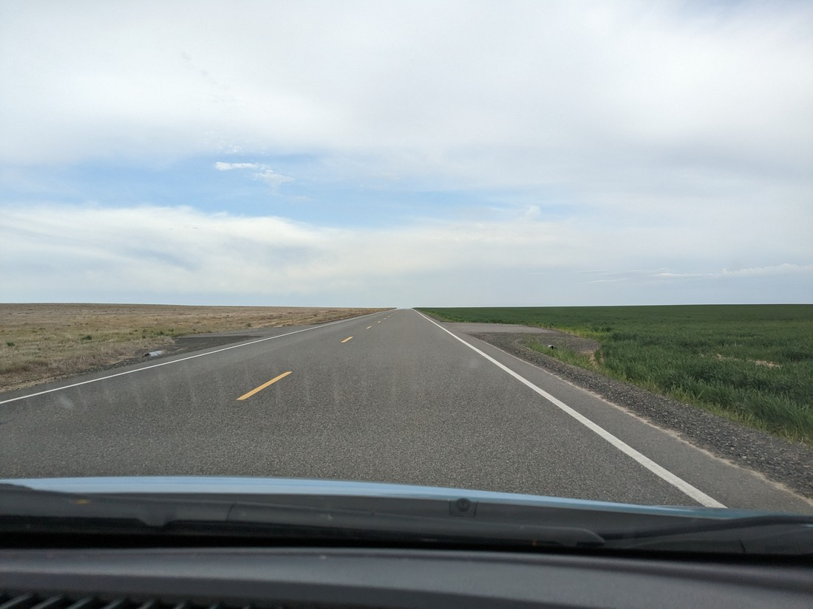
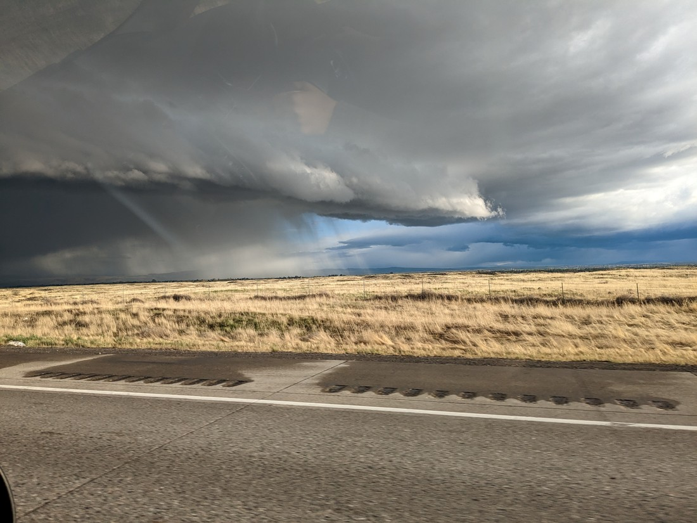
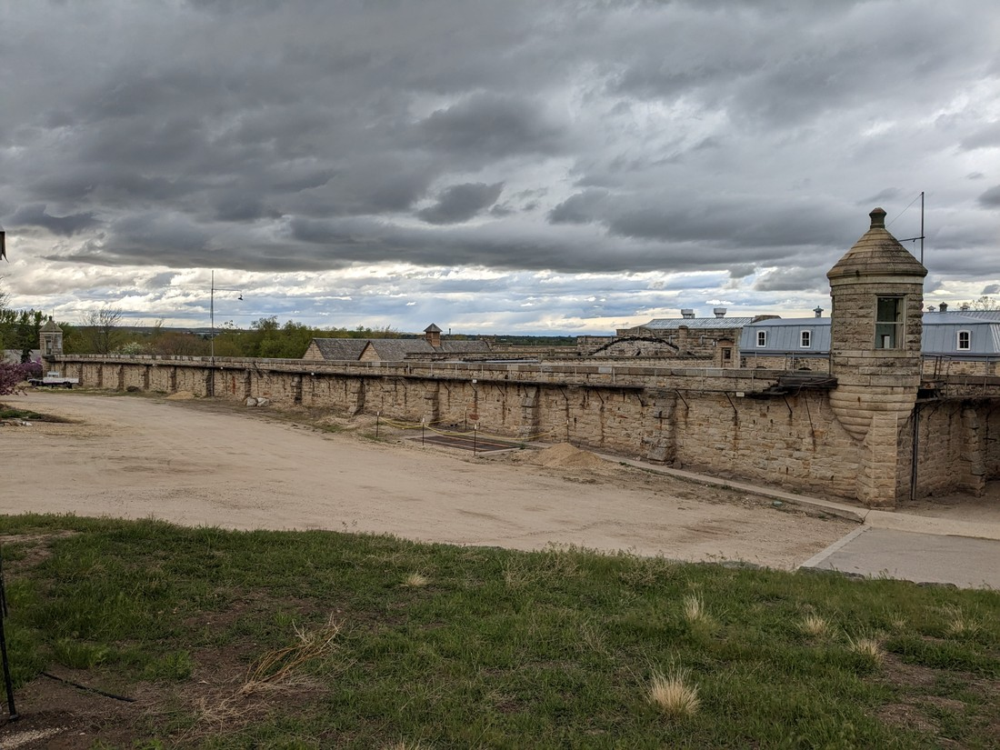
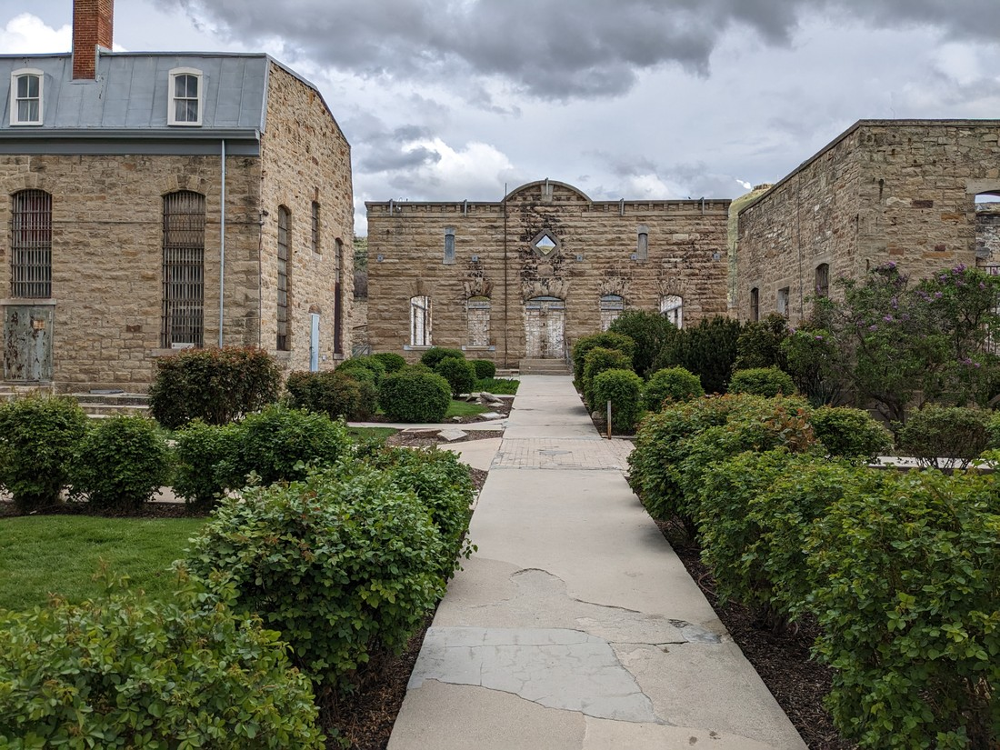
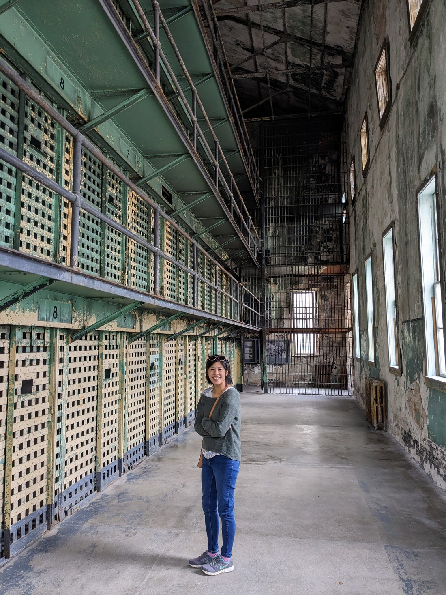
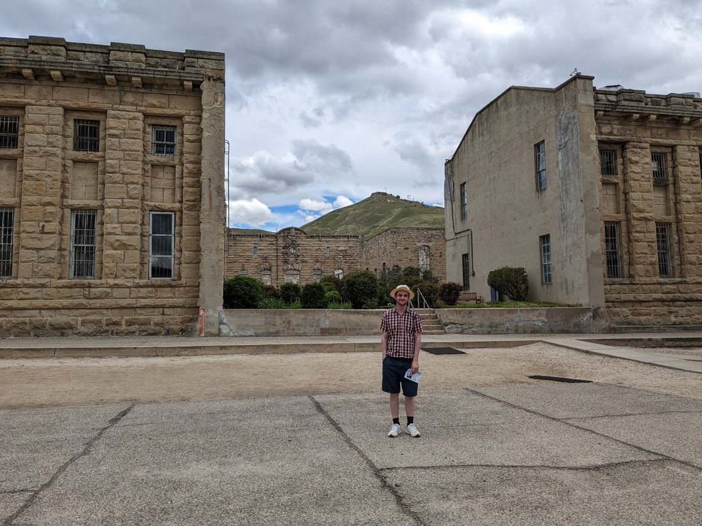
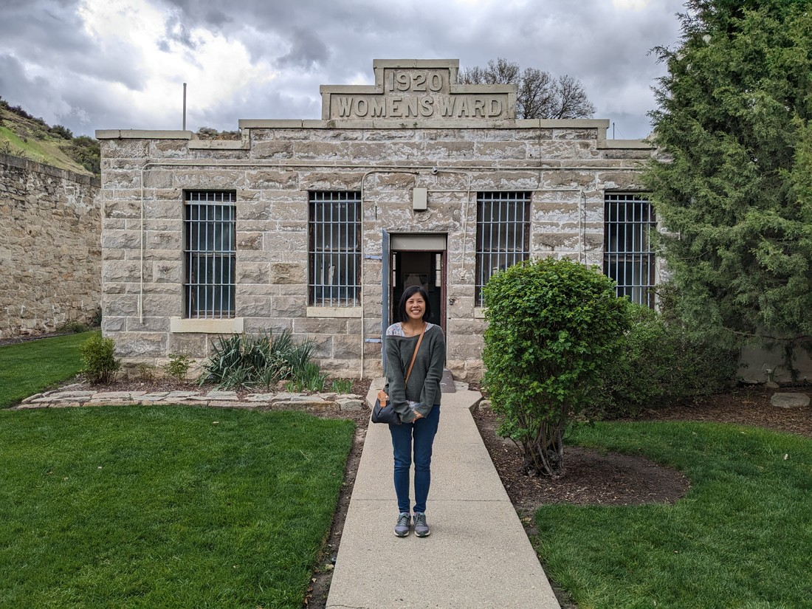

To start our roadtrip we have three days of driving to do to get us from Vancouver to our first national park.  I wasn't planning to blog about them, but... things happened.

To start we arrived at the Canadian / USA border at 9:30 am.  There was a 5 minute delay of built up traffic according to Google Maps so not too bad.  But when we got to the booth, the guard that had been letting everyone ahead of us through decided we weren't going to be going straight through.  We were told to park nearby and go inside a building for... something.

Inside was a rather slow moving line (of course).  This was a very worrying wait.  Eventually we were able to speak to someone and while they were probably worried about our status as two unemployed foreigners trying to enter the USA, eventually they recognised that we were just tourists and let us be on our way.  That is, until we got back in our car and it would not start...

We had been told to turn our hazard lights on and never told to turn them off.  Leaving them on for over an hour had apparently drained enough of the battery that we could not start the car.  From what I've heard USA border employees are not people you want to mess with.  This was potentially a horrible place for us to break down.

...or maybe it wasn't?  We are after all surrounded by people who could potentially be of help.  That turned out to be true.  We called a guy over and after hearing the car, he went and got a battery thing and it wasn't long before we were able to be off.  Phew.

Next stop was to get to an American telecommunications store to buy a SIM card.  Our Canadian SIM was no use for roaming data and so we needed a new one to be able to use maps and for emergencies.  Well we found the store alright, but after spending possibly 45 minutes trying to get the SIM to work on my phone, it would just not work.  So we had to give up and switch to using Betty's.  This wasn't ideal because now everything was going through that phone.  Plus Betty's phone liked to chew through battery very quickly and right now it was low.

We also had to go out of our way to make a stop to find a product Betty couldn't source in Canada.  We were well behind schedule and still had a long day of driving to go.  I had hoped to make a couple of stops to do some short waterfall walks but there was no time now.  We just had to drive and drive until just before dark we got to our motel.

> Passed a variety of terrain but at the end it was just flat fields in every direction

So that was a rather stressful day.  All problems were handled, but there was a fair bit of worrying going on.

Next day arrives - car won't start...

Honestly, this was actually somewhat of a relief.  I had been worrying overnight about whether we might have a faulty battery.  Now I know for sure.  And while it happened to fail in a small town, the small town was very industrial and so we had several battery places nearby.  This was much better than it randomly failing while we tried to do a walk in the middle of nowhere.  The receptionist at our motel kindly jump started our car and so we drove to a battery place and they were able to confirm the battery was in fact the problem and immediately fit a new one.  I was really happy to only have to replace a battery.

At the end of our day of driving we got to our next motel and... they didn't have our reservation.  This was very confusing.  I was sure I had an email confirmation, but it was at this time that my phone started to play difficult again.  While waiting I double checked that the name of the motel was correct.  The receptionist confirmed that it was..., but there was a another with the same name in the town of Eden.

We were at the wrong place.  "How far is Eden?", I asked, criginging because the answer was probably going to be four hours or something.  But no - it was only 36 minutes down the road.  As we got there we entered a thunderstorm with hail and a lot of rain.  And when that passed we found that the only food nearby was the exact restaurant we stopped at for lunch.

> The approaching lightning storm that we were heading straight towards

So it hasn't been the smoothest couple of days.  Fortunately every bump in the road so far has been manageable.  But it was telling how exhausted we were for two days where we didn't actually do any walking.  Well, we did try do a walk.  We stopped in Boise to walk up a hill, but as we were walking we spied something nearby that looked interesting.

> What is it?

There was an "Old Penitentiary" that was open for viewing.  So we didn't do our hill walk and we went there instead.  We arrived at the exact time they were letting in the last visitors for the day.  One minute after buying the tickets Betty turned to me and asked, "So what does a 'penitentiary' mean?"

> Betty just thought it looked cool

Overall it was pretty interesting place to visit.  It seemed so old - brick walls built by prison labour - but it only closed in the early 1970s.

> Very "Shawshank Redemption" - right time period too.

There was various signs all around the grounds with information about the everyday life inside the prison.  Details about the people that had resided here and their crimes.  Details about the jobs they held in the prison.  Details about what each building was used for.

The information was so interesting that we took so long reading them that we'd only got round a few buildings when we realised we only had 30 minutes left before closing.  And so we had to rush round the rest of the prison.  Didn't get to read anything about the barber building, or the riot and fire that got the prison shut down.

So that was something interesting we got to do and see.  It wasn't all driving and putting out small fires.  I won't say, "Hopefully that's all that will go wrong" because I know more things will go wrong in this trip.  However, hopefully they aren't anything we can't handle and/or hopefully our preparation will make them easier to overcome than they otherwise would have been.
