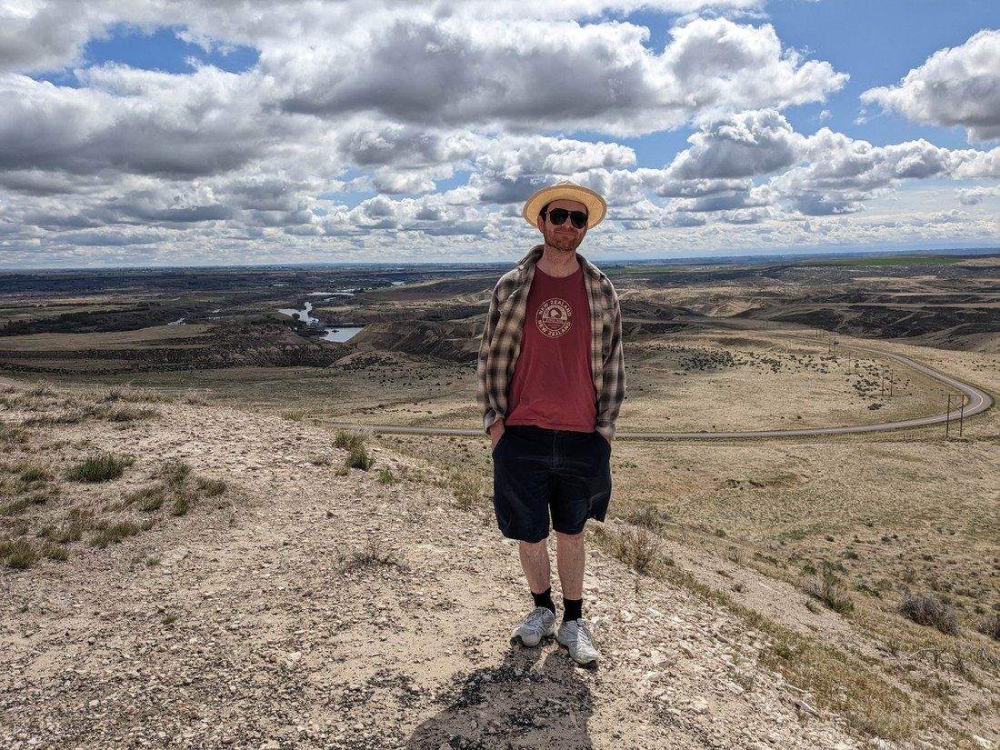
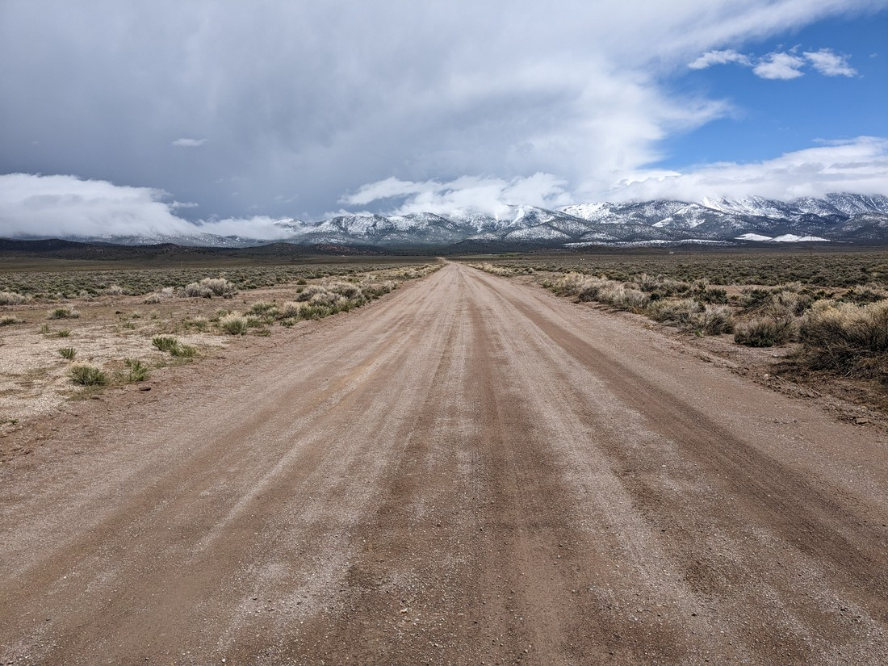

So today we're going back in time.  We're staying in Idaho which is in Mountain Time (18 hours behind NZ) and then we're travelling south to Nevada which is back in Pacific Time (19 hours behind NZ).  So we kind of get an extra hour to spend today.

We start by backtracking along the interstate freeway we came down yesterday.  We had crossed an interesting canyon but didn't have time to stop.  However today we had that chance.

It was quite stunning.

Lots of canyons seem to have smooth-ish walls, as the ground has been eroded away over thousands of years.  But it appears the ground here is solid rocks - and the water hasn't eroded the rocks as much as it has caused them to be dislodged.  As a result the canyon walls are a jaggedy mess.

It was a good way to start the day.

We tried to find other cool things in this state park, but there wasn't much.  We made another stop at a view point with some history about the Oregon Trail.  We didn't learn that much, but we did enjoy a somewhat elevated view of the countryside around us.

We've been passing huge numbers of wind turbines for the last couple of hours.  It make sense - it has been very windy.  The speed limit for the freeway reached 80 miles per hour (which is 128 kilometres per hour) but its so windy that we dare not try to reach that speed.

Overall we've passed a lot of different terrain since entering the USA.  First we were in Seattle which was normal but seemingly permanently overcast.  Then we crossed the Cascades which was fully forrested but also amongst the clouds.  The lands on the otherside were rolling hills of desert.  Then in Oregon it was flat green fields.  Idaho appears to be riding a fine line between animal grazing farmland and infertile dirt nothingness.

But now we are crossing south to Nevada.  Nevada is definitely the most inhospitable terrain we've come across yet.  Definitely a desert.  The ground is very, very flat while snow capped mountains usually rise from the desert floor on both sides.  Towns are very few with no houses in between.  There is also no cellphone signal.  It is certainly a very isolated part of the country.

> Fortunately this was not the road we were taking

And boy was the weather changeable.  Lots of rain, with some being part way between raindrops and hailstones.  But only for half an hour or so - then it would be back to overcast or the occasional blue sky.  But then half an hour later they'd be more rain.  And it was cold.  At the end of our trip we just wanted something warm to fill our bellies and a hot shower.

Our destination this day was the town of Baker - population 80 and boy does it feel that way.

> 5,318 feet = 1,620 metres - slightly higher than Roy's Peak in Wanaka

The motel we're staying at also doubles as the town's general store.

There was also a resident cat that hangs out inside that does that thing where he clearly wants company but at the same time doesn't want attention.

> But he's definitely going to get attention

And in our room we found something we thought we'd never see again

> Though Betty's enthusiasm was dampened later when she found that there was no milk

So that's about it for this post.  It was just a day of driving with some sights but I thought it could have its own blog post.  Tomorrow we'll be hitting our first National Park of the trip, but we really don't know how it will go.
