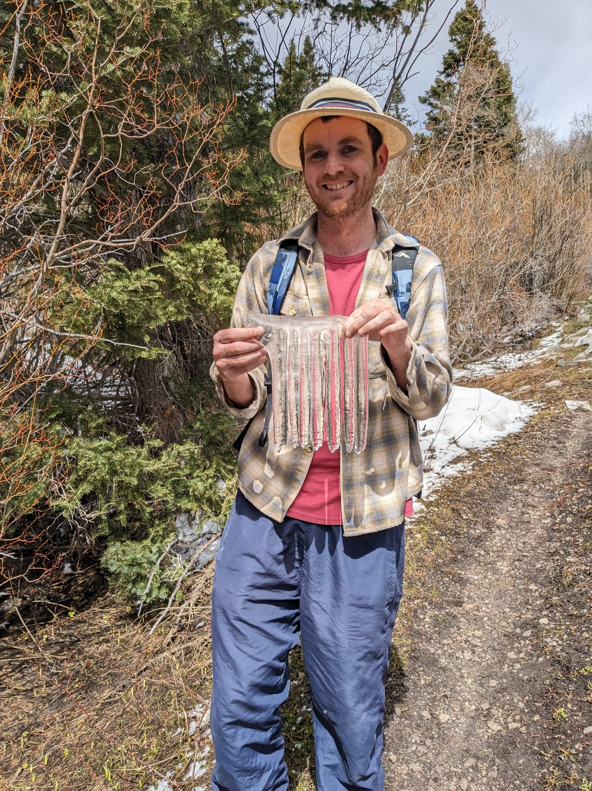
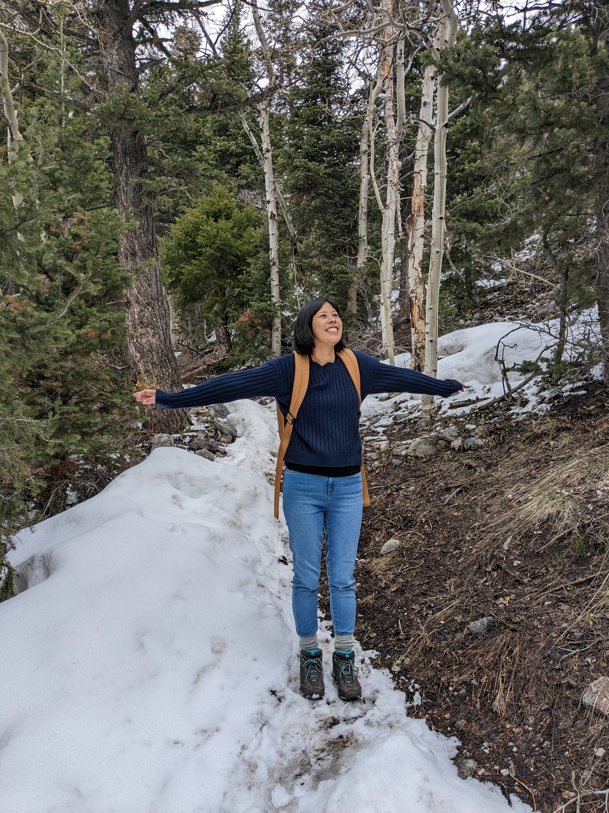

Great Basin National Park was described to me as one of America's most underrated national parks.  Part of the issue might be the location - it is quite far from any major cities so no one thinks to visit.  But perhaps that is why it is underrated - very few people go there so you can experience a national park but without the crowds.

Something of note in this park is that there is a cave that has reasonably priced guided tours through.  Unfortunately I did not book this in advance.  But we rocked up to the visitor centre in the morning anyway and found there were still tickets available for 2pm.  Now we just needed something to do before then.

I already knew the park was still recovering from winter.  There'd been more snow then usual so the scenic road to near the top of the mountain was mostly closed.  The park website suggested that if you wanted to do some walking then perhaps try 3 or 4 different trails - but only the first mile of each.  The reason: same as why the scenic road was closed.

> Same story as BCMC: the trail is perfectly dry, then starts getting wet, then snow patches, then dirt patches, then all snow.

However the cold brought some new sights for us to see.

> Stole these from a low hanging branch over a stream

I think we made it a mile and a half before the path had switched from all dirt to all snow.  It was also a hard mile and a half - all uphill and the higher than usual altitude wasn't helping.

> Starting elevation of the walk was 2,300 metres about sea level - same height as Mount Ngauruhoe

And ultimately we just turned around after a bit of snow walking.  There was no big amazing endpoint to this trail so no need to persist.  Plus it could be slow walking on the way down, and we had a cave appointment to get to.  But there was still some time for silliness.

> Still a bit icy - one day I will find the perfect snow drift to snow angel in

Then we noticed something falling from either the trees or the skies.  They were small and hard to see.  Could this be snow?  Or just some tree flower or something.

> Trying to catch the mystery white falling flakes

It turned out to be snowing!  Well, kind of.  The snowflakes seemed more like flakes of snowflakes.  But it was undeniably snow.  I caught some in my hand and watched as they quickly melted.  And this was our first recorded experience of falling snow.  It wasn't much, but it didn't need to be much to make us a little giddy.

After lunch we headed to the caves.  Outside the tour guide asked around if anyone has been in caves before.  The other people in our party rattled off various caves in USA.  We stayed silent - no point mentioning a cave they won't have heard of.  Then the guide said, "One cave that lots of people say that they've visited..." and Betty and I both shared a moment where we both went, "Oooh, is she going to say New Zealand.  Nah, there's no way - there must be tons of other more famous caves."  But the guide finished her sentence with, "...is the glowworm caves in New Zealand."

Wow, did not realise the Waitomo caves were that well known.

Anyway, these caves were also good - though no glowworms.

Lots of stalactites and stalagmites, and even some helictites - which the guide explained was a stalactite that grows sideways as a result of a water jet spraying out of the wall.

> Probably none in this picture though

In fact the guide was really interesting to listen to.  Even afterwards we just hung around listening to her answer questions until she decided she'd had enough.

Overall Great Basin National Park was a success.  An interesting cave trip and some walking around with other people few and far between.

It would have nicer to have the whole park available to us - to be able to drive the whole length of the scenic drive then climb to the peak but that's what we get for not coming in summer.  Instead we got to experience something a bit different, and it was certainly a good experience.

> Great Basin has the Betty seal of approval

