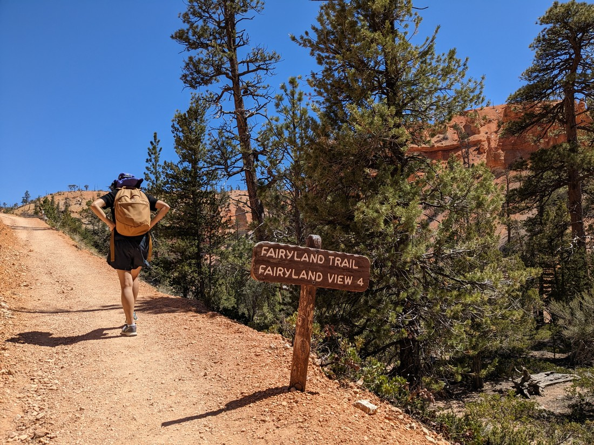
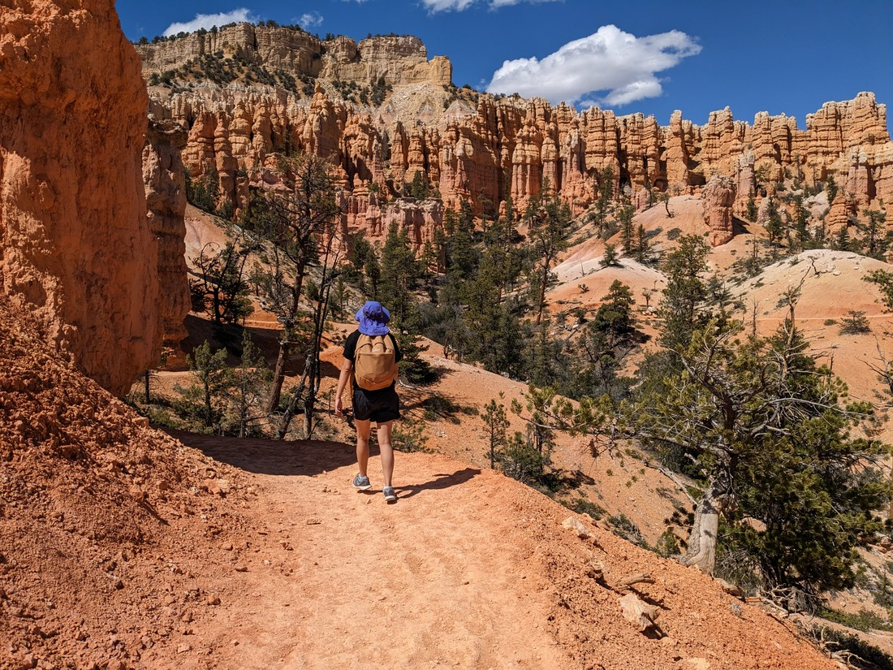
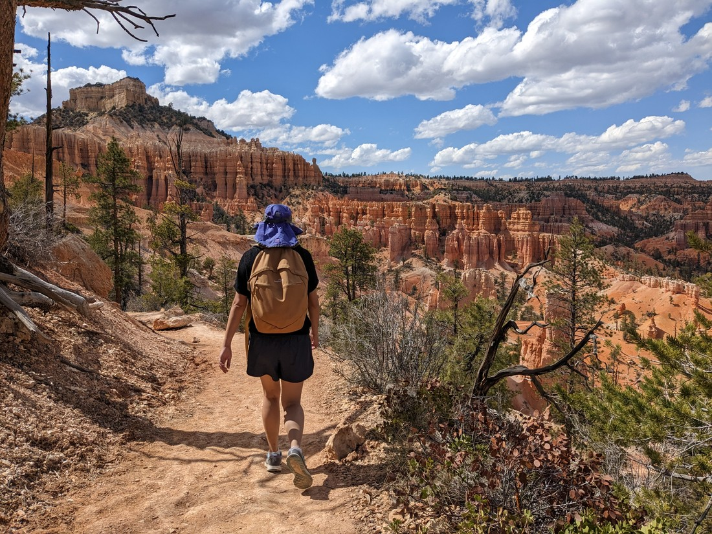
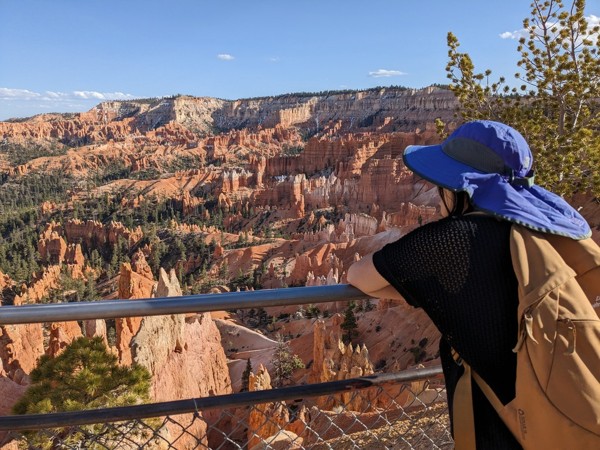

Today I wanted to go to Cedar Breaks National Monument - but for some reason Google Maps couldn't calculate how long it would take to get there.  I tried again with the visitor centre for the park but also no such luck.  Then I went to the park's website.  Turns out record snowfall had not only closed the park, but all roads to the park as well.

Drat!  No way that's going to reopen before we have to move on.  Guess we're not visiting Cedar Breaks.

So instead we decided to return to Bryce Canyon National Park.

> Let's see how many of these sign photos I can collect

This is not the first time we've visited this park.  It's also not even the second.  (Although to be fair the first and second visits were both within 24 hours.)  This was a park we visited on our 2019 trip to North America - and it certainly is a goodie.

> That first view is breath-taking

The park has a number of parking lots, and each are within a short walk to the rim of the canyon.  And I dare anyone not to be blown away by what they see when they look out over the canyon and countryside.

> It's also always nice when you get a view at the start

And lucky for us, like last time it was a beautiful day.  I swear the blue sky makes the rocks look that much redder while the red rocks make the sky look that much bluer.  And despite the sun shining, due to Bryce Canyon's rather high elevation it wasn't too warm either.

> Makes for good pictures

But the question was - what do we do now that were are here?  We've already done two walks in this park on previous visits.  There are a number of walks but annoyingly some of the most popular trails down into the canyon were closed (still snow about).  As a result there wasn't that much worth doing that we hadn't already done.

> (In half a day anyway)

So we picked a walk down to a structure called "Tower Bridge", with the option of turning the walk into a big loop.  Then we began our walk down into the canyon.

The "Tower Bridge" turned out to be not all that big, but it was fairly named

> Yep, I'd say that looks like Tower Bridge

That didn't take too long, so we figured we may as well do the loop

> That "4" is very misleading - it would be closer to 10 more kilometres until we could put our feet up

This part of the park ended up being a lot less populated which was nice

> Again, makes good photos / less people that need to be cropped out

It also had plenty of amazing rock structures.  One of the walks we did last time had very little but at least this one had hoodoos aplenty.

> We spent part of the time debating what hoodoos resembled.  Came to no conclusion.

Got a bit sunburnt unfortunately.  I have a new sunscreen and its weird.  It is more liquid when it is in my hand and I keep splashing it on the ground.  But then when it's smeared on my body it goes all solid and hard to rub in.  But supposedly it is better at giving instant sun protection rather than the "apply 15 minutes beforehand" instructions that my old sunscreen would say.

> Not a lot of shade around

Overall it wasn't the easiest of walks.  Again, this might be due to the altitude.  We parked our car at 2,442 metres above sea level, which is almost as high as Mount Taranaki.  We ended up taking the whole four hours.  But we did it!

> Now even fewer Bryce Canyon walks we haven't done

And on the walk I started to debate with myself.  Is this better than Grand Canyon?  Grand Canyon is certainly "grand" (no doubt about that) but Bryce Canyon is certainly more interesting.  Both are big enough that it never feels crowded.  Bryce Canyon is at a higher elevation so is less hot.

> Still a bit hot - lots of water was consumed and then sweated back out again

And so I decided - Bryce Canyon is better.  Though this opinion might not last.  We're due to visit Grand Canyon in the coming days so that could remind me why it gets so much love from everyone.

> Grand Canyon also has like zero trees

Man, this was a long walk.  Lots of photos to add.  Still have two more but I'm running out of ways to say "this was pretty great".

> Pretty great this was

So yeah, overall it was a good walk.

> But time to say goodbye again.

Definitely drop by if you're in the area.