Today we went to a different canyon.  Well, kind of a canyon.

It's called Red Canyon and to get to Bryce Canyon you basically have to drive through it.  But it doesn't feel like a canyon.  Maybe technically it is one as there are hills on both sides which could be canyon walls, but it more just feels like a road between some hills.

I picked out a loop walk and we set off.

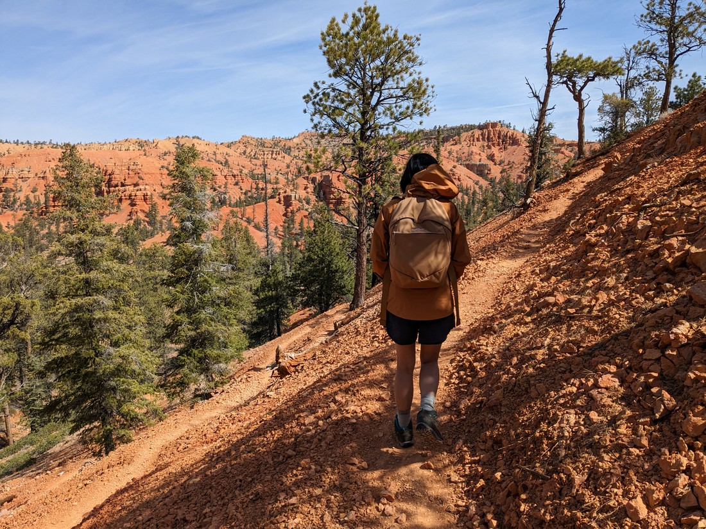

Straight away it was obvious why it is called "Red" Canyon.  Bryce Canyon had very colourful rocks, and while they looked red compared to the other rocks, they really were more of an orange colour.  However Red Canyon's rocks... well they're still orange - but a more red-ish orange than Bryce.

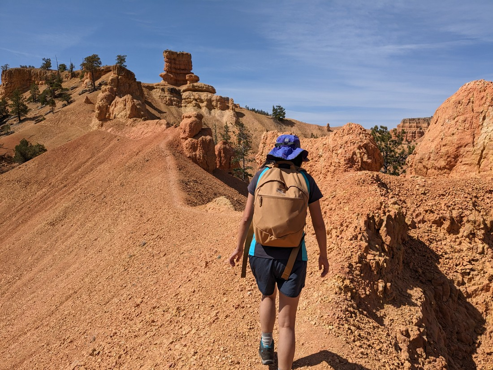

This hike started by zig-zagging up a hill and then there was an offshoot path along a small ridgeline to a bit of a peak.  The hills we were walking on just seemed to be layered with loose rocks.  Walking along a narrow path on the top of these hills didn't feel very secure.

But we made it.

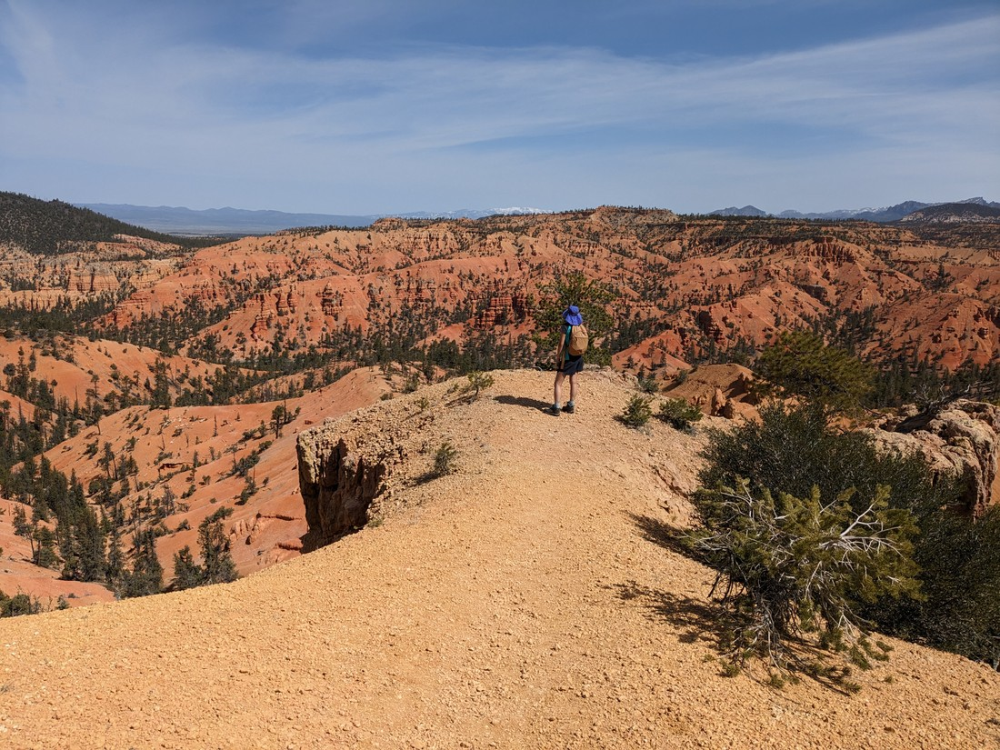

Only thing was, Betty couldn't really enjoy herself because she knew she still had to walk back down that narrow path.

Overall it was a nice walk.  The loose rocks weren't as nice to walk on as the well made paths we had hiked in Bryce Canyon, but it was still a walk worth doing.

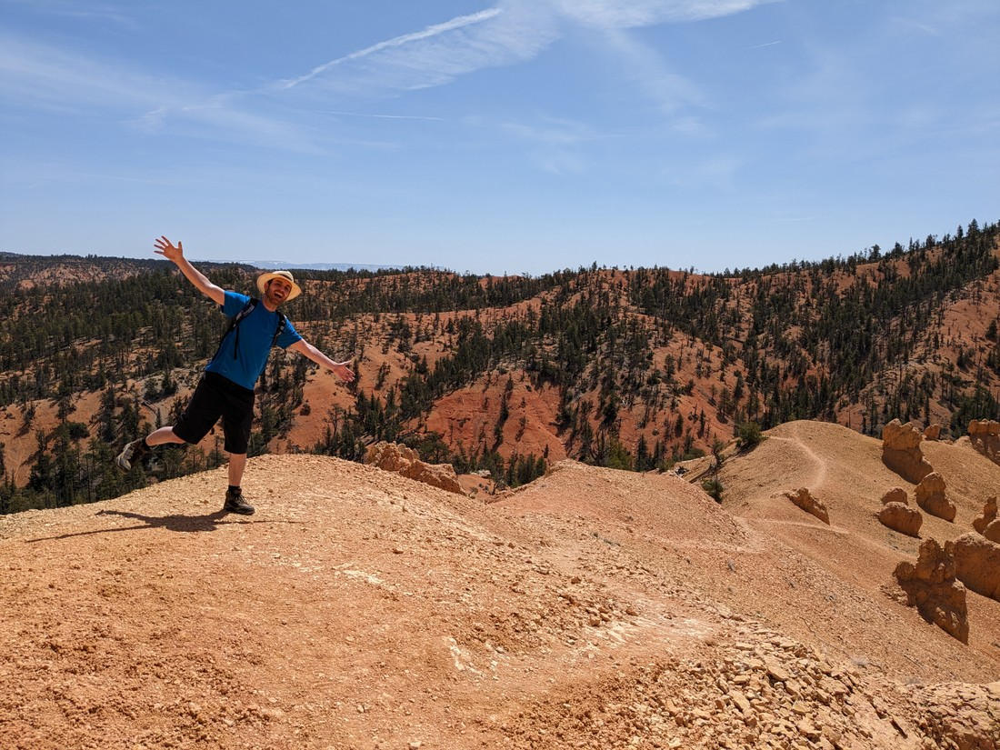

> Luke enjoyed it

Interesting rock formations were less frequent than in our previous day of walking, but they were still around.

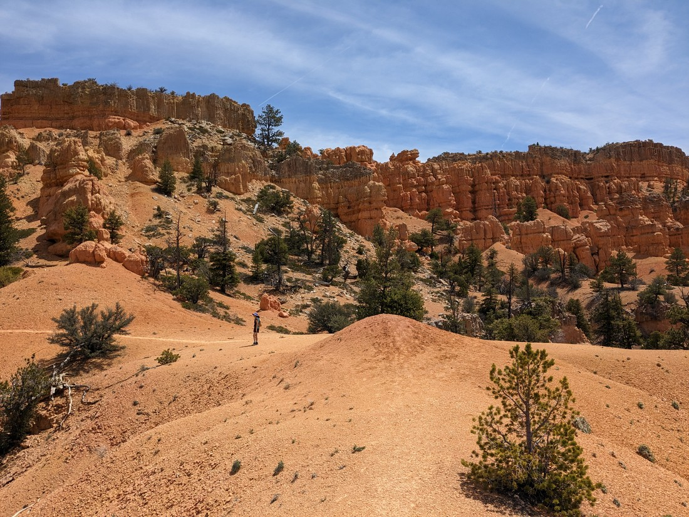

> And very much appreciated

It took a bit longer than we had hoped (blame the heat and the elevation) but afterwards we didn't have far to drive back to our accommodation for a nice rest.

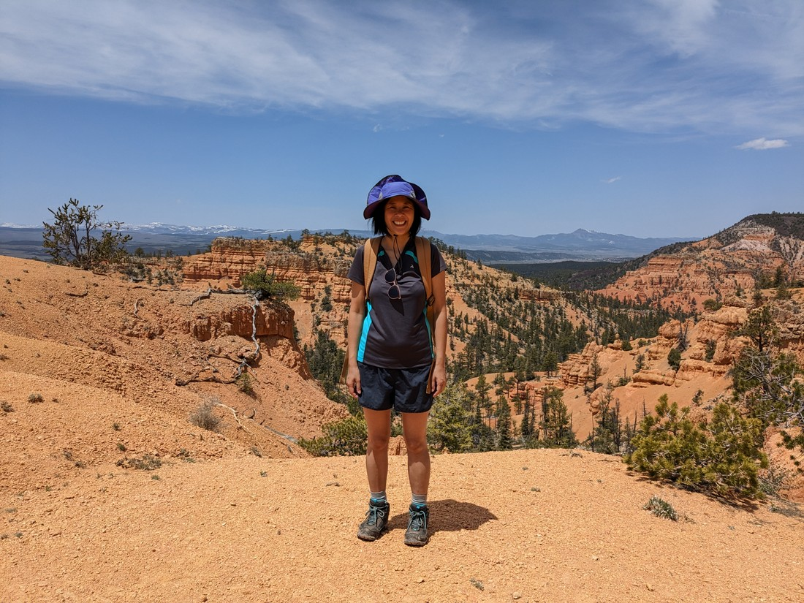

> Looks hot cause it was hot

But the day wasn't over.  In the late afternoon I suggested we go out again.  On the way to Red Canyon I had spotted some small signs for other canyons.  When looking them up I found a walk called the Arches trail.  Arches sounded cool (after all there is a whole National Park named after them) so I suggested to Betty that we go check it out.

As I noted above, the Red Canyon walk was noticeably less developed than the Bryce Canyon walks.  Well, the Arches walk was noticeably less developed than the Red Canyon walk.  It was supposed to be a loop walk, but really it felt more like an area where you could just walk around looking at whatever you wanted.  And because everyone had been doing that, it made following the intended path quite difficult to follow.

In terms of arches, we found this one:

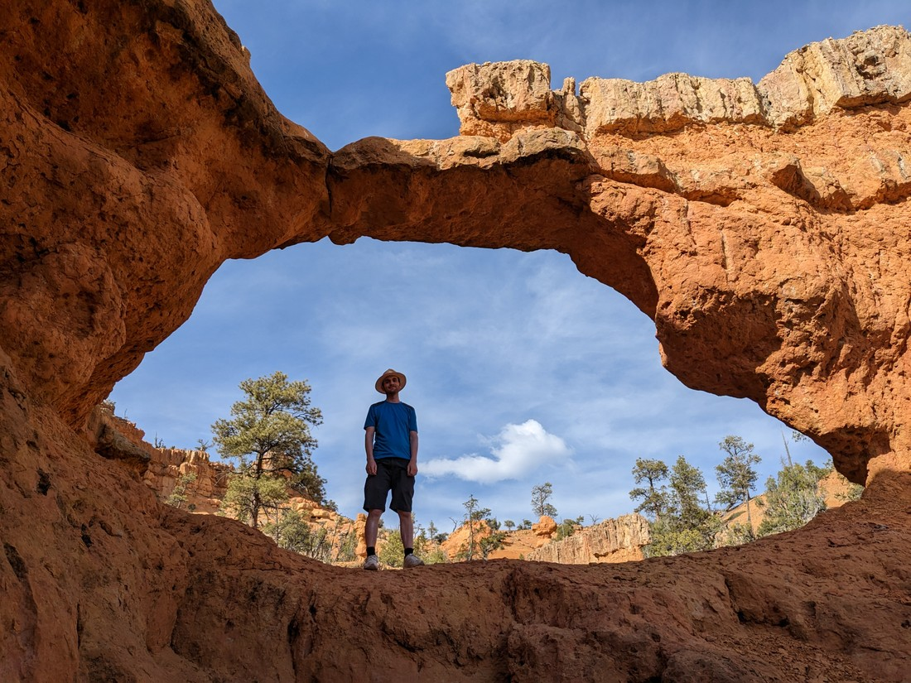

And some others that felt more like windows than arches:

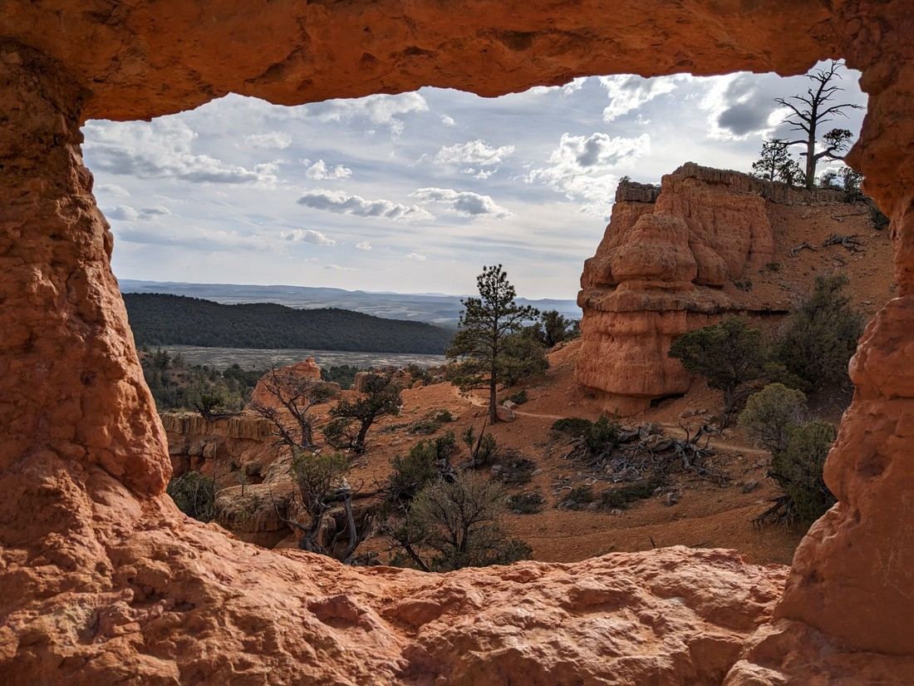

Or maybe doorways:

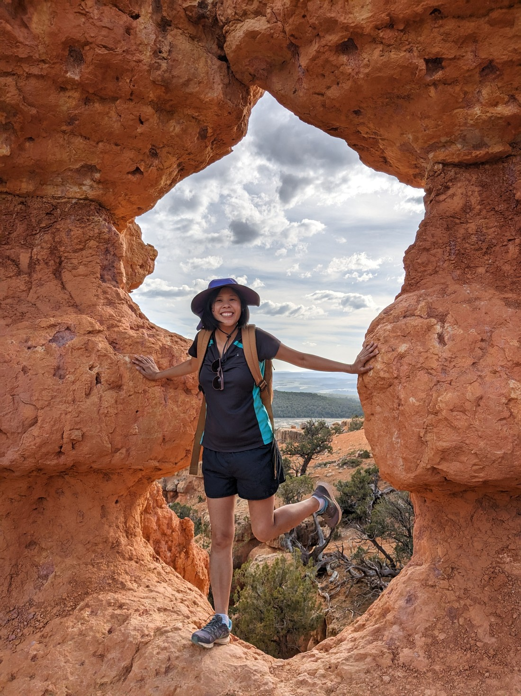

Like Red Canyon, overall this was a very nice walk.  I've said it before but there's something about the combination of red rocks, blue sky, and green trees which make these landscapes feel very scenic.

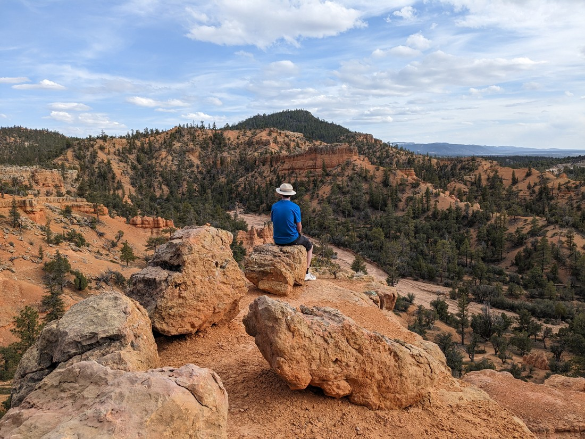

We came to this area for the national parks and while they are certainly excellent, there's a lot of good stuff in between too.

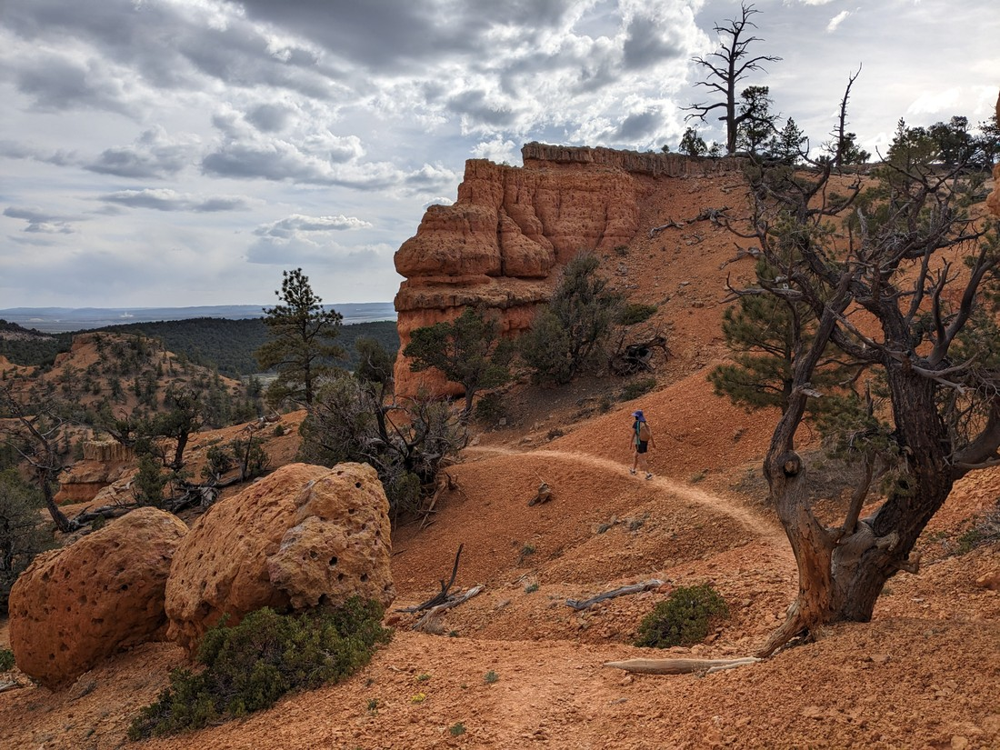